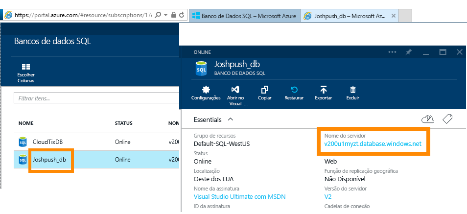

# Banco de Dados SQL do Azure com DirectQuery
Saiba como você pode se conectar diretamente ao banco de dados SQL e criar relatórios que usam dados dinâmicos. Você pode manter os dados na fonte e não no Power BI.

Com o DirectQuery, as consultas serão enviadas de volta para o Banco de Dados SQL do Azure conforme você explora os dados na exibição de relatório. Essa experiência é sugerida para usuários que estão familiarizados com os bancos de dados e as entidades aos quais eles se conectam.

**Observações:**

* Especifique o nome totalmente qualificado do servidor ao estabelecer a conexão (consulte abaixo para obter mais detalhes)
* Garanta que as regras de firewall para o banco de dados estejam configuradas para "[Permitir acesso aos serviços do Azure](https://msdn.microsoft.com/library/azure/ee621782.aspx)".
* Toda ação, como selecionar uma coluna ou adicionar um filtro, enviará uma consulta de volta ao banco de dados
* Os blocos são atualizados aproximadamente a cada 15 minutos (a atualização não precisa ser agendada). Isso pode ser ajustado nas Configurações avançadas quando você se conectar.
* P e R não estão disponíveis para conjuntos de dados do DirectQuery
* Alterações de esquema não são aplicadas automaticamente

Essas restrições e observações podem mudar conforme continuamos a aprimorar as experiências. As etapas para conectar são detalhadas abaixo. 

## Power BI Desktop e DirectQuery
Para se conectar ao Banco de Dados SQL do Azure usando DirectQuery, você precisará usar o Power BI Desktop. Essa abordagem fornece mais flexibilidade e recursos. Os relatórios criados com o Power BI Desktop podem ser publicados no serviço do Power BI. Você pode aprender mais sobre como se conectar ao [Banco de Dados SQL do Azure usando DirectQuery](desktop-use-directquery.md) dentro do Power BI Desktop. 

## Conectando-se por meio do Power BI
Você não pode se conectar ao Banco de Dados SQL do Azure diretamente do serviço do Power BI. Quando você selecionar o [Conector do Banco de Dados SQL do Azure](https://app.powerbi.com/getdata/bigdata/azure-sql-database-with-live-connect), será solicitado que você faça a conexão dentro do Power BI Desktop. Em seguida, você poderá publicar seus relatórios do Power BI Desktop para o serviço do Power BI. 

### Localizando Valores de Parâmetro
Seu nome do servidor totalmente qualificado e o nome do banco de dados podem ser encontrados no Portal do Azure.

## Próximas etapas
[Usar o DirectQuery no Power BI Desktop](desktop-use-directquery.md)  
[Introdução ao Power BI](service-get-started.md)  
[Obter dados para o Power BI](service-get-data.md)  
Mais perguntas? [Experimente a Comunidade do Power BI](http://community.powerbi.com/)

