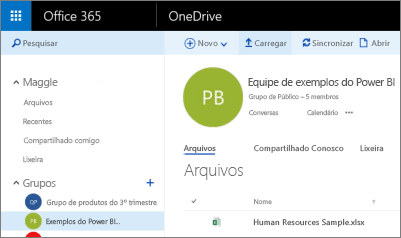
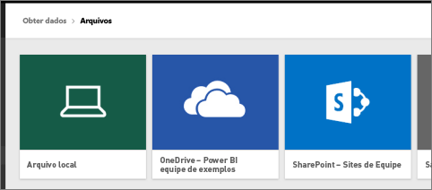
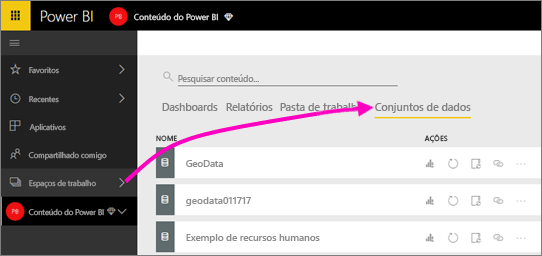
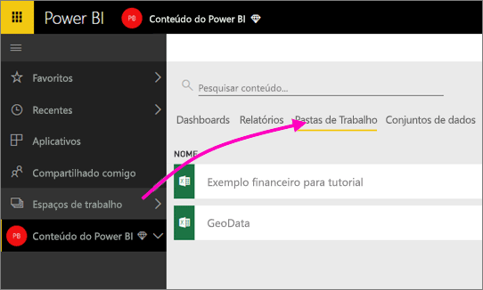

# Conecte-se a arquivos armazenados no OneDrive para seu espaço de trabalho de aplicativo do Power BI
Após você [criar um espaço de trabalho de aplicativo no Power BI](service-create-distribute-apps.md), é possível armazenar os arquivos do Excel, de CSV e do Power BI Desktop no OneDrive for Business para o seu espaço de trabalho de aplicativo do Power BI. Você pode continuar atualizando os arquivos que armazena no OneDrive e essas atualizações serão refletidas automaticamente nos relatórios e dashboards do Power BI com base nos arquivos. 

A adição de arquivos ao seu espaço de trabalho de aplicativo consiste em um processo de duas etapas: 

1. Primeiro você [carrega arquivos para o OneDrive para Negócios](service-connect-to-files-in-app-workspace-onedrive-for-business.md#1-upload-files-to-the-onedrive-for-business-for-your-app-workspace) do seu espaço de trabalho de aplicativo.
2. Em seguida, você [conecta-se a esses arquivos do Power BI](service-connect-to-files-in-app-workspace-onedrive-for-business.md#2-import-excel-files-as-datasets-or-as-excel-online-workbooks).

> [!NOTE]
> Os espaços de trabalho de aplicativo estão disponíveis apenas no [Power BI Pro](service-free-vs-pro.md).
> 
> 

## 1 Carregar arquivos no OneDrive for Business para o seu espaço de trabalho de aplicativo
1. No serviço do Power BI, selecione a seta ao lado de Espaços de trabalho > selecione as reticências (**...**) ao lado do nome do espaço de trabalho. 
   
   
2. Selecione **Arquivos** para abrir o OneDrive para Negócios do espaço de trabalho do aplicativo no Office 365.
   
   > [!NOTE]
   > Se você não vir **Arquivos** no menu do espaço de trabalho de aplicativo, selecione **Membros** para abrir o OneDrive for Business para o seu espaço de trabalho de aplicativo. Nele, selecione **Arquivos**. O Office 365 configura um local de armazenamento do OneDrive para seus arquivos do espaço de trabalho de grupo do aplicativo. Esse processo pode levar algum tempo. 
   > 
   > 
3. Aqui você pode carregar seus arquivos no OneDrive for Business para o seu espaço de trabalho de aplicativo. Selecione **Carregar**e navegue até os arquivos.
   
   

## 2 Importar arquivos do Excel como conjuntos de dados ou como pastas de trabalho do Excel Online
Agora que os arquivos estão no OneDrive for Business para o seu espaço de trabalho de aplicativo, você tem uma opção. Você pode: 

* [Importar dados da pasta de trabalho do Excel como conjuntos de dados](service-get-data-from-files.md) e usar os dados para criar relatórios e painéis que podem ser exibidos em um navegador da Web e em dispositivos móveis.
* Ou [conectar-se a uma pasta de trabalho completa do Excel no Power BI](service-excel-workbook-files.md) e exibi-la exatamente como aparece no Excel Online.

### Importar ou conectar-se aos arquivos em seu espaço de trabalho de aplicativo
1. No Power BI, mude para o espaço de trabalho de aplicativo, para que o nome do espaço de trabalho de aplicativo esteja no canto superior esquerdo. 
2. Selecione **Obter Dados** na parte inferior do painel de navegação esquerdo. 
   
   
3. Na caixa **Arquivos** , selecione **Obter**.
   
   
4. Selecione **OneDrive** - *Nome do seu espaço de trabalho de aplicativo*.
   
    
5. Selecione o arquivo desejado > **Conectar**.
   
    Esse é o momento de decidir se deseja [importar os dados da pasta de trabalho do Excel](service-get-data-from-files.md) ou [conectar-se a pastas de trabalho completas do Excel](service-excel-workbook-files.md).
6. Selecione **Importar** ou **Conectar**.
   
    
7. Se você selecionar **Importar** a pasta de trabalho aparecerá na guia **Conjuntos de dados**. 
   
    
   
    Se você selecionar **Conectar**, a pasta de trabalho estará na guia **Pastas de trabalho**.
   
    

## Próximas etapas
* [Criar aplicativos e espaços de trabalho de aplicativo no Power BI](service-create-distribute-apps.md)
* [Importar dados das pastas de trabalho do Excel](service-get-data-from-files.md)
* [Conectar-se a todas as pastas de trabalho do Excel](service-excel-workbook-files.md)
* Mais perguntas? [Experimente a Comunidade do Power BI](http://community.powerbi.com/)
* Comentários? Visite [Power BI Ideias](https://ideas.powerbi.com/forums/265200-power-bi) (Ideias do Power BI)

