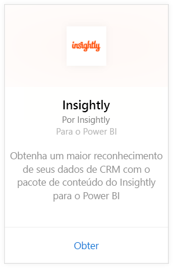
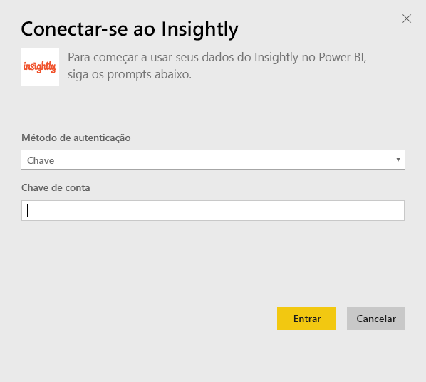
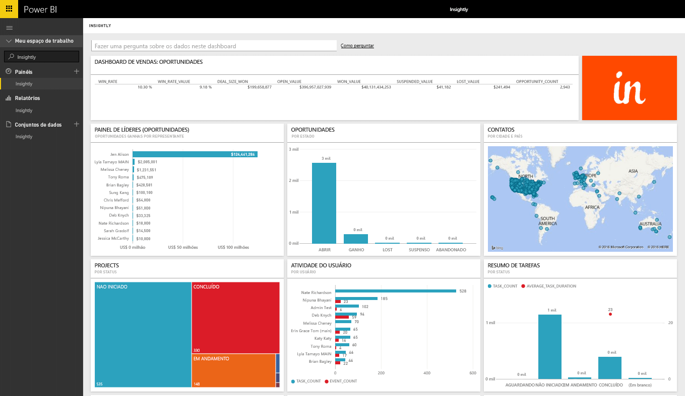
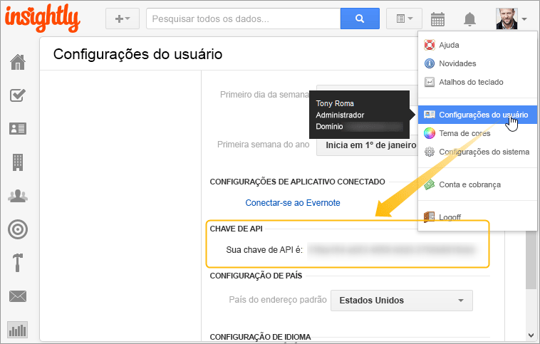

# Conectar-se ao Insightly com o Power BI
Visualize e compartilhe seus dados do CRM Insightly no Power BI com o pacote de conteúdo do Insightly. Conecte-se ao Power BI usando sua chave de API do Insightly para exibir e criar relatórios e painéis de seus dados CRM. Com o Power BI, você pode analisar os dados de novas maneiras, criar gráficos poderosos e exibir contatos, clientes potenciais e organizações em um mapa.

Conecte-se ao [pacote de conteúdo do Insightly](https://app.powerbi.com/getdata/services/insightly) para o Power BI.

## Como se conectar
1. Selecione **Obter Dados** na parte inferior do painel de navegação esquerdo.
   
   
2. Na caixa **Serviços** , selecione **Obter**.
   
   
3. Selecione **Insightly** \>  **Obter**.
   
   
4. Selecione **Chave** como o tipo de Autenticação e forneça sua chave de API do Insight e selecione **Entrar**. Veja detalhes sobre como [encontrar isso](#FindingParams) abaixo.
   
   
5. Após a aprovação, o processo de importação será iniciado automaticamente. Quando concluído, um novo painel, relatório e modelo aparecerão no Painel de Navegação. Selecione o painel para exibir os dados importados por você.
   
     

**E agora?**

* Tente [fazer uma pergunta na caixa de P e R](consumer/end-user-q-and-a.md) na parte superior do dashboard
* [Altere os blocos](service-dashboard-edit-tile.md) no dashboard.
* [Selecione um bloco](consumer/end-user-tiles.md) para abrir o relatório subjacente.
* Enquanto seu conjunto de dados será agendado para ser atualizado diariamente, você pode alterar o agendamento de atualização ou tentar atualizá-lo sob demanda usando **Atualizar Agora**

## O que está incluído
O pacote de conteúdo inclui as tabelas a seguir com os campos dos registros correspondentes:

| Tabelas |  |  |  |
| --- | --- | --- | --- |
| Contatos |Oportunidades |Estágios de Pipeline |Data de Conclusão da Tarefa |
| Campos Personalizados |Data de Fechamento da Oportunidade |Data de Conclusão do Projeto |Tarefas |
| Eventos |Data de Previsão da Oportunidade |Projetos |Equipes/Membros |
| Clientes potenciais |Organizações |Marcas |Usuários |

Muitas tabelas e relatórios também incluem campos calculados exclusivos, como:  

* Tabelas com datas previstas de fechamento de oportunidades, datas reais de fechamento de oportunidades, datas de conclusão de projetos e datas de conclusão de tarefas "agrupadas" para análise por mês, trimestre ou ano.  
* Um campo de valor ponderado para oportunidades (valor da oportunidade * probabilidade de vencer).  
* Campos de duração média e total das tarefas, com base nas datas de início e conclusão.  
* Relatórios com campos calculados para taxa de vitória de oportunidade (número de vitórias/número de oportunidades totais) e valor da taxa de vitória (valor de vitórias/valor de oportunidades totais).  

## Requisitos de sistema
Uma conta Insightly com acesso à API Insightly é necessária. As permissões de visibilidade serão baseadas na chave de API usada para estabelecer a conexão com o Power BI. Quaisquer registros do Insightly visíveis também serão visíveis nos relatórios e nos painéis do Power BI que você compartilha com outras pessoas.

## Localizando parâmetros
**Chave de API**

Para copiar a chave de API do Insightly, selecione as configurações de usuário no menu do perfil do Insightly e role para baixo. Essa cadeia de caracteres será usada para conectar seus dados ao Power BI.

## Solução de problemas
Os dados são importados por meio da API do Insightly, que inclui um limite diário com base em seu nível de plano de assinatura do Insightly. Os limites são listados na seção Solicitações de Limitação/Limitação de Taxa de nossa documentação da API: https://api.insight.ly/v2.2/Help#!/Overview/Introduction#ratelimit

Os relatórios fornecidos usam campos padrões do Insightly e podem não incluir as suas personalizações. Edite o relatório para exibir todos os campos disponíveis.

## Próximas etapas
[Introdução ao Power BI](service-get-started.md)

[Obter dados no Power BI](service-get-data.md)

