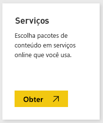
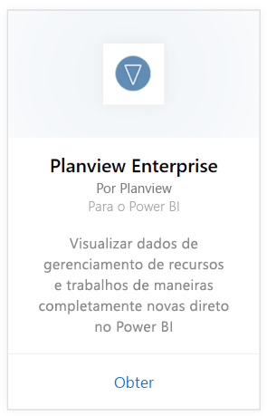
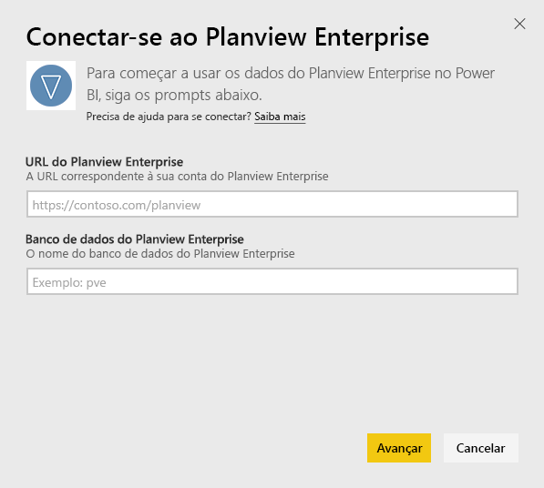
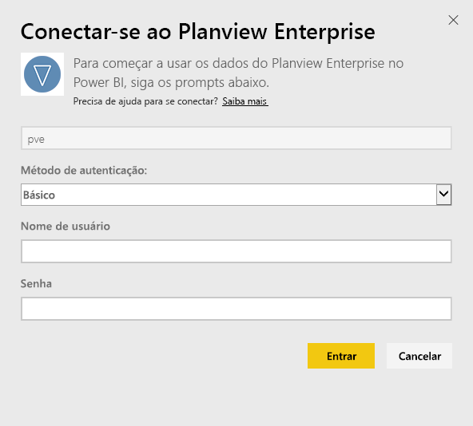
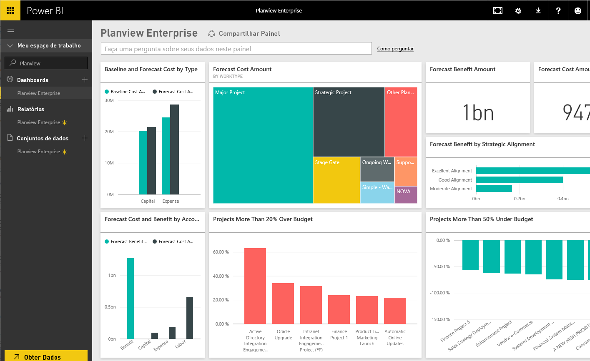

# Conectar-se ao Planview Enterprise com o Power BI
Com o pacote de conteúdo do Planview Enterprise, você pode visualizar seus dados de gerenciamento de trabalho e recursos de formas totalmente novas diretamente no Power BI. Use suas credenciais de logon do Planview Enterprise para ver de maneira interativa seus gastos de investimento de portfólio, entender os pontos em que você está acima e abaixo do orçamento e saber até que ponto seus projetos se alinham com suas prioridades estratégicas corporativas. Também é possível estender o painel e os relatórios prontos para uso para obter as informações mais importantes para você.

Conectar-se ao [pacote de conteúdo do Planview Enterprise no Power BI](https://app.powerbi.com/getdata/services/planview-enterprise)

>[!NOTE]
>Para importar dados do Planview Enterprise para o Power BI, você deve ser um usuário do Planview Enterprise com o recurso Visualizador de Portal de Relatório habilitado em sua função. Consulte abaixo os requisitos adicionais.

## Como se conectar
1. Selecione **Obter Dados** na parte inferior do painel de navegação esquerdo.
   
    
2. Na caixa **Serviços** , selecione **Obter**.
   
    
3. Na página do Power BI, selecione**Planview Enterprise** e, em seguida, selecione **Obter**:  
    
4. Na caixa de texto URL do Planview Enterprise, insira a URL do servidor do Planview Enterprise que deseja usar. Na caixa de texto Planview Enterprise Database, insira o nome do banco de dados do Planview Enterprise e clique em Avançar.  
    
5. Na lista Método de Autenticação, selecione **Básico** se essa opção ainda não estiver marcada. Insira o **Nome de usuário** e a **Senha** de sua conta e selecione **Entrar**.  
   
6. No painel esquerdo, selecione Planview Enterprise na lista de painéis.  
     O Power BI importa os dados do Planview Enterprise para o painel. Observe que os dados podem levar algum tempo para carregar.  
    

**E agora?**

* Tente [fazer uma pergunta na caixa de P e R](consumer/end-user-q-and-a.md) na parte superior do dashboard
* [Altere os blocos](service-dashboard-edit-tile.md) no dashboard.
* [Selecione um bloco](consumer/end-user-tiles.md) para abrir o relatório subjacente.
* Enquanto seu conjunto de dados será agendado para ser atualizado diariamente, você pode alterar o agendamento de atualização ou tentar atualizá-lo sob demanda usando **Atualizar Agora**

## Requisitos de sistema
Para importar dados do Planview Enterprise para o Power BI, você deve ser um usuário do Planview Enterprise com o recurso Visualizador de Portal de Relatório habilitado em sua função. Consulte abaixo os requisitos adicionais.

Este procedimento pressupõe que você já entrou na home page do Microsoft Power BI com uma conta do Power BI. Se você não tem uma conta do Power BI, acesse [powerbi.com](https://powerbi.microsoft.com/get-started/) e, em **Power BI – Colaboração e compartilhamento em nuvem**, selecione **Experimentar gratuitamente**. Em seguida, clique em **Obter Dados**.

## Próximas etapas:

[O que é o Power BI?](power-bi-overview.md)

[Obter dados para o Power BI](service-get-data.md)