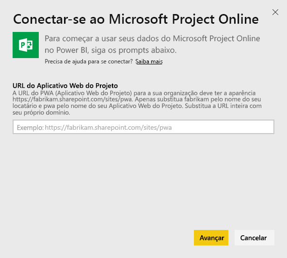

# Conectar-se ao Project Online com o Power BI
Microsoft Project Online é uma solução online flexível para PPM (gerenciamento de portfólio de projetos) e para o trabalho cotidiano. O Project Online permite que as organizações comecem, priorizem investimentos de portfólio de projetos e entreguem o valor comercial pretendido. O pacote de conteúdo do Project Online para o Power BI permite que você explore seus dados de projeto com métricas prontas para uso, como status do portfólio e conformidade do projeto.

Conecte-se ao [pacote de conteúdo do Project Online](https://app.powerbi.com/getdata/services/project-online) para o Power BI.

## Como se conectar
1. Selecione **Obter Dados** na parte inferior do painel de navegação esquerdo.
   
    
2. Na caixa **Serviços** , selecione **Obter**.
   
   
3. Selecione **Microsoft Project Online** \> **Obter**.
   
   
4. Na caixa de texto **URL do Project Web App** , digite a URL para o PWA (Project Web Add) à qual você deseja se conectar e pressione **Avançar**. Observe que isso pode ser diferente do exemplo, caso você tenha um domínio personalizado.
   
    
5. Para o Método de Autenticação, selecione **oAuth2** \> **Entrar**. Quando solicitado, insira suas credenciais do Project Online e siga o processo de autenticação.
   
    
    
Observe que você precisa ter as permissões Visualizador de portfólio, Gerente de portfólio ou Administrador do Project Web App ao qual você está se conectando.

6. Você verá uma notificação indicando que os dados estão sendo carregados. Dependendo do tamanho de sua conta, isso pode levar algum tempo. Após o Power BI importar os dados, você verá novos elementos (painel, relatório e conjunto de dados) no painel de navegação esquerdo. Esse é o painel padrão criado pelo Power BI para exibir seus dados. Você pode alterar esse painel para exibir seus dados de qualquer modo que desejar.
   
   

**E agora?**

* Tente [fazer uma pergunta na caixa de P e R](power-bi-q-and-a.md) na parte superior do dashboard
* [Altere os blocos](service-dashboard-edit-tile.md) no dashboard.
* [Selecione um bloco](service-dashboard-tiles.md) para abrir o relatório subjacente.
* Enquanto seu conjunto de dados será agendado para ser atualizado diariamente, você pode alterar o agendamento de atualização ou tentar atualizá-lo sob demanda usando **Atualizar Agora**

## Próximas etapas
[Introdução ao Power BI](service-get-started.md)

[Obter dados no Power BI](service-get-data.md)

