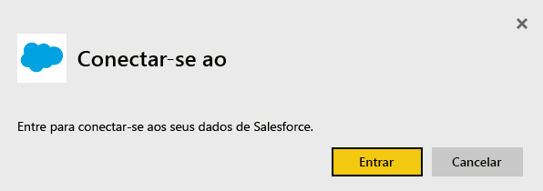
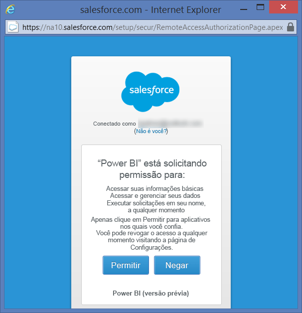
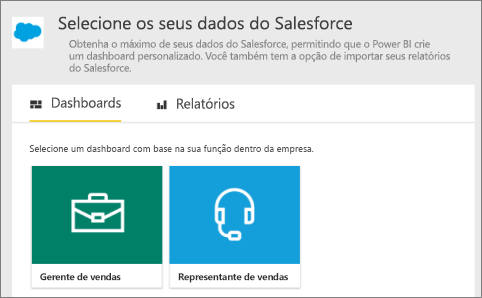
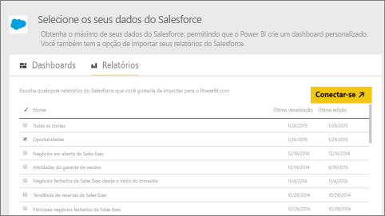
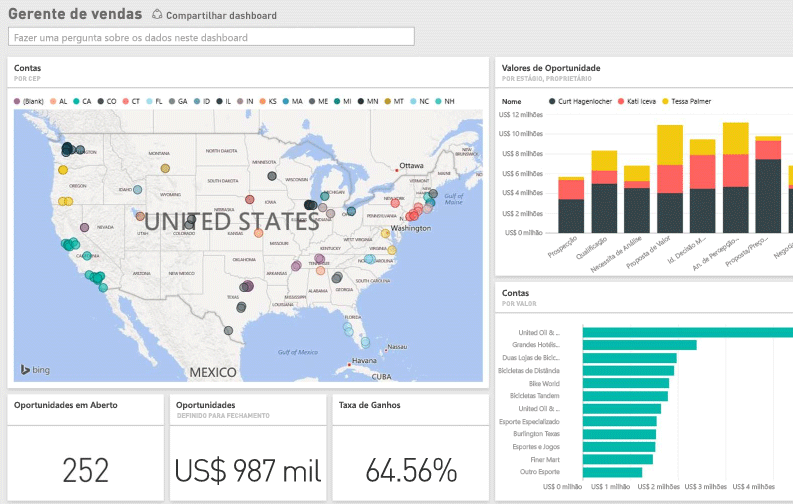

# Conectar-se ao Salesforce com o Power BI
Com o Power BI, você pode se conectar facilmente à sua conta do Salesforce.com. A criação dessa conexão recupera os dados, além de fornecer automaticamente um painel e relatórios relacionados com base nesses dados.

Conecte-se ao [pacote de conteúdo do Salesforce](https://app.powerbi.com/getdata/services/salesforce) para o Power BI ou leia mais sobre a [integração do Salesforce](https://powerbi.microsoft.com/integrations/salesforce) com o Power BI.

## Como se Conectar
1. Selecione **Obter Dados** na parte inferior do painel de navegação esquerdo.
   
    
2. Na caixa **Serviços** , selecione **Obter**.
   
    
3. Clique em **Salesforce** e selecione **Obter**.  
   
   
4. Selecione **Entrar** para iniciar o fluxo de logon.
   
    
5. Quando solicitado, insira suas credenciais do Salesforce. Clique em **Permitir** para que o Power BI possa acessar suas informações e dados básicos do Salesforce.
   
   
6. Configure o que você deseja importar para o Power BI usando a opção de lista suspensa:
   
   * **Dashboard**
     
     Selecione um painel predefinido com base em uma persona (como **Gerente de Vendas**). Esses painéis trazem um conjunto específico de dados padrão do Salesforce e não incluirão nenhum campo personalizado.
     
     
   * **Relatórios**
     
     Selecione um ou mais relatórios personalizados da conta do Salesforce. Esses relatórios corresponderão às visualizações no Salesforce, podendo incluir dados de objetos ou campos personalizados.
     
     
     
     Se você não vir quaisquer relatórios, adicione ou crie-os em sua conta do Salesforce e tente conectar-se novamente.
7. Clique em **Conectar** para iniciar o processo de importação. Durante a importação, você verá uma notificação mostrando que a importação está em andamento. Depois de concluída a importação, você verá um painel, relatório e conjunto de dados para os dados do Salesforce listados no painel de navegação esquerdo.
   
   

Você pode alterar esse painel para exibir os dados de qualquer modo que desejar. É possível fazer perguntas com a P e R ou clicar em um bloco para [abrir o relatório subjacente](service-dashboard-tiles.md) e [alterar os blocos](service-dashboard-edit-tile.md) no dashboard.

**E agora?**

* Tente [fazer uma pergunta na caixa de P e R](power-bi-q-and-a.md) na parte superior do dashboard
* [Alterar os blocos](service-dashboard-edit-tile.md) no dashboard
* [Selecionar um bloco](service-dashboard-tiles.md) para abrir o relatório subjacente
* Enquanto seu conjunto de dados será agendado para ser atualizado diariamente, você pode alterar o agendamento de atualização ou tentar atualizá-lo sob demanda usando **Atualizar Agora**

## Requisitos de sistema
* Estar conectado a uma conta do Salesforce que tenha acesso habilitado à API
* Permissão ter sido concedida ao aplicativo Power BI durante o logon
* A conta ter chamadas à API suficientes disponíveis para efetuar pull dos dados e atualizá-los
* Um token de autenticação válido é necessário para a atualização. Certifique-se de ter importado no máximo cinco conjuntos de dados do Salesforce, já que o Salesforce tem um limite de cinco tokens de autenticação por aplicativo

## Solução de problemas
Se você encontrar algum erro, examine os requisitos acima. Observe também que não há suporte para a capacidade de logon em domínio personalizado de área restrita no momento.

## Próximas etapas
[Introdução ao Power BI](service-get-started.md)

[Obter dados](service-get-data.md)

