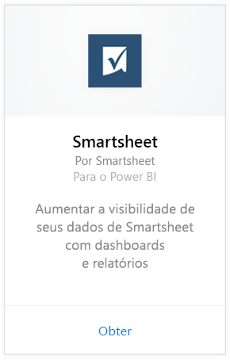
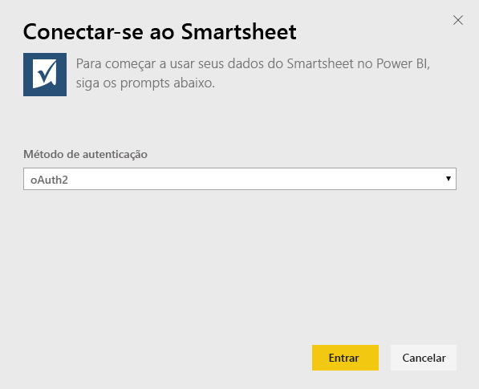
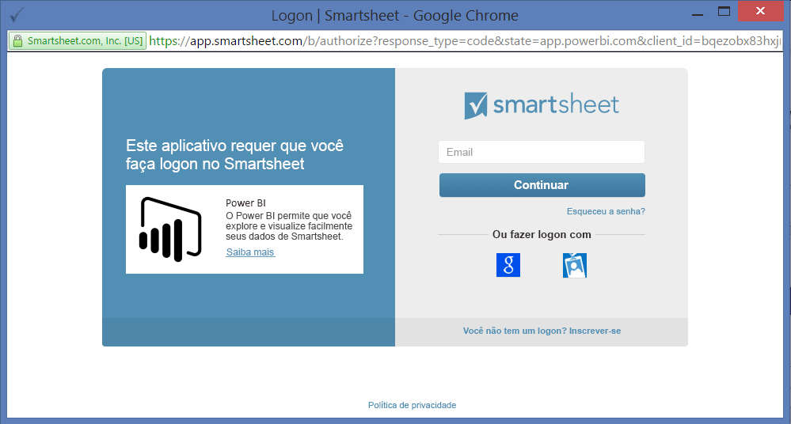
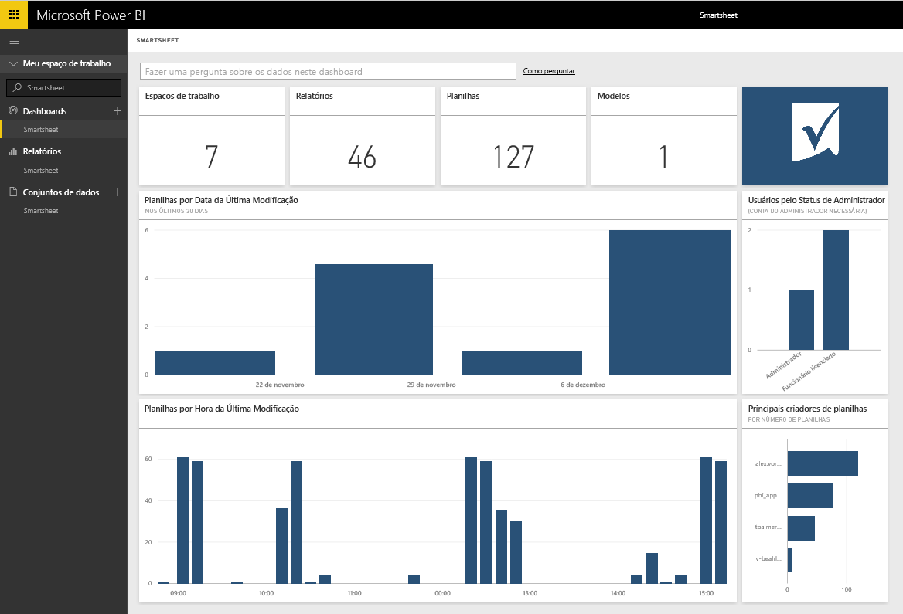

# Conectar-se ao Smartsheet com o Power BI
O Smartsheet oferece uma plataforma fácil para colaboração e compartilhamento de arquivos. O pacote de conteúdo Smartsheet para Power BI fornece um painel, relatórios e o conjunto de dados que mostra uma visão geral da sua conta de Smartsheet. Também é possível usar o [Power BI Desktop](desktop-connect-to-data.md) para se conectar diretamente às planilhas individuais em sua conta. 

Conecte-se ao [pacote de conteúdo do Smartsheet](https://app.powerbi.com/groups/me/getdata/services/smartsheet) para o Power BI.

>[!NOTE]
>A conta de administrador de Smartsheet é preferida para conectar e carregar o pacote de conteúdo do Power BI, pois tem acesso adicional.

## Como se conectar
1. Selecione **Obter Dados** na parte inferior do painel de navegação esquerdo.
   
   
2. Na caixa **Serviços** , selecione **Obter**.
   
    
3. Selecione **Smartsheet \> Obter**.
   
   
4. Para o Método de Autenticação, selecione **oAuth2 \> Entrar**.
   
   Quando solicitado, insira suas credenciais do Smartsheet e siga o processo de autenticação.
   
   
   
   
5. Após o Power BI importar os dados, você verá novos elementos (painel, relatório e conjunto de dados) no painel de navegação esquerdo. Novos itens são marcados com um asterisco amarelo \*; selecione a entrada do Smartsheet.
   
   

**E agora?**

* Tente [fazer uma pergunta na caixa de P e R](power-bi-q-and-a.md) na parte superior do dashboard
* [Altere os blocos](service-dashboard-edit-tile.md) no dashboard.
* [Selecione um bloco](service-dashboard-tiles.md) para abrir o relatório subjacente.
* Enquanto seu conjunto de dados será agendado para ser atualizado diariamente, você pode alterar o agendamento de atualização ou tentar atualizá-lo sob demanda usando **Atualizar Agora**

## O que está incluído
O pacote de conteúdo do Smartsheet para o Power BI inclui uma visão geral de sua conta do Smartsheet, tais como o número de espaços de trabalho, os relatórios e as planilhas existentes, informações sobre a data em que são modificados, etc. Os usuários administradores também verão algumas informações sobre os usuários em seu sistema, como os principais criadores de planilhas.  

Para se conectar diretamente a planilhas individuais em sua conta, é possível usar o conector do Smartsheet no [Power BI Desktop](desktop-connect-to-data.md).  

## Próximas etapas:

[Introdução ao Power BI](service-get-started.md)

[Obter dados para o Power BI](service-get-data.md)