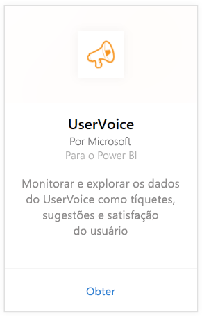
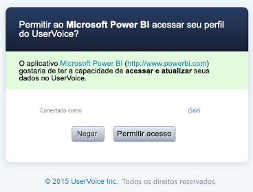

# Conectar-se ao UserVoice com o Power BI
É fácil acompanhar e explorar dados do UserVoice com o Power BI e o pacote de conteúdo do UserVoice. O Power BI recupera seus dados, incluindo tíquetes, sugestões e classificações de satisfação, e cria um painel e relatórios prontos para uso com base nesses dados.

Conecte-se ao [pacote de conteúdo do UserVoice](https://app.powerbi.com/getdata/services/uservoice) para o Power BI.

>[!NOTE]
>Uma conta de administrador é necessária para conexão com o pacote de conteúdo do Power BI. O pacote de conteúdo também aproveita a API UserVoice e contribuirá com o uso para os limites do UserVoice. Mais detalhes abaixo.

## Como se conectar
1. Selecione **Obter Dados** na parte inferior do painel de navegação esquerdo.
   
   
2. Na caixa **Serviços** , selecione **Obter**.
   
    
3. Selecione **UserVoice** e **Obter**.
   
   
4. Quando solicitado, digite a URL do UserVoice. A URL deve seguir o padrão indicado abaixo com exatamente `https://fabrikam.uservoice.com` substituindo “fabrikam” pelo nome do produto ou serviço.
   
   >[!NOTE]
   >Não há nenhuma barra no final e a conexão está em http**s**.
   
   
5. Quando solicitado, insira suas credenciais do UserVoice e siga o processo de autenticação. Se já tiver entrado no UserVoice em seu navegador, talvez suas credenciais não sejam solicitadas. Conceda ao aplicativo Power BI o acesso aos seus dados clicando em “Permitir Acesso”.
   
   >[!NOTE]
   >Você precisa de credenciais de administrador para a conta do UserVoice.
   
   
6. O Power BI recuperará seus dados do UserVoice e criará um relatório e painel prontos para uso para você. O Power BI recuperará os seguintes dados: todas as suas sugestões, todos os seus registros em aberto, todos os tíquetes criados nos últimos 30 dias incluindo aqueles encerrados e todos os índices de satisfação do usuário.
   
   

**E agora?**

* Tente [fazer uma pergunta na caixa de P e R](power-bi-q-and-a.md) na parte superior do dashboard
* [Altere os blocos](service-dashboard-edit-tile.md) no dashboard.
* [Selecione um bloco](service-dashboard-tiles.md) para abrir o relatório subjacente.
* Enquanto seu conjunto de dados será agendado para ser atualizado diariamente, você pode alterar o agendamento de atualização ou tentar atualizá-lo sob demanda usando **Atualizar Agora**

## Solução de problemas
**“Falha na validação do parâmetro. Verifique se todos os parâmetros são válidos.”**

Se você visualizar esse erro depois de digitar a URL do UserVoice. Verifique se que os requisitos a seguir forem atendidos:

* A URL segue exatamente esse padrão `https://fabrikam.uservoice.com` substituindo "fabrikam" pelo prefixo de URL correto do UserVoice.
* Verifique se todas as letras são minúsculas.
* Verifique se a URL está em "http**s**".
* Verifique se que não há nenhuma barra invertida no final da URL.

**“Falha no logon.”**

Se você receber um erro “Falha no logon” depois de usar suas credenciais do UserVoice para fazer logon, isso significa que a conta que você está usando não tem permissões para recuperar os dados do UserVoice de sua conta. Verifique se que ela é uma conta de administrador e tente novamente.

“**Opa, algo deu errado**”

Se você receber essa mensagem de erro enquanto os dados estiverem sendo carregados, verifique se a sua conta do UserVoice não excedeu sua cota mensal de uso de APIs. Se tudo estiver correto, tente se conectar novamente. Se o problema persistir, entre em contato com o suporte do Power BI em [https://community.powerbi.com](https://community.powerbi.com/).

**Outros**  

O pacote de conteúdo do UserVoice para o Power BI usa APIs do UserVoice para recuperar seus dados. Lembre-se de monitorar seu uso da API para não exceder seu limite. Se você tiver muitos dados em sua conta do UserVoice, uma sugestão para minimizar o impacto no uso da API é alterar a frequência de atualização do padrão atual, que é uma vez por dia, para atualizar somente em dias da semana ou em dias intercalados, dependendo de suas necessidades. Outra sugestão é fazer com que um administrador crie o pacote de conteúdo e compartilhe-o com o restante da equipe em vez de fazer com que todos os administradores em sua organização criem seus próprios pacotes, colocando uma carga extra desnecessária sobre as APIs

## Próximas etapas
[Introdução ao Power BI](service-get-started.md)

[Obter dados no Power BI](service-get-data.md)

