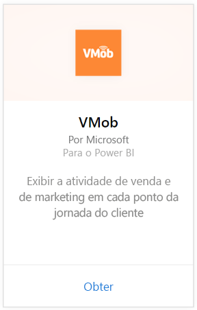
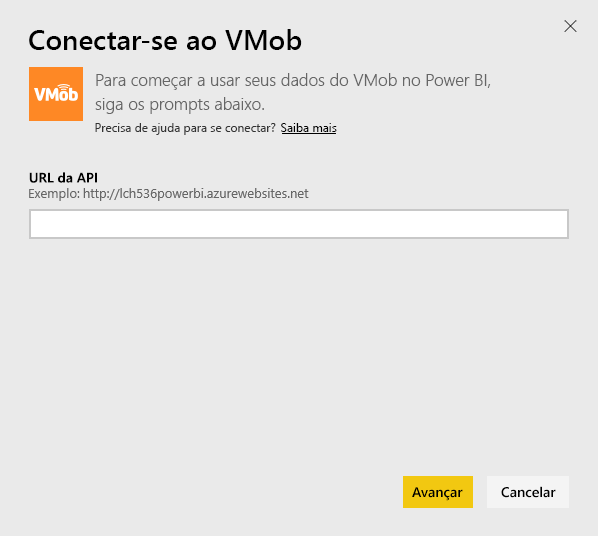
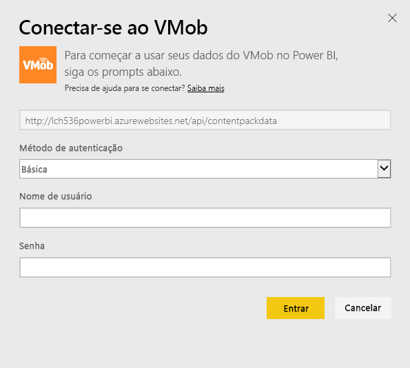
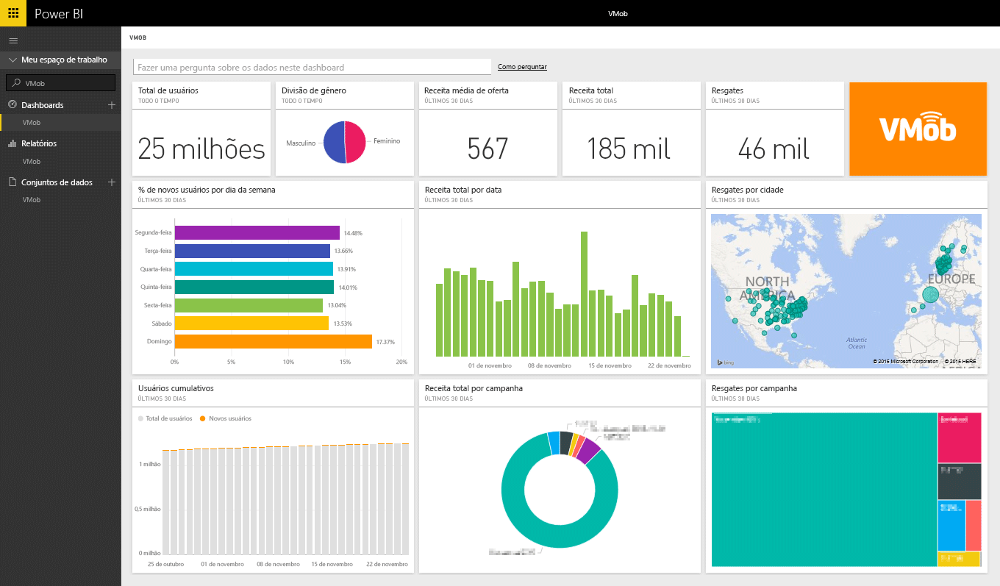

# Conectar-se ao VMob com o Power BI
É fácil acompanhar e explorar dados do VMob com o Power BI e o pacote de conteúdo do VMob. O Power BI recuperará os seguintes dados: Estatísticas do Usuário para todas as horas e nos últimos 30 dias, KPI de Varejo nos últimos 30 dias e Desempenho da Campanha nos últimos 30 dias.

Conecte-se ao [Pacote de conteúdo do VMob](https://app.powerbi.com/getdata/services/vmob) para o Power BI.

## Como se conectar
1. Selecione **Obter Dados** na parte inferior do painel de navegação esquerdo.
   
    
2. Na caixa **Serviços** , selecione **Obter**.
   
   
3. Selecione **VMob** \> **Obter**.
   
   
4. Quando solicitado, insira a URL do VMob e clique no botão Avançar. Essa URL é fornecida pelo VMob separadamente.
   
    
5. Escolha a opção **Básica** no menu suspenso do método de Autenticação, insira seu nome de usuário do VMob e a senha e clique no botão **Entrar** .
   
    
6. O processo de importação será iniciado automaticamente e o Power BI recuperará os dados do VMob para criar um relatório e painel prontos para uso para você.
   
   

**E agora?**

* Tente [fazer uma pergunta na caixa de P e R](power-bi-q-and-a.md) na parte superior do dashboard
* [Altere os blocos](service-dashboard-edit-tile.md) no dashboard.
* [Selecione um bloco](service-dashboard-tiles.md) para abrir o relatório subjacente.
* Enquanto seu conjunto de dados será agendado para ser atualizado diariamente, você pode alterar o agendamento de atualização ou tentar atualizá-lo sob demanda usando **Atualizar Agora**

## Próximas etapas
[Introdução ao Power BI](service-get-started.md)

[Obter dados no Power BI](service-get-data.md)

