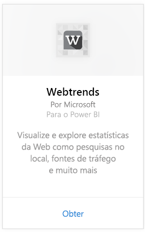
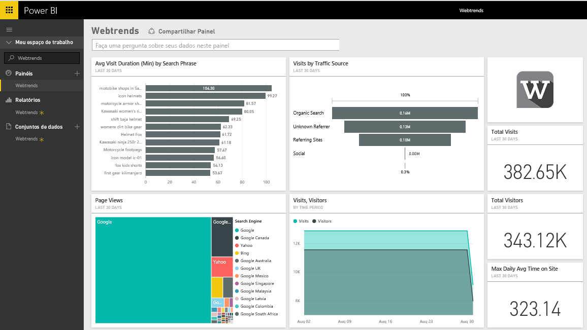
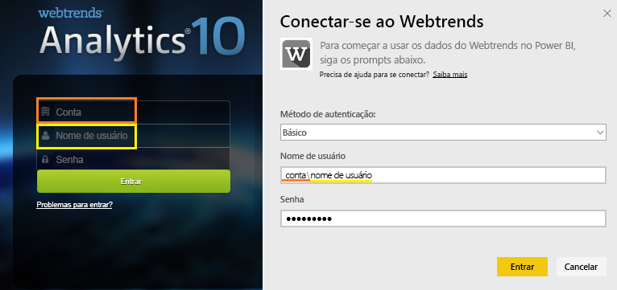

# Conectar-se ao Webtrends com o Power BI
O pacote de conteúdo do Webtrends para o Power BI inclui uma variedade de métricas prontas para uso, como total de exibições e visitas de página por origem do tráfego. A visualização dos seus dados do Webtrends no Power BI começa com a conexão à sua conta do Webtrends. Você pode usar o painel e os relatórios como fornecidos, ou então personalizá-los para realçar as informações que mais importam a você.  Os dados serão atualizados automaticamente uma vez por dia.

Conecte-se ao [pacote de conteúdo do Webtrends para o Power BI.](https://app.powerbi.com/getdata/services/webtrends)

## Como se conectar
1. Selecione **Obter Dados** na parte inferior do painel de navegação esquerdo.
   
   
2. Na caixa **Serviços** , selecione **Obter**.
   
   
3. Selecione **Webtrends** \> **Obter**.
   
   
4. O pacote de conteúdo se conecta a uma ID de perfil específica do Webtrends. Veja detalhes sobre como [encontrar esse parâmetro](#FindingParams) abaixo.
   
   
5. Forneça suas credenciais do Webtrends para se conectar. É importante observar que no campo de nome de usuário é esperado que você insira sua conta e nome de usuário. Veja os [detalhes](#FindingParams) abaixo.
   
   
6. Após a aprovação, o processo de importação será iniciado automaticamente. Quando concluído, um novo painel, relatório e modelo aparecerão no Painel de Navegação. Selecione o painel para exibir os dados importados por você.
   
   

**E agora?**

* Tente [fazer uma pergunta na caixa de P e R](power-bi-q-and-a.md) na parte superior do dashboard
* [Altere os blocos](service-dashboard-edit-tile.md) no dashboard.
* [Selecione um bloco](service-dashboard-tiles.md) para abrir o relatório subjacente.
* Enquanto seu conjunto de dados será agendado para ser atualizado diariamente, você pode alterar o agendamento de atualização ou tentar atualizá-lo sob demanda usando **Atualizar Agora**

## O que está incluído

O pacote de conteúdo do Webtrends efetua pull de dados dos seguintes relatórios:  

| Nome do Relatório | ID do Relatório |
| --- | --- |
| Principais Métricas | |
| Pesquisas no Site |34awBVEP0P6 |
| Páginas de Saída |7FshY8eP0P6 |
| Próximas Páginas |CTd5rpeP0P6 |
| Páginas Anteriores |aSdOeaUgnP6 |
| Páginas do site |oOEWQj3sUo6 |
| Cliques de Anúncios no Site |41df19b6d9f |
| Cidades |aUuHskcP0P6 |
| Países |JHWXJNcP0P6 |
| Visitantes |xPcmTDDP0P6 |
| Duração da Visita |U5KAyqdP0P6 |
| Frases de Pesquisa |IKYEDxIP0P6 |
| Fontes de Tráfego |JmttAoIP0P6 |
| Mecanismos de Pesquisa |yGz3gAGP0P6 |
| Páginas de Entrada |i6LrkNVRUo6 |

>[!NOTE]
>Para os perfis do SharePoint, os nomes de métrica podem ser um pouco diferentes do que é mostrado na interface do usuário do Webtrends. O seguinte mapeamento é feito para manter a consistência entre os perfis do SharePoint e da Web:   

    - Sessões = Visitas  
    - Novos usuários = Novos visitantes  
    - Exibições por sessão = Exibições de página por visita  
    - Duração diária média do usuário = Tempo médio no site por visitante  

## Requisitos de sistema
O pacote de conteúdo requer acesso a um perfil do Webtrends com o [conjunto correto de relatórios](#Included) habilitado.

## Localizando parâmetros
Sua ID de perfil do Webtrends pode ser encontrada na URL depois de selecionar um perfil:

Suas credenciais são as mesmas que você insere ao entrar no Webtrends, mas esperamos que você insira sua conta e nome de usuário na mesma linha, separado por uma barra invertida:

## Solução de problemas
Você pode encontrar um problema durante o carregamento do pacote de conteúdo, depois de fornecer as credenciais. Se você vir a mensagem “Ops” durante o carregamento, examine as sugestões de solução de problemas abaixo. Se você ainda tiver problemas, registre um tíquete de suporte em https://support.powerbi.com

1. A ID do Perfil correta está sendo usada; veja [Encontrando parâmetros](#FindingParams) para obter mais detalhes.
2. O usuário tem acesso aos relatórios listados na seção [“O que está incluído”](#Included)

## Próximas etapas
[O que é o Power BI?](power-bi-overview.md)

[Power BI – conceitos básicos](service-basic-concepts.md)

