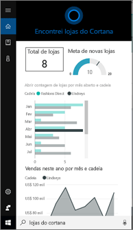
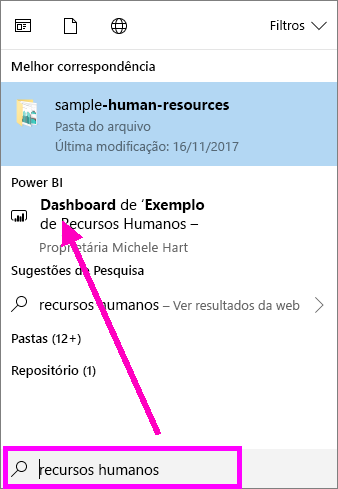
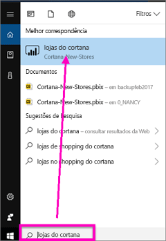
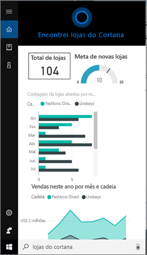

# Localize e exiba rapidamente seus dados do Power BI usando a Cortana para o Power BI
Use a Cortana em seus dispositivos Windows 10 para obter respostas instantâneas para suas perguntas de negócios importantes. Ao se integrar ao Power BI, a Cortana pode recuperar informações importantes diretamente dos relatórios e dashboards do Power BI. Tudo o que você vai precisar é do Windows 10 com a versão de novembro de 2015 ou posterior, da Cortana, do Power BI e de acesso a, pelo menos, um conjunto de dados.

## Visualize a nova experiência de pesquisa do *dashboard* da Cortana para o Windows 10
Por um tempo, você conseguiu [usar a Cortana para recuperar determinados tipos de páginas de relatórios](service-cortana-answer-cards.md). Agora, adicionamos uma **nova experiência** – a capacidade de recuperar dashboards também. Experimente e [envie seus comentários ](mailto:pbicortanasg@microsoft.com). Eventualmente, a *nova experiência* será estendida para incluir a pesquisa de relatórios da Cortana também.  Um dos principais benefícios da nova experiência é que você não precisa fazer nada especial para configurá-la – não é preciso habilitar a Cortana ou configurar o Windows 10 – ela simplesmente funciona.

> [!NOTE]
> Se ela não “funcionar”, consulte o [Artigo de solução de problemas](service-cortana-troubleshoot.md) para obter ajuda.
> 
> 

A tecnologia subjacente está usando o [Serviço Azure Search da Microsoft](). Esse serviço de pesquisa fornece recursos adicionais como classificação inteligente, correção de erros e preenchimento automático.

Ambas as experiências da Cortana existirão de modo paralelo.

## Documentação da Cortana para o Power BI
Temos quatro documentos que orientam você durante a configuração e o uso da Cortana para o Power BI. Esta série de artigos o guiará pelas etapas para

**Artigo 1** (este artigo): Compreender como a Cortana e o Power BI funcionam juntos

**Artigo 2**: [pesquisar relatórios do Power BI: habilitar a integração entre Cortana – Power BI – Windows](service-cortana-enable.md)

**Artigo 3**: [pesquisar relatórios do Power BI: criar cartões de respostas especiais da *Cortana*](service-cortana-answer-cards.md)

**Artigo 4**: [Solucionar problemas](service-cortana-troubleshoot.md)

## Como o Cortana e o Power BI funcionam juntos?
Quando você usa a Cortana para fazer uma pergunta, o Power BI pode ser um dos locais em que a Cortana procura por respostas. No Power BI, a Cortana pode encontrar respostas orientadas a dados detalhados nos relatórios do Power BI (que contêm um tipo especial de página de relatório chamada *Cartão de respostas da Cortana*) e de dashboards do Power BI.

Se a Cortana encontrar uma correspondência, ela exibirá o nome da página do dashboard ou do relatório diretamente na tela da Cortana. A página do dashboard ou do relatório pode ser aberta no Power BI. As páginas do relatório também podem ser exploradas à direita na Cortana – elas são interativas.

### Cortana e Dashboards (a *nova experiência*)
A Cortana pode encontrar respostas nos dashboards que você tem e nos dashboards que foram compartilhados com você. Faça perguntas à Cortana usando títulos, palavras-chave, nomes de proprietários, nomes de espaços de trabalho, nomes de aplicativos e muito mais.

Sua pergunta deve ter pelo menos duas palavras para que a Cortana encontre uma resposta. Portanto, se você pesquisar em um dashboard que tem um nome de uma palavra (marketing), adicione a palavra “mostrar” ou “Power BI” ou “<owner name>” à sua pergunta, como em “mostrar Marketing” e “exemplo de michele hart”. 

Se o dashboard tiver um título com mais de uma palavra, a Cortana retornará esse dashboard apenas se a pesquisa corresponder a pelo menos duas das palavras ou se o dashboard corresponder a uma das palavras mais o nome do proprietário. Para um dashboard chamado “Exemplo de lucratividade do cliente”: 

* a expressão “mostrar cliente” *não* retornará um resultado de dashboard do Power BI.   
* expressões como “mostrar lucratividade do cliente”, ”cliente p”, “cliente s”, ”exemplo de lucratividade”, “exemplo de michele hart”, “mostrar exemplo de lucratividade do cliente” e “mostrar cliente p” *retornarão* um resultado do Power BI.
* Adicionar a palavra “powerbi” conta como uma das duas palavras necessárias, portanto a expressão “amostra do powerbi” *retornará* um resultado do Power BI. 
  
    

### Cortana e Relatórios
 A Cortana pode encontrar respostas nos relatórios que têm [páginas criadas especificamente para exibição pela Cortana](service-cortana-answer-cards.md). Basta fazer perguntas usando o título ou palavras-chave de uma dessas páginas de relatórios de especialidade.  

A tecnologia subjacente para relatórios está usando [P e R do Microsoft Power BI](consumer/end-user-q-and-a.md).

Quando você faz uma pergunta na Cortana, o Power BI responde das páginas do relatório projetadas especificamente para a Cortana. As respostas possíveis são determinadas pela Cortana no mesmo instante, diretamente dos *cartões de resposta* da Cortana já criados no Power BI.  Para explorar mais uma resposta, basta abrir um resultado no Power BI.

> [!NOTE]
> Antes que a Cortana consiga procurar respostas em seus relatórios do Power BI, você precisará [habilitar este recurso usando o serviço do Power BI e configurar o Windows para se comunicar com o Power BI](service-cortana-enable.md).  
> 
> 

## Uso da Cortana para obter respostas do Power BI
1. Início na Cortana. Há várias maneiras diferentes de *abrir* a Cortana: selecione o ícone da Cortana na barra de tarefas (mostrada abaixo), use os comandos de voz ou toque no ícone de pesquisa em seu dispositivo móvel do Windows.
   
     
2. Depois que a Cortana estiver pronta, digite ou fale a sua pergunta na barra de pesquisa da Cortana. A Cortana exibe os resultados disponíveis. Se houver um dashboard do Power BI que corresponda à pergunta, ele aparecerá em **Melhor correspondência** ou em **Power BI**.
   
     
   
   > [!NOTE]
   > No momento, há suporte apenas em inglês.
   > 
   > 
3. Selecione o painel para abri-lo na Cortana.

    

    Você pode alterar o layout [editando a *exibição de telefone* do painel](service-create-dashboard-mobile-phone-view.md). 

1. Na Cortana, você também tem as opções de abrir o painel no serviço do Power BI ou Power BI móvel. Abra o painel no serviço do Power BI selecionando **Aberto na web**. 
   
      
4. Agora vamos usar a Cortana para pesquisar um relatório. Precisaremos conhecer um [relatório que tenha uma página com um cartão de respostas da Cortana ](service-cortana-answer-cards.md). Neste exemplo, um relatório chamado “Cortana-New-Stores” tem uma página do cartão de respostas da Cortana chamada “cortana stores”.  
   
     Digite ou fale a sua pergunta na barra de pesquisa da Cortana. A Cortana exibe os resultados disponíveis. Se houver uma página de relatórios do Power BI que corresponda à pergunta, ela aparecerá em **Melhor correspondência** ou em **Power BI**. E neste exemplo, o arquivo .pbix (e o backup) usado para criar os cartões de respostas também é exibido em **Documentos**.
   
      
5. Selecione a página de relatórios **Armazenamentos da Cortana** para exibi-la na janela da Cortana.
   
       
   
    Lembre-se, um *cartão de resposta* é um tipo especial de página de relatório do Power BI que foi criado por um proprietário de conjunto de dados.  Para obter mais informações, consulte [Create a Cortana answer card](service-cortana-answer-cards.md) (Criar um cartão de respostas da Cortana).
6. Mas, isso não é tudo. Interaja com as visualizações no cartão de respostas do mesmo modo que você faria no Power BI.
   
   * Por exemplo, selecione um elemento em uma visualização para filtrar e destacar as outras visualizações no cartão de resposta.
     
     
   * Ou use uma linguagem natural para filtrar os resultados.  Por exemplo, pergunte “Armazenamentos da Cortana para a Lindseys” e veja o cartão filtrado para mostrar apenas os dados da cadeia da Lindseys.
     
     
7. Continue a explorar. Role até a parte inferior da janela da Cortana e selecione **Abrir no Power BI**.
   
     
8. A página de relatórios é aberta no Power BI.    
     

## Considerações e solução de problemas
* A Cortana não terá acesso a nenhum cartão da Cortana que não tenha sido [habilitado para o Power BI](service-cortana-enable.md).
* Ainda não consegue fazer com que a Cortana funcione com o Power BI?  Experimente a [solução de problemas da Cortana](service-cortana-troubleshoot.md).
* Atualmente, a Cortana para o Power BI está disponível apenas em inglês.
* A Cortana para o Power BI está disponível somente em dispositivos móveis do Windows.

Mais perguntas? [Experimente a Comunidade do Power BI](http://community.powerbi.com/)

## Próximas etapas
[Habilitar a integração Cortana – Power BI – Integração do Windows para relatórios](service-cortana-enable.md)

