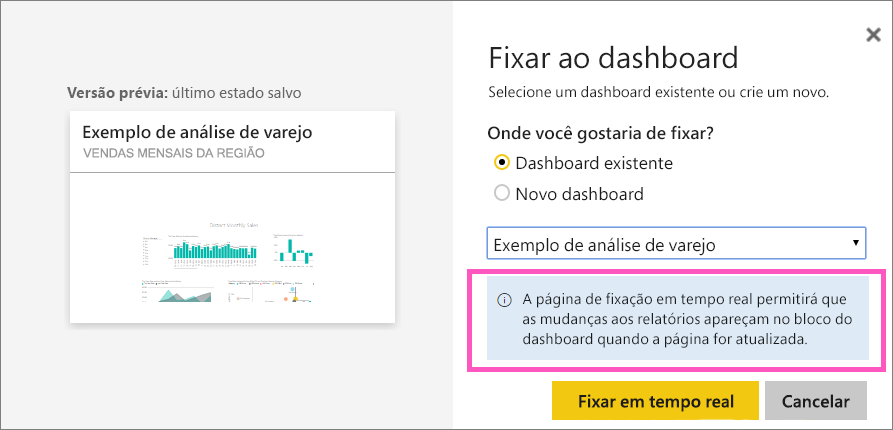

# Fixar uma página inteira do relatório, como um bloco dinâmico, em um painel do Power BI
Outra maneira de adicionar um novo [bloco do dashboard](service-dashboard-tiles.md) é fixar uma página inteira do relatório. Essa é uma maneira fácil de fixar mais de uma visualização por vez.  Além disso, quando você fixa uma página inteira, os blocos são *dinâmicos*, sendo possível interagir com eles diretamente no painel. E as alterações feitas a qualquer uma das visualizações no editor de relatórios, como adicionar um filtro ou alterar os campos usados no gráfico, também são refletidas no bloco do painel.  

Fixar blocos dinâmicos de relatórios nos painéis só está disponível no serviço Power BI (app.powerbi.com).

> [!NOTE]
> Não é possível fixar blocos de relatórios que são compartilhados com você.
> 
> 

## Fixar uma página do relatório
Veja Amanda fixar uma página dinâmica do relatório em um dashboard e siga as instruções passo a passo abaixo do vídeo para testá-lo por conta própria.

<iframe width="560" height="315" src="https://www.youtube.com/embed/EzhfBpPboPA" frameborder="0" allowfullscreen></iframe>

1. Abra um relatório no [Modo de Exibição de Edição](service-interact-with-a-report-in-editing-view.md).
2. Sem nenhuma visualização selecionada, na barra de menus, selecione **Fixar esta Página em Tempo Real**.
   
    
3. Fixe o bloco em um painel existente ou em um novo painel. Observe o texto realçado: *Fixar esta página em tempo real permite que as alterações nos relatórios sejam exibidas no bloco do painel quando a página é atualizada.*
   
   * Painel existente: selecione o nome do painel no menu suspenso. Painéis que foram compartilhados com você não aparecerão na lista suspensa.
   * Novo painel: digite o nome do novo painel.
     
     
4. Selecione **Fixar em tempo real**. Uma mensagem de Êxito (próximo ao canto superior direito) informa que a página foi adicionada, como um bloco, ao painel.

## Abrir o dashboard para ver o bloco dinâmico fixado
1. No painel de navegação, selecione o painel com o novo bloco dinâmico. Nele, você pode executar ações como [renomear, redimensionar, vincular e mover](service-dashboard-edit-tile.md) a página de relatório fixada.  
2. Interagir com os blocos dinâmicos.  Na captura de tela abaixo, selecionando uma barra no gráfico de colunas há um filtro cruzado e realçado entre outras visualizações do bloco.
   
    

## Próximas etapas
[Dashboards no Power BI](service-dashboards.md)

Mais perguntas? [Experimente a Comunidade do Power BI](http://community.powerbi.com/)

