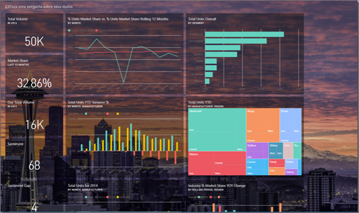
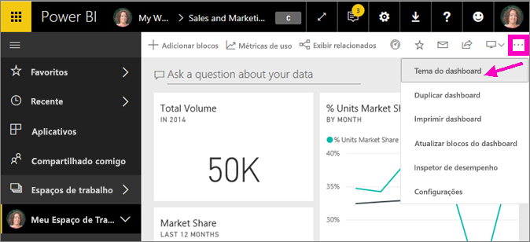
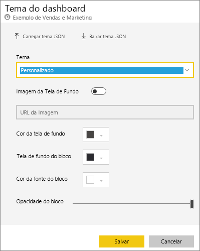
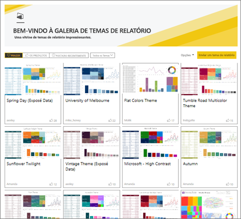
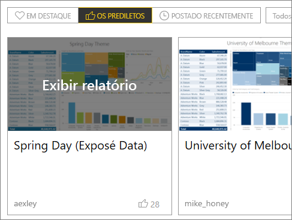
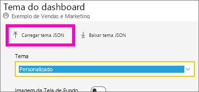
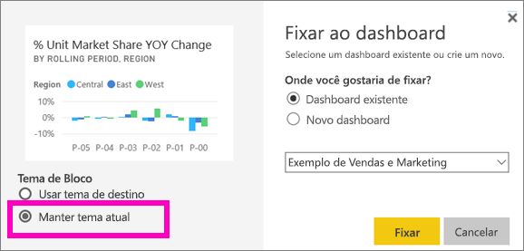
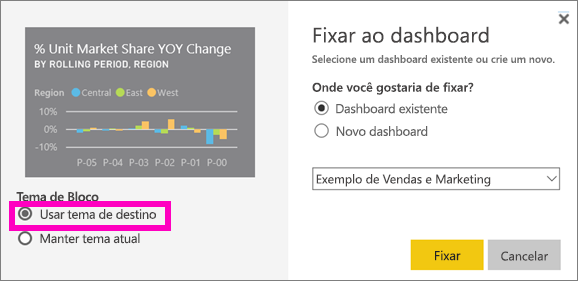

# Usar temas de dashboard no serviço do Power BI
Com **Temas do dashboard**, é possível aplicar um tema de cor ao dashboard inteiro, como as cores da empresa, uma coloração sazonal ou qualquer outro tema de cor que você queira aplicar. Quando você aplicar um **Tema do dashboard**, todos os visuais no dashboard passarão a usar as cores do tema selecionado (aplicam-se algumas exceções que serão descritas posteriormente neste artigo).

Alterar as cores dos visuais do relatório no dashboard não os afetará. Além disso, quando você fixar blocos de um relatório que já tenha um [tema de relatório](desktop-report-themes.md), você terá a opção de manter o tema atual ou usar o tema do dashboard.

## Pré-requisitos
* Para acompanhar, [abra o dashboard de exemplo de Vendas e Marketing](sample-datasets.md).

## Como funcionam os temas de dashboard
Para começar, abra um dashboard que você criou (ou tenha a permissão de editar) e deseja personalizar. Selecione as reticências (...) e escolha **Tema do dashboard**. 

No painel do dashboard exibido, selecione um dos temas predefinidos.  No exemplo a seguir, selecionamos **Escuro**.

## Criar um tema personalizado

O tema padrão para dashboards do Power BI é **Claro**. Se você quiser personalizar as cores ou criar um tema próprio, selecione **Personalizado** na lista suspensa. 

Use as opções personalizadas para criar seu próprio tema de dashboard. Caso você adicione uma imagem de tela de fundo, é recomendável que ela tenha uma resolução de no mínimo 1.920 x 1.080.  

### Usar temas JSON
Outra maneira de criar um tema personalizado é carregar um arquivo JSON que tenha as configurações para todas as cores que você deseja usar no dashboard. No Power BI Desktop, os criadores de relatório usam arquivos JSON para [criar temas para relatórios](desktop-report-themes.md). Esses arquivos JSON podem ser carregados nos dashboards ou você pode encontrar e carregar arquivos JSON da [página da Galeria de Temas](https://community.powerbi.com/t5/Themes-Gallery/bd-p/ThemesGallery) da Comunidade do Power BI 

Também é possível salvar um tema personalizado como um arquivo JSON e, em seguida, compartilhá-lo com outros criadores de dashboards. 

### Usar um tema da Galeria de Temas

Assim como as opções internas e personalizadas, quando o tema é carregado, as cores serão aplicadas automaticamente a todos os blocos do dashboard. 

1. Passe o mouse sobre um tema e escolha **Exibir relatório**.

    

2. Role para baixo e localize o link para o arquivo JSON.  Selecione o ícone de download e salve o arquivo.

    

3. No serviço do Power BI, na janela de tema do dashboard personalizado, escolha **Carregar tema JSON**.

    

4. Navegue até o local em que você salvou o arquivo do tema JSON e selecione **Abrir**.

5. Na página de tema do dashboard, selecione **Salvar**. O novo tema será aplicado ao dashboard.

    

## Considerações e limitações

* Se o relatório estiver usando um tema diferente do tema do dashboard, você poderá controlar se o visual retém o tema atual ou usa o tema padrão do dashboard para obter consistência em elementos visuais de várias fontes. Ao fixar um bloco em um dashboard, para manter o tema do relatório, selecione **Manter tema atual**. O visual, no dashboard, manterá o tema do relatório, incluindo configurações de transparência. 

    Você só verá opções de **Tema de bloco** se tiver criado o relatório no Power BI Desktop, [adicionado um tema de relatório](desktop-report-themes.md) e, em seguida, publicado o relatório no serviço do Power BI. 

    

    Tente fixar novamente o bloco e selecionar **Usar tema de dashboard**.

    

* No momento, os temas de dashboard não são compatíveis com a exibição do dashboard inserido pela API REST, em dispositivos móveis ou por usuários externos.    
* Os temas de dashboard não podem ser aplicados a páginas de relatórios em tempo real fixadas, blocos iframe, blocos SSRS, blocos de pasta de trabalho ou imagens.
* Os temas de dashboard podem ser exibidos em dispositivos móveis, mas só podem ser criados no serviço do Power BI. 
* Os temas de dashboard personalizados só funcionam com blocos fixados de relatórios. 

