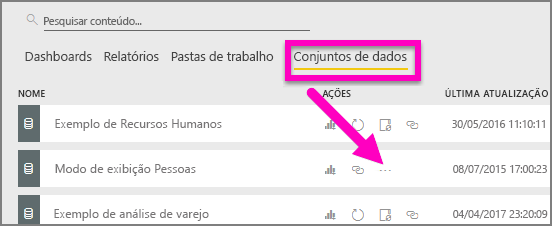
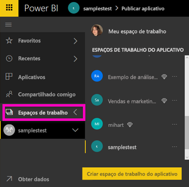
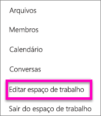
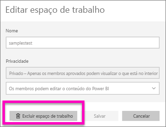
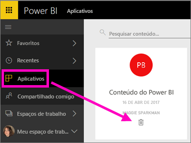

# Excluir quase tudo no serviço do Power BI
Este artigo ensina como excluir um dashboard, um relatório, uma pasta de trabalho, um conjunto de dados, um aplicativo, uma visualização e um espaço de trabalho no serviço do Power BI.

## Excluir um painel
Os painéis podem ser removidos. Remover o painel não exclui o conjunto de dados subjacente ou os relatórios associados a esse painel.

* Se você for o proprietário do painel, poderá removê-lo. Se você compartilhou o painel com colegas, remover o painel de seu espaço de trabalho do Power BI removerá o painel do espaço de trabalho do Power BI de seus colegas.
* Se um painel de controle for compartilhado com você e você não deseja vê-lo, é possível removê-lo.  Remover um painel não o remove do espaço de trabalho do Power BI de outra pessoa.
* Se um dashboard fizer parte de um [pacote de conteúdo organizacional](service-organizational-content-pack-disconnect.md), a única maneira de removê-lo é remover o conjunto de dados associado.

### Excluir um painel
1. Em seu espaço de trabalho, selecione a guia **Dashboards**.
2. Localize o dashboard a ser excluído e selecione o ícone Excluir .

    

## Excluir um relatório
Não se preocupe, excluir um relatório não exclui o conjunto de dados que o relatório está baseado.  E quaisquer visualizações que você tenha fixado por meio do relatório também estão seguras - permanecem no painel até você excluí-las individualmente.

### Para excluir um relatório
1. Em seu espaço de trabalho, selecione a guia **Relatórios**.
2. Localize o relatório a ser excluído e selecione o ícone Excluir   .   

    
3. Confirme a exclusão.

   

   > [!NOTE]
   > Se o relatório fizer parte de um [pacote de conteúdo](service-organizational-content-pack-introduction.md), você não poderá excluí-la usando esse método.  Consulte [Remover a conexão com um pacote de conteúdo organizacional](service-organizational-content-pack-disconnect.md).
   >
   >

## Excluir uma pasta de trabalho
As pastas de trabalho podem ser removidas. No entanto, a remoção de uma pasta de trabalho também remove todos os relatórios e blocos de dashboard que contêm dados desta pasta de trabalho.

Se a pasta de trabalho está armazenada no OneDrive for Business, excluí-la do Power BI não a exclui do OneDrive.

### Para excluir uma pasta de trabalho
1. Em seu espaço de trabalho, selecione a guia **Pastas de trabalho**.
2. Localize a pasta de trabalho a ser excluída e selecione o ícone  Excluir.

    
3. Confirme a exclusão.

   

## Excluir um conjunto de dados
Os conjuntos de dados podem ser excluídos. No entanto, excluir um conjunto de dados também exclui todos os relatórios e blocos de painel que contêm dados desse conjunto de dados.

Se um conjunto de dados fizer parte de um ou mais [pacotes de conteúdo organizacional](service-organizational-content-pack-disconnect.md), a única maneira de exclui-lo é removê-lo dos pacotes de conteúdo em que ele está sendo usado, aguardar para que isso seja processado e tentar excluí-lo novamente.

### Para excluir um conjunto de dados
1. Em seu espaço de trabalho, selecione a guia **Conjuntos de dados**.
2. Localize o conjunto de dados para excluir e selecione as reticências (...).  

    
3. No menu suspenso, selecione **Excluir**.

   
4. Confirme a exclusão.

   

## Excluir um espaço de trabalho de aplicativo
> [!WARNING]
> Quando você cria um espaço de trabalho do aplicativo, você cria um grupo do Office 365. E quando você exclui um espaço de trabalho do aplicativo, você exclui esse grupo do Office 365. Isso significa que o grupo também será excluído de outros produtos do O365 como o SharePoint e o Microsoft Teams.
>
>

Como autor do espaço de trabalho do aplicativo, você poderá excluí-lo. Ao excluí-lo, o aplicativo associado também é excluído de todos os membros do grupo e removido do seu AppSource, caso você tenha publicado o aplicativo para toda a sua organização. Excluir um espaço de trabalho de aplicativo é diferente de sair de um espaço de trabalho de aplicativo.

### Para excluir um espaço de trabalho de aplicativo – caso você seja um Administrador
1. No menu de navegação à esquerda, selecione **Espaços de trabalho**

    
2. Selecione as reticências (...) à direita do espaço de trabalho a ser excluída e escolha **Editar espaço de trabalho**.

   
3. Na janela **Editar espaço de trabalho**, selecione **Excluir espaço de trabalho** > **Excluir**.

    

### Para remover um espaço de trabalho de aplicativo da sua lista
Se você não deseja mais ser um membro de um espaço de trabalho de aplicativo, você pode ***sair*** dele e ele será removido da sua lista. Sair de um espaço de trabalho deixa-o no lugar para todos os outros membros do espaço de trabalho.  

> [!IMPORTANT]
> Se você for o único Administrador do espaço de trabalho do aplicativo, o Power BI não permitirá que você saia.
>
>

1. Inicie o espaço de trabalho de aplicativo que você deseja remover.
2. No canto superior direito, selecione as reticências (...) e escolha **Sair do espaço de trabalho** > **Sair**.

      

   > [!NOTE]
   > As opções exibidas na lista suspensa dependem se você é um Administrador ou um Membro desse espaço de trabalho do aplicativo.
   >
   >

## Excluir ou remover um aplicativo
Os aplicativos podem ser removidos facilmente da sua página de lista de aplicativos. Mas somente um Administrador de aplicativo pode excluir permanentemente um aplicativo.

### Remover um aplicativo de sua página de lista de aplicativos
A exclusão de um aplicativo de sua página de lista de aplicativos não exclui o aplicativo para outros membros.

1. No seu menu de navegação à esquerda, selecione **Aplicativos** para abrir a página de lista de aplicativos.
2. Passe o mouse sobre o aplicativo a ser excluído e selecione o ícone Excluir .

   

   Se você remover um aplicativo acidentalmente, você terá várias opções para obtê-lo novamente.  Você pode solicitar ao criador do aplicativo para enviá-lo novamente, pode encontrar o email original com o link para o aplicativo, pode verificar seu [Centro de Notificações](service-notification-center.md) para ver se a notificação desse aplicativo ainda está listada ou pode verificar o [AppSource](service-install-use-apps.md) da sua organização.

## Considerações e solução de problemas
Este artigo abordou como excluir os principais elementos básicos do serviço do Power BI. Mas há mais coisas que você pode excluir no Power BI.  

* [Remover seu Dashboard em destaque](service-dashboard-featured.md#change-the-featured-dashboard)
* [Remover (dos favoritos) um dashboard](service-dashboard-favorite.md)
* [Excluir uma página de relatório](service-delete.md)
* [Excluir um bloco de dashboard](service-dashboard-edit-tile.md)
* [Excluir uma visualização de relatório](service-delete.md)

Mais perguntas? [Experimente a Comunidade do Power BI](http://community.powerbi.com/)
