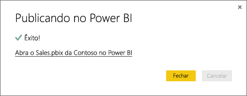

# Obter dados de arquivos do Power BI Desktop

O **Power BI Desktop** facilita o business intelligence e a emissão de relatórios. Seja se conectando a diferentes fontes de dados, consultando e transformando dados, modelando seus dados e criando relatórios avançados e dinâmicos, o **Power BI Desktop** torna as tarefas de business intelligence rápidas e intuitivas. Se ainda não estiver familiarizado com o **Power BI Desktop**, confira a [Introdução ao Power BI Desktop](desktop-getting-started.md).

Depois de inserir dados no **Power BI Desktop** e criar alguns relatórios, é hora de inserir seu arquivo salvo no **serviço do Power BI**.

## O local em que o arquivo é salvo faz a diferença
**Local** - Caso o arquivo seja salvo em uma unidade local no computador ou em outro local em sua organização, por meio do Power BI Desktop, é possível *importar* o arquivo ou *publicá-lo* para inserir os dados e relatórios no Power BI. Na verdade, o arquivo permanecerá na unidade local; portanto, o arquivo completo não é, de fato, movido para o Power BI. O que realmente ocorre é que um novo conjunto de dados é criado no Power BI e os dados e o modelo de dados do arquivo do Power BI Desktop são carregados nesse conjunto de dados. Se o arquivo tiver relatórios, eles serão exibidos no site do Power BI em Relatórios.

**OneDrive - Business** – Caso você tenha o OneDrive for Business e entre com a mesma conta usada para o logon no Power BI, essa será, sem dúvida, a maneira mais efetiva de manter seu trabalho no Power BI Desktop em sincronia com seu conjunto de dados, seus relatórios e dashboards no Power BI. Visto que tanto o Power BI quanto o OneDrive ficam na nuvem, o Power BI se *conecta* ao seu arquivo no OneDrive em intervalos aproximados de sessenta minutos. Caso sejam encontradas alterações, o conjunto de dados, os relatórios e os dashboards serão atualizados automaticamente no Power BI.

**OneDrive - Personal** – Caso os arquivos sejam salvos em sua própria conta do OneDrive, você aproveitará vários dos mesmos benefícios que teria com o OneDrive for Business. A maior diferença é que, na primeira conexão ao arquivo (usando Obter Dados > Arquivos > OneDrive – Personal), será necessário entrar no OneDrive com sua conta da Microsoft, que, normalmente, é diferente daquela usada para fazer logon no Power BI. Ao entrar no OneDrive com sua conta da Microsoft, certifique-se de selecionar a opção Mantenha-me conectado. Dessa forma, o Power BI poderá se conectar ao seu arquivo em intervalos aproximados de sessenta minutos e garantir que o conjunto de dados no Power BI está em sincronia.

**SharePoint – Sites de Equipe** – Salvar seus arquivos do Power BI Desktop no SharePoint – Sites de Equipe é muito semelhante a salvá-los no OneDrive for Business. A maior diferença nesse caso é como você se conecta ao arquivo do Power BI. É possível especificar uma URL ou conectar-se à pasta raiz.

## Importar ou conectar-se a um arquivo do Power BI Desktop por meio do Power BI
>[!IMPORTANT]
>O tamanho máximo do arquivo que pode ser importado no Power BI é de 1 gigabyte.

1. No Power BI, no painel do navegador, clique em **Obter Dados**.
   
   
2. Em **Arquivos**, clique em **Obter**.
   
   
3. Encontre o arquivo. Os arquivos do Power BI Desktop têm a extensão .PBIX.
   
   

## Publicar um arquivo em seu site do Power BI por meio do Power BI Desktop
O uso do recurso Publicar por meio do Power BI Desktop é praticamente o mesmo que usar o recurso Obter Dados no Power BI para importar o arquivo de uma unidade local ou se conectar a ele no OneDrive.  Apresentamos aqui o passo a passo rápido, mas é possível ver [Publicar por meio do Power BI Desktop](desktop-upload-desktop-files.md) para saber mais.

1. No Power BI Desktop, clique em **Arquivo** > **Publicar** > **Publicar no Power BI** ou clique em **Publicar** na faixa de opções.
   
   
2. Entre no Power BI. Você só precisará fazer isso na primeira vez.
   
   Ao concluir, você receberá um link para abrir o relatório no seu site do Power BI.
   
   

## Próximas etapas
**Explore os dados** – Depois de obter dados e relatórios de seu arquivo no Power BI, é hora de explorá-los. Se o arquivo já contiver relatórios, eles aparecerão no painel do navegador em **Relatórios**. Se o arquivo tinha apenas dados, é possível criar novos relatórios; basta clicar com o botão direito do mouse no novo conjunto de dados e clicar em **Explorar**.

**Atualizar fontes de dados externas** - Se o arquivo do Power BI Desktop se conectar a fontes de dados externas, será possível configurar a atualização agendada para garantir que o conjunto de dados está sempre atualizado. Na maioria dos casos, é muito fácil configurar a atualização agendada; no entanto, não entraremos em detalhes sobre essa configuração neste artigo, pois isso está fora do escopo. Veja [Atualização de dados no Power BI](refresh-data.md) para saber mais.

