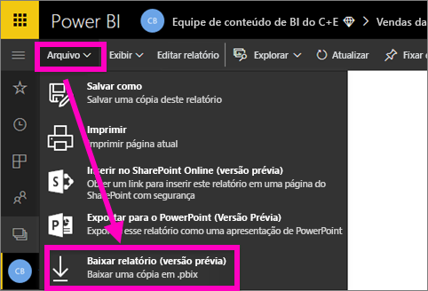
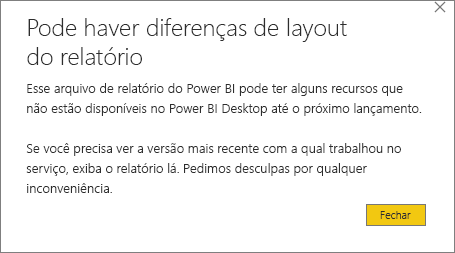
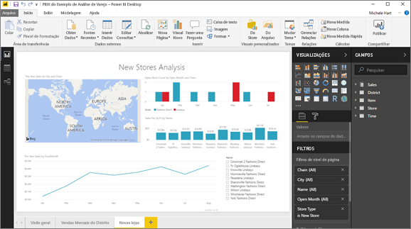

# Exportar um relatório do serviço do Power BI para o Desktop (visualização)
No Power BI Desktop, você pode exportar (também conhecido como *baixar*) um relatório para o serviço do Power BI ao salvá-lo e selecionar **Publicar**. Também é possível exportar de volta e baixar um relatório do serviço do Power BI para o Desktop. A extensão para os arquivos exportados, em qualquer direção, é *.pbix*.

Há algumas limitações e considerações a serem feitas, que são abordadas neste artigo.

## Baixar o relatório como um .pbix
Para baixar o arquivo .pbix, siga estas etapas:

1. No **serviço do Power BI**, abra o relatório que você deseja baixar no [modo de exibição de Edição](service-reading-view-and-editing-view.md).
2. Na barra de menus, selecione **Arquivo > Baixar relatório**.
   
   > [!NOTE]
   > O relatório deve ter sido [criado com o Power BI Desktop](guided-learning/publishingandsharing.yml#step-2) após 23 de novembro de 2016 – e atualizado desde então – para que você consiga baixá-lo. Caso contrário, a opção de menu *Baixar Relatório* no serviço do Power BI ficará acinzentada.
   > 
   > 
3. Durante a criação do arquivo .pbix, uma faixa de status exibe o progresso. Quando o arquivo estiver pronto, você será solicitado a abrir ou salvar o arquivo .pbix. O nome do arquivo corresponde ao título do relatório.
   
    
   
    Agora, existe a opção de abrir o arquivo .pbix no serviço do Power BI (app.powerbi.com) ou no Power BI Desktop.     
4. Para abrir imediatamente o relatório no Desktop, selecione **Abrir**. Para salvar o arquivo em um local específico, selecione **Salvar > Salvar Como**. [Instale o Power BI Desktop](desktop-get-the-desktop.md), caso ainda não tenha feito isso.
   
    Ao abrir o relatório no Desktop, uma mensagem de aviso pode ser exibida informando que alguns recursos disponíveis no relatório do serviço do Power BI talvez não estejam disponíveis no Desktop.
   
    

5. Os editores de relatórios do Power BI Desktop e do serviço do Power BI são muito semelhantes.  
   
    

## Considerações e solução de problemas
Há algumas considerações e limitações importantes associadas ao download (exportação) de um arquivo *.pbix* no serviço do Power BI.

* Para baixar o arquivo, você deve ter acesso de edição ao relatório
* O relatório deve ter sido criado usando o **Power BI Desktop** e ter sido *publicado* no **serviço Power BI**, ou o .pbix deve ter sido *carregado* no serviço.
* Os relatórios devem ser publicados ou atualizados após 23 de novembro de 2016. Relatórios publicados antes dessa data não poderão ser baixados.
* Esse recurso não funcionará com relatórios criados originalmente no **serviço do Power BI**, incluindo pacotes de conteúdo.
* Use sempre a última versão do **Power BI Desktop** ao abrir os arquivos baixados. Talvez não seja possível abrir os arquivos *.pbix* baixados em versões não atuais do **Power BI Desktop**.
* Se o administrador tiver desativado a capacidade de exportar dados, esse recurso não estará visível no **serviço do Power BI**.

## Próximas etapas
Assista ao vídeo de um minuto **Guy in a Cube** sobre esse recurso:

<iframe width="560" height="315" src="https://www.youtube.com/embed/ymWqU5jiUl0" frameborder="0" allowfullscreen></iframe>

Além disso, estes são alguns outros artigos que podem ajudá-lo a saber como usar o **serviço do Power BI**:

* [Relatórios no Power BI](service-reports.md)
* [Power BI – conceitos básicos](service-basic-concepts.md)

Depois que você instalar o **Power BI Desktop**, o conteúdo a seguir poderá ajudá-lo a colocar ele em funcionamento rapidamente:

* [Introdução ao Power BI Desktop](desktop-getting-started.md)

Mais perguntas? [Experimente a Comunidade do Power BI](http://community.powerbi.com/)   

