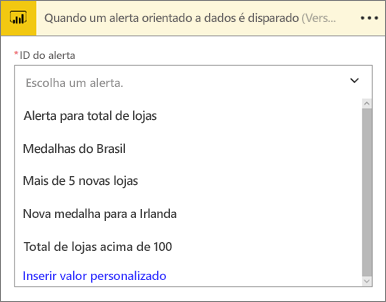
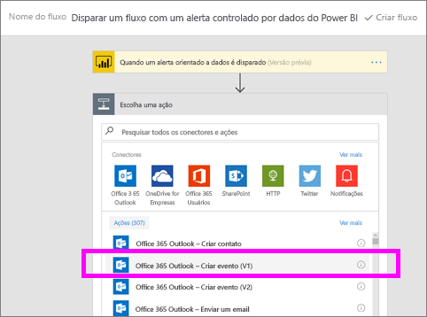
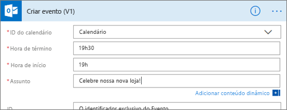

# Microsoft Flow e Power BI

[Microsoft Flow](https://flow.microsoft.com/en-us/documentation/getting-started) é uma oferta de SaaS para automatizar os fluxos de trabalho entre o número crescente de serviços SaaS e aplicativos nos quais os usuários empresariais dependem. Com o Flow, é possível automatizar tarefas integrando seus aplicativos e serviços favoritos (incluindo o Power BI) para obter notificações, sincronizar os arquivos, coletar dados e muito mais. Tarefas repetitivas se tornam fácil com a automação do fluxo de trabalho.

[Começar a usar o Flow agora.](https://flow.microsoft.com/documentation/getting-started)

Assista a Sirui criar um Fluxo que envia um email detalhado para colegas quando um alerta do Power BI é disparado. Em seguida, siga as instruções passo a passo abaixo do vídeo para testá-la por conta própria.

<iframe width="560" height="315" src="https://www.youtube.com/embed/YhmNstC39Mw" frameborder="0" allowfullscreen></iframe>

## Criar um fluxo disparado por um alerta de dados do Power BI
Este tutorial mostra como criar dois fluxos diferentes; um de um modelo e um do zero. Para acompanhar, [crie um alerta de dados no Power BI](service-set-data-alerts.md) e [inscreva-se no Microsoft Flow](https://flow.microsoft.com/en-us/#home-signup) (é gratuito!).

## Criar um fluxo que usa Power BI de um modelo
Nesta tarefa, usaremos um modelo para criar um fluxo simples que é disparado por um alerta de dados do Power BI (notificação).

1. Entre no Microsoft Flow (flow.microsoft.com).
2. Selecione **Meus fluxos**.
   
   
3. Selecione **Criar do modelo**.
   
    
4. Use a caixa Pesquisar para localizar modelos de Power BI e selecione **Postar uma mensagem em um canal Slack quando um alerta de dados do Power BI for disparado**.
   
    
5. Selecione **Usar este modelo**.
   
   
6. Se solicitado, conecte-se ao Slack e ao Power BI selecionando **Entrar** e, em seguida, siga as instruções. Uma marca de seleção verde permite saber o que você está conectado.  Depois de confirmar suas conexões, selecione **Continuar**.
   
   

### Criar o fluxo
Este modelo tem um gatilho (alerta de dados do Power BI para novas medalhas olímpicas para Irlanda) e uma ação (postar uma mensagem para a o Slack). Conforme você seleciona um campo, o Flow exibe conteúdo dinâmico que pode ser incluído.  Nesse exemplo, incluímos o valor e a URL do bloco no corpo da mensagem.

1. No menu suspenso do gatilho, selecione um alerta de dados do Power BI. Selecione **Nova medalha para a Irlanda**. Para saber como criar um alerta, consulte [Alertas de dados no Power BI](service-set-data-alerts.md).
   
   
2. Para postar no Slack, digite o nome do canal e texto da mensagem (você também pode selecionar a mensagem padrão que o Flow cria). Observe o conteúdo dinâmico que incluímos no campo de texto da mensagem.
   
   > [!NOTE]
   > Inclua "@" no início do nome do canal.  Por exemplo, se o canal Slack for chamado “channelA”, insira "@channelA" no Flow.
   > 
   > 
   
   
3. Ao terminar, selecione **Criar fluxo** ou **Salvar fluxo**.  O fluxo é criado e avaliado.  O Flow avisa se encontrar erros.
4. Se forem encontrados erros, selecione **Editar fluxo** para corrigi-los, caso contrário, selecione **Feito** para executar o novo fluxo.
   
   
5. Abra sua conta do Slack para ver a mensagem.  
   
   

## Criar um fluxo que usa o Power BI do zero (em branco)
Nesta tarefa, criaremos um fluxo simples do zero que é disparado por um alerta de dados do Power BI (notificação).

1. Entre no Microsoft Flow.
2. Selecione **Meus fluxos** > **Criar em branco**.
   
   
3. Use a caixa Pesquisar para encontrar um gatilho do Power BI e selecione **Disparar um fluxo com um alerta controlado por dados do Power BI**.

### Criar seu fluxo
1. No menu suspenso, selecione o nome do alerta.  Para saber como criar um alerta, consulte [Alertas de dados no Power BI](service-set-data-alerts.md).
   
    
2. Selecione **Nova etapa** > **Adicionar uma ação**.
   
   
3. Pesquise por **Outlook** e selecione **Criar evento**.
   
   
4. Preencha os campos no evento. Conforme você seleciona um campo, o Flow exibe conteúdo dinâmico que pode ser incluído.
   
   
5. Selecione **Criar fluxo** quando terminar.  O Flow salva e avalia o fluxo. Se não houver nenhum erro, selecione **Feito** para executar esse fluxo.  O novo fluxo é adicionado à página **Meus fluxos**.
   
   
6. Quando o fluxo for disparado pelo alerta de dados do Power BI, você receberá uma notificação de eventos do Outlook semelhante a esta.
   
    

## Próximas etapas
* [Introdução ao Microsoft Flow](https://flow.microsoft.com/en-us/documentation/getting-started/)
* [Definir alertas de dados no serviço do Power BI](service-set-data-alerts.md)
* [Definir alertas de dados no seu iPhone](mobile-set-data-alerts-in-the-mobile-apps.md)
* [Definir alertas de dados no aplicativo móvel do Power BI para Windows 10](mobile-set-data-alerts-in-the-mobile-apps.md)
* Mais perguntas? [Experimente a Comunidade do Power BI](http://community.powerbi.com/)

