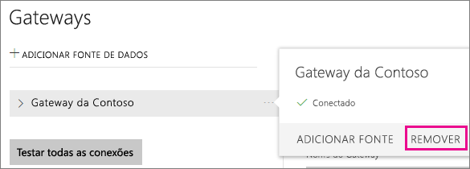
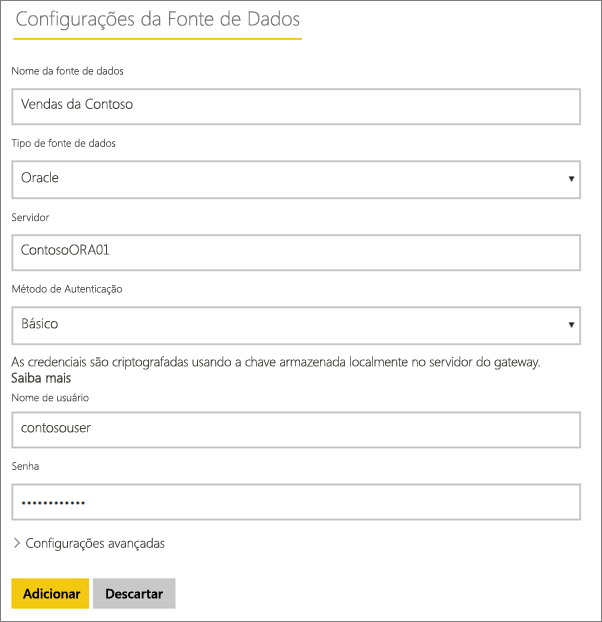
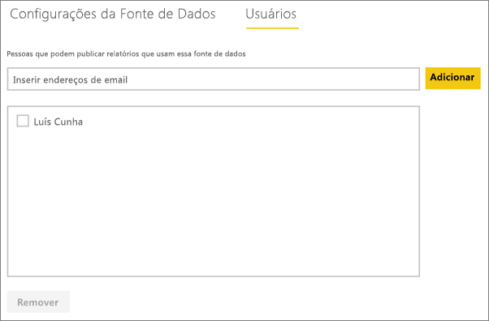

# Gerenciar sua fonte de dados – Importar/Atualização Agendada
Depois de instalar o Gateway de Dados Local, será necessário adicionar fontes de dados que podem ser usadas com o gateway. Este artigo examinará como trabalhar com os gateways e fontes de dados que são usadas para a atualização agendada em vez das conexões dinâmicas ou do DirectQuery.

## Baixar e instalar o gateway
É possível baixar o gateway no serviço do Power BI. Selecione **Downloads** > **Gateway de Dados** ou vá para a [página de download do gateway](https://go.microsoft.com/fwlink/?LinkId=698861).

## Adicionar um gateway
Para adicionar um gateway, basta [baixar](https://go.microsoft.com/fwlink/?LinkId=698863) e instalar o gateway corporativo em um servidor de seu ambiente. Depois de instalar o gateway, ele será mostrado na lista de gateways em **Gerenciar gateways**.

> [!NOTE]
> **Gerenciar gateways** não será mostrado até que você seja o administrador de, pelo menos, um gateway. Isso pode acontecer ao ser adicionado como um administrador ou ao instalar e configurar um gateway.
> 
> 

## Excluir um gateway
A exclusão de um gateway também excluirá as fontes de dados contidas nele.  Isso também interromperá todos os painéis e relatórios que dependem dessas fontes de dados.

1. Selecione o ícone de engrenagem  no canto superior direito > **Gerenciar gateways**.
2. Gateway > **Remover**
   
   

## Adicionar uma fonte de dados
É possível adicionar uma fonte de dados selecionando um gateway e clicando em **Adicionar fonte de dados** ou acessando Gateway > **Adicionar fonte de dados**.

Você pode selecionar o **Tipo de Fonte de Dados** na lista. Todas as fontes de dados relacionadas podem ser usadas para atualização agendada com o gateway corporativo. O Analysis Services, o SQL Server e o SAP HANA podem ser usados para a atualização agendada ou para o DirectQuery/conexões dinâmicas.

Em seguida, é necessário preencher as informações sobre a fonte de dados, que inclui as informações de origem e as credenciais usadas para acessar a fonte de dados.

> [!NOTE]
> Todas as consultas à fonte de dados serão executadas com essas credenciais. Para obter mais informações, veja o artigo principal sobre o gateway de dados local para saber mais sobre como as [credenciais](service-gateway-onprem.md#credentials) são armazenadas.
> 
> 

Você pode clicar em **Adicionar** depois preencher tudo.  Agora você pode usar esta fonte de dados para a atualização agendada com seus dados locais. Você verá *Conexão Bem-sucedida* , se tiver êxito.

<!-- Shared Install steps Include -->
[!INCLUDE [gateway-onprem-datasources-include](./includes/gateway-onprem-datasources-include.md)]

### Configurações avançadas
Você pode configurar o nível de privacidade para sua fonte de dados. Ele controla como os dados podem ser combinados. É usado somente para a atualização agendada. [Saiba mais](https://support.office.com/article/Privacy-levels-Power-Query-CC3EDE4D-359E-4B28-BC72-9BEE7900B540)

## Remover uma fonte de dados
A remoção de uma fonte de dados interromperá todos os painéis ou relatórios que dependem da fonte de dados em questão.  

Para remover uma Fonte de Dados, vá para a Fonte de Dados > **Remover**.

## Gerenciar administradores
Na guia Administradores, para o gateway, você pode adicionar e remover os usuários que podem administrar o gateway. Você pode adicionar usuários apenas neste momento. Não é possível adicionar grupos de segurança.

## Gerenciar usuários
Na guia Usuários, da fonte de dados, você pode adicionar e remover os usuários ou grupos de segurança que podem usar essa fonte de dados.

> [!NOTE]
> A lista de usuários só controla quem tem permissão de publicar relatórios. Os proprietários de relatório podem criar painéis ou pacotes de conteúdo e compartilhá-los com outros usuários.
> 
> 

## Usando a fonte de dados para a atualização agendada
Depois de criar a fonte de dados, ela estará disponível para uso com as conexões do DirectQuery ou por meio da atualização agendada.

> [!NOTE]
> Os nomes do servidor e do banco de dados devem corresponder entre o Power BI Desktop e a fonte de dados no gateway de dados local!
> 
> 

O vínculo entre o conjunto de dados e a fonte de dados no gateway baseia-se nos nomes do servidor e do banco de dados. Eles devem corresponder. Por exemplo, se você fornecer um Endereço IP para o nome do servidor, no Power BI Desktop, será necessário usar o Endereço IP para a fonte de dados na configuração do gateway. Se você usar *SERVIDOR\INSTÂNCIA*, no Power BI Desktop, precisará usar o mesmo na fonte de dados configurada para o gateway.

Se você estiver listado na guia **Usuários** da fonte de dados configurada no gateway e houver a correspondência entre os nomes do servidor e do banco de dados, você verá o gateway como uma opção a ser usada com a atualização agendada.

> [!WARNING]
> Se seu conjunto de dados contiver várias fontes de dados, cada uma delas deverá ser adicionada dentro do gateway. Se uma ou mais fontes de dados não forem adicionadas ao gateway, você não o verá como disponível para a atualização agendada.
> 
> 

## Limitações
* O OAuth não é um esquema de autenticação com suporte no gateway de dados local. Você não pode adicionar fontes de dados que exigem o OAuth. Se seu conjunto de dados tiver uma fonte de dados que exija o OAuth, você não poderá usar o gateway para a atualização agendada.

## Próximas etapas
[Gateway de dados local](service-gateway-onprem.md)  
[Detalhes sobre o Gateway de dados local](service-gateway-onprem-indepth.md)  
[Solução de problemas do Gateway de dados local](service-gateway-onprem-tshoot.md)  
Mais perguntas? [Experimente a Comunidade do Power BI](http://community.powerbi.com/)

