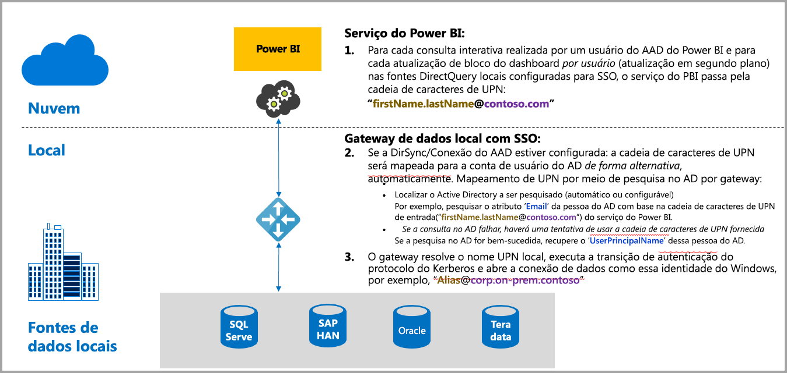
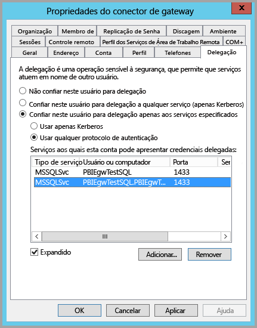
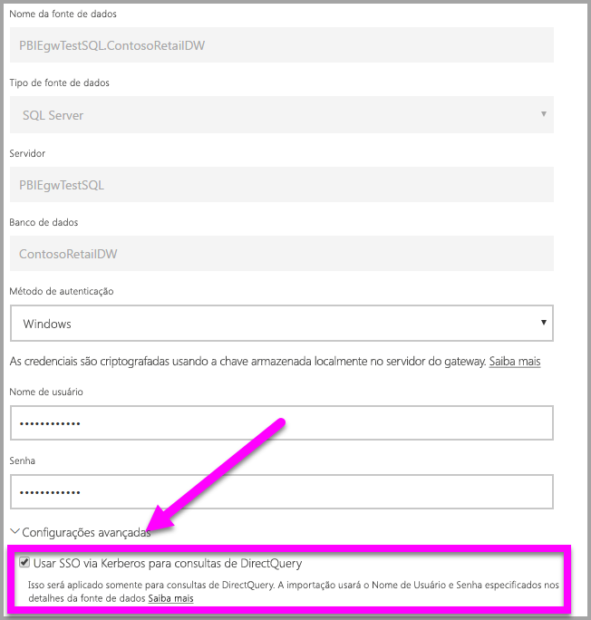
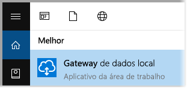
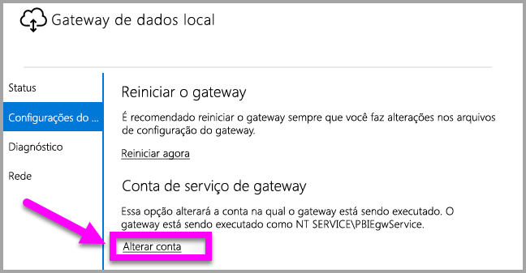

# Use o Kerberos para SSO (logon único) do Power BI para fontes de dados locais
Ao configurar o gateway de dados local com o Kerberos, você obterá conectividade ininterrupta de logon único para atualizar os relatórios e os dashboards do Power BI com base em dados locais. O Gateway de dados local facilita o SSO (logon único) com o DirectQuery, que é usado para a conexão às fontes de dados locais.

No momento, as seguintes fontes de dados são compatíveis: SQL Server, SAP HANA e Teradata. Todas elas são baseadas na [delegação restrita de Kerberos](https://technet.microsoft.com/library/jj553400.aspx).

* SQL Server
* SAP HANA
* SAP BW
* Teradata

Quando um usuário interage com um relatório do DirectQuery no serviço do Power BI, cada operação de filtro cruzado, de fatia, de classificação e de edição de relatório pode resultar em consultas de execução dinâmica com relação à fonte de dados local subjacente.  Quando o logon único é configurado para a fonte de dados, as consultas são executadas na identidade do usuário que interage com o Power BI (isto é, por meio da experiência na Web ou de aplicativos móveis do Power BI). Dessa forma, cada usuário vê precisamente os dados para os quais têm permissões na fonte de dados subjacente. Com o logon único configurado, não há cache de dados compartilhados entre usuários diferentes.

## Executando uma consulta com SSO: etapas em que isso ocorre
Uma consulta executada com SSO é formada por três etapas, conforme mostrado no diagrama a seguir.

> [!NOTE]
> SSO para Oracle ainda não está habilitado, mas está em desenvolvimento e será lançado em breve.
> 
> 

Veja abaixo mais detalhes sobre essas etapas:

1. Para cada consulta, o **serviço do Power BI** inclui o *nome UPN* ao enviar uma solicitação de consulta ao gateway configurado.
2. O gateway precisa mapear o UPN do Azure Active Directory para uma identidade do Active Directory local.
   
   a.  Se AAD DirSync (também conhecido como *AAD Connect*) for configurado, o mapeamento funcionará automaticamente no gateway.
   
   b.  Caso contrário, o gateway pode pesquisar e mapear o UPN do Azure AD para um usuário local ao executar uma pesquisa em relação ao domínio do Active Directory local.
3. O processo do serviço do gateway representa o usuário local mapeado, abre a conexão ao banco de dados subjacente e envia a consulta. O gateway não precisa estar instalado no mesmo computador que o banco de dados.
   
   - A representação e a conexão do usuário ao banco de dados só serão bem-sucedidas se a conta de serviço do gateway for uma conta de domínio (ou SID de serviço), e se a delegação restrita do Kerberos foi configurada para o banco de dados Aceitar tíquetes do Kerberos da conta de serviço do gateway.  
   
   > [!NOTE]
   > Em relação ao sid de serviço, se o AAD DirSync/Connect estiver configurado e as contas de usuário sincronizadas, o serviço de gateway não precisará realizar pesquisas AD adicionais no tempo de execução e você poderá usar o SID de serviço local (em vez de uma conta de domínio) para o serviço de gateway.  As etapas de configuração de delegação restrita de Kerberos descritas neste documento são as mesmas (são simplesmente aplicadas com base no SID do serviço, em vez da conta de domínio).
   > 
   > 

> [!NOTE]
> Para habilitar o SSO para SAP HANA:
>
> - Verifique se o servidor do SAP HANA está executando a versão mínima necessária, que depende do nível de plataforma de servidor do SAP HANA:
>     - [HANA 2 SPS 01 Rev 012.03](https://launchpad.support.sap.com/#/notes/2557386)
>     - [HANA 2 SPS 02 Rev 22](https://launchpad.support.sap.com/#/notes/2547324)
>     - [HANA 1 SP 12 Rev 122.13](https://launchpad.support.sap.com/#/notes/2528439)
>
> - No computador do gateway, instale o driver ODBC do HANA mais recente do SAP.  A versão mínima é o HANA ODBC versão 2.00.020.00 de agosto de 2017.
>
> Para saber mais sobre como configurar o logon único para SAP HANA usando o Kerberos, veja o tópico [Logon único usando Kerberos](https://help.sap.com/viewer/b3ee5778bc2e4a089d3299b82ec762a7/2.0.03/en-US/1885fad82df943c2a1974f5da0eed66d.html) no Guia de Segurança do SAP HANA e os links da página, particularmente a Nota SAP 1837331 – COMO HANA DBSSO Kerberos/Active Directory]. 
>
>

## Erros de configuração insuficiente do Kerberos
Se o gateway e o servidor de banco de dados subjacente não forem configurados corretamente para a **delegação restrita de Kerberos**, você receberá a seguinte mensagem de erro:

Além disso, os detalhes técnicos associados à mensagem de erro poderão ser parecidos com os seguintes:

O resultado é esse porque, devido à configuração insuficiente do Kerberos, o gateway não pôde representar o usuário de origem corretamente e houve falha na tentativa da conexão de banco de dados.

## Preparando-se para a delegação restrita de Kerberos
Vários itens devem ser configurados para que a delegação restrita de Kerberos funcione corretamente, incluindo os *SPNs* (nomes das entidades de serviço) e as configurações de delegação nas contas de serviço.

### Pré-requisito 1: instalar e configurar o gateway de dados local
Essa versão de gateway de dados local é compatível com atualização in-loco, bem como com o controle das configurações de gateway existentes.

### Pré-requisito 2: executar o serviço Windows do gateway como uma conta de domínio
Em uma instalação padrão, o gateway é executado como uma conta de serviço de computador local (especificamente, *NT Service\PBIEgwService*), conforme mostrado na imagem a seguir:

Para habilitar a **delegação restrita de Kerberos**, o gateway deve ser executado como uma conta de domínio, a menos que o AAD já esteja sincronizado com o Active Directory local (usando o DirSync/Connect do AAD). Para que a alteração de conta funcione corretamente, você tem duas opções:

* Se você iniciar com uma versão anterior do Gateway de dados local, siga precisamente todas as cinco etapas em sequência (incluindo a execução do configurador do gateway na etapa 3), conforme descrito no seguinte artigo:
  
  * [Alterando a conta de serviço do gateway para um usuário de domínio](https://powerbi.microsoft.com/documentation/powerbi-gateway-proxy/#changing-the-gateway-service-account-to-a-domain-user)
  * Caso já tenha instalado a versão prévia do Gateway de dados local, há uma nova abordagem guiada por interface do usuário para mudar as contas de serviço diretamente no configurador do gateway. Consulte a seção **Mudando o gateway para uma conta de domínio** próxima ao final deste artigo.

> [!NOTE]
> Se o AAD DirSync/Connect estiver configurado e as contas de usuário estiverem sincronizadas, o serviço do gateway não precisará executar pesquisas no AD local no tempo de execução e você poderá usar o SID de Serviço local (em vez de uma conta de domínio) para o serviço do gateway. As etapas de configuração da delegação restrita de Kerberos descritas neste artigo são as mesmas da configuração (elas são simplesmente aplicadas com base na SID do serviço, em vez da conta de domínio).
> 
> 

### Pré-requisito 3: ter direitos de administrador de domínio para configurar definições de SPNs (SetSPN) e da delegação restrita de Kerberos
Embora seja tecnicamente possível que um administrador de domínio conceda direitos temporários ou permanentes para alguém configurar a delegação de Kerberos e os SPNs sem exigir direitos de administrador de domínio, essa não é a abordagem recomendada. Na seção a seguir, veja em detalhes as etapas de configuração necessárias para o **Pré-requisito 3**.

## Configurando a delegação restrita de Kerberos para o gateway e a fonte de dados
Para configurar o sistema corretamente, é preciso configurar ou validar os dois itens a seguir:

1. Se necessário, configure um SPN para a conta de domínio do serviço do gateway (caso ainda não tenha sido criado).
2. Defina as configurações de delegação na conta de domínio do serviço do gateway.

Observe que é preciso ser administrador de domínio para executar as duas etapas de configuração.

As seções a seguir descrevem essas etapas individualmente.

### Configurar um SPN para a conta de serviço do gateway
Primeiro, determine se um SPN já foi criado para a conta de domínio usada como a conta de serviço do gateway, mas seguindo estas etapas:

1. Como administrador de domínio, inicie os **Usuários e Computadores do Active Directory**
2. Clique com o botão direito do mouse no domínio, selecione **Localizar** e digite o nome da conta de serviço do gateway
3. No resultado da pesquisa, clique com o botão direito do mouse na conta de serviço do gateway e selecione **Propriedades**.
   
   * Se a guia **Delegação** estiver visível na caixa de diálogo **Propriedades**, será a indicação que um SPN já foi criado e que você poderá pular para a próxima subseção sobre como definir as configurações de Delegação.

Se não houver nenhuma guia **Delegação** na caixa de diálogo **Propriedades**, você poderá criar manualmente um SPN nessa conta para adicionar a guia **Delegação** (que é a maneira mais fácil de definir as configurações de delegação). A criação de um SPN pode ser executada usando a [ferramenta setspn](https://technet.microsoft.com/library/cc731241.aspx) fornecida com o Windows (você precisa de direitos de administrador de domínio para criar o SPN).

Por exemplo, imagine que a conta de serviço do gateway seja “PBIEgwTest\GatewaySvc” e o nome do computador com o serviço do gateway em execução tenha o nome de **Machine1**. Para definir o SPN para a conta de serviço do gateway desse computador do exemplo, você precisará executar o seguinte comando:

Com a etapa concluída, podemos prosseguir para as configurações de delegação.

### Definir as configurações de delegação na conta de serviço do gateway
O segundo requisito de configuração são as configurações de delegação na conta de serviço do gateway. Há diversas ferramentas que podem ser usadas para realizar essas etapas. Neste artigo, usaremos os **Usuários e Computadores do Active Directory**, que é um snap-in do MMC (Console de Gerenciamento Microsoft) que você pode usar para administrar e publicar informações no diretório e que está disponível nos controladores de domínio por padrão. Você também pode habilitá-lo pela configuração do **Recurso do Windows** em outros computadores.

Precisamos configurar a **delegação restrita de Kerberos** com o trânsito de protocolos. Com a delegação restrita, é preciso ser explícito com os serviços para os quais você deseja delegar, por exemplo, somente o SQL Server ou o servidor SAP HANA aceitará chamadas de delegação da conta de serviço do gateway.

Esta seção considera que você já configurou SPNs para as fontes de dados subjacentes (como SQL Server, SAP HANA, Teradata e assim por diante). Para saber como configurar os SPNs do servidor da fonte de dados, consulte a documentação técnica do respectivo servidor de banco de dados. Você também pode conferir a postagem no blog que descreve [*Qual SPN seu aplicativo exige?*](https://blogs.msdn.microsoft.com/psssql/2010/06/23/my-kerberos-checklist/)

Nas etapas a seguir, vamos considerar um ambiente local com dois computadores: um computador do gateway e um servidor de banco de dados (banco de dados do SQL Server) e, para este exemplo, também consideraremos as seguintes configurações e nomes:

* Nome do computador do gateway: **PBIEgwTestGW**
* Conta de serviço do gateway: **PBIEgwTest\GatewaySvc** (nome de exibição da conta: Conector do Gateway)
* Nome do computador da fonte de dados do SQL Server: **PBIEgwTestSQL**
* Conta de serviço da fonte de dados do SQL Server: **PBIEgwTest\SQLService**

Considerando os nomes e as configurações do exemplo, as etapas de configuração serão as seguintes:

1. Com direitos de administrador de domínio, inicie os **Usuários e Computadores do Active Directory**.
2. Clique com o botão direito do mouse na conta de serviço do gateway (**PBIEgwTest\GatewaySvc**) e selecione **Propriedades**.
3. Selecione a guia **Delegação**.
4. Selecione **Confiar no computador para delegação apenas a serviços especificados.**
5. Selecione **Usar qualquer protocolo de autenticação.**
6. Em **Serviços aos quais esta conta pode apresentar credenciais delegadas:** selecione **Adicionar**.
7. Na caixa de diálogo, selecione **Usuários ou computadores**.
8. Insira a conta de serviço do Banco de Dados do SQL Server (**PBIEgwTest\SQLService**) e selecione **OK**.
9. Selecione o SPN que você criou para o servidor de banco de dados. Em nosso exemplo, o SPN começará com **MSSQLSvc**. Se você tiver adicionado o SPN NetBIOS e o FQDN para o serviço de banco de dados, selecione ambos. Você pode ver apenas um.
10. Selecione **OK**. Agora você verá o SPN na lista.
11. Como opção, é possível selecionar **Expandido** para mostrar o SPN NetBIOS e FQDN
12. Se você marcar **Expandido**, a caixa de diálogo terá aparência semelhante à seguinte.
    
    
13. Selecione **OK**.
    
    Por fim, no computador que executa o serviço do gateway (**PBIEgwTestGW** em nosso exemplo), a conta de serviço do gateway deverá receber a política local “Representar um cliente após autenticação”. Você poderá executar/verificar isso com o Editor de Política de Grupo Local (**gpedit**).
14. No computador do gateway, execute: *gpedit.msc*
15. Navegue até **Política de Computador Local > Configuração do Computador > Configurações do Windows > Configurações de Segurança > Políticas Locais > Atribuição de Direitos de Usuário**, conforme mostrado na imagem a seguir.
    
    
16. Na lista de políticas em **Atribuição de Direitos de Usuário**, selecione **Representar um cliente após autenticação**.
    
    
    
    Clique com o botão direito do mouse e abra as **Propriedades** para **Representar um cliente após autenticação** e verifique a lista de contas. A conta de serviço do gateway (**PBIEgwTest\GatewaySvc**) deverá estar incluída nela.
17. Na lista de políticas em **Atribuição de Direitos de Usuário**, selecione **Atuar como parte do sistema operacional (SeTcbPrivilege)**. Verifique se a conta de serviço do gateway também está incluída na lista de contas.
18. Reinicie o processo do serviço do **gateway de dados local**.

## Executando um relatório do Power BI
Após concluir todas as etapas de configuração descritas neste artigo, você poderá usar a página **Gerenciar Gateway** no Power BI para configurar a fonte de dados e, nas **Configurações Avançadas**, habilitar o SSO e publicar relatórios e conjuntos de dados associados à fonte de dados.

Essa configuração funcionará na maioria dos casos. No entanto, dependendo do ambiente, pode haver configurações diferentes com o Kerberos. Se ainda não for possível carregar o relatório, você precisará contatar o administrador de domínio para investigar o caso.

## Mudando o gateway para uma conta de domínio
Neste artigo, discutimos como mudar o gateway de uma conta de serviço local para ser executada como uma conta de domínio usando a interface do usuário do **Gateway de dados local**. Veja abaixo as etapas necessárias para fazer isso.

1. Inicie a ferramenta de configuração do **gateway de dados local**.
   
   
2. Selecione o botão **Entrar** na página principal e entre usando sua conta do Power BI.
3. Em seguida, selecione a guia **Configurações do Serviço**.
4. Clique em **Alterar conta** para iniciar as instruções passo a passo, conforme mostrado na figura a seguir.
   
   

## Próximas etapas
Para obter mais informações sobre o **Gateway de dados local** e o **DirectQuery**, confira os seguintes recursos:

* [Gateway de dados local](service-gateway-onprem.md)
* [DirectQuery no Power BI](desktop-directquery-about.md)
* [Fontes de dados com suporte do DirectQuery](desktop-directquery-data-sources.md)
* [DirectQuery e SAP BW](desktop-directquery-sap-bw.md)
* [DirectQuery e SAP HANA](desktop-directquery-sap-hana.md)

