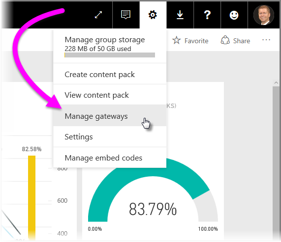
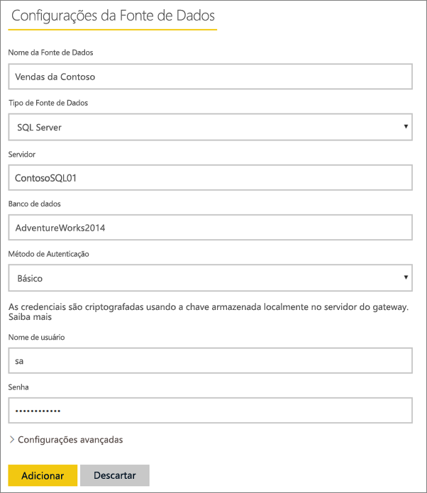
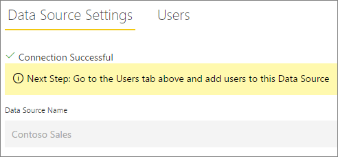
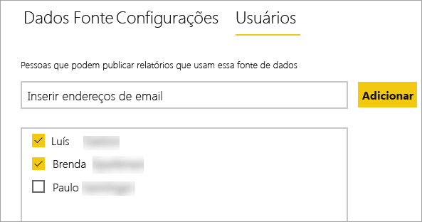
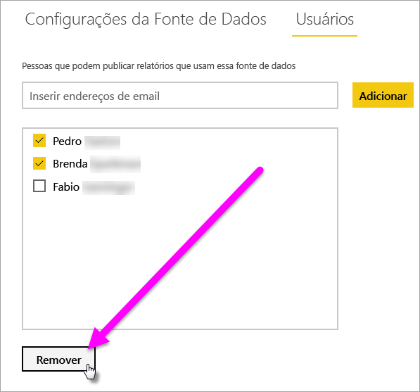
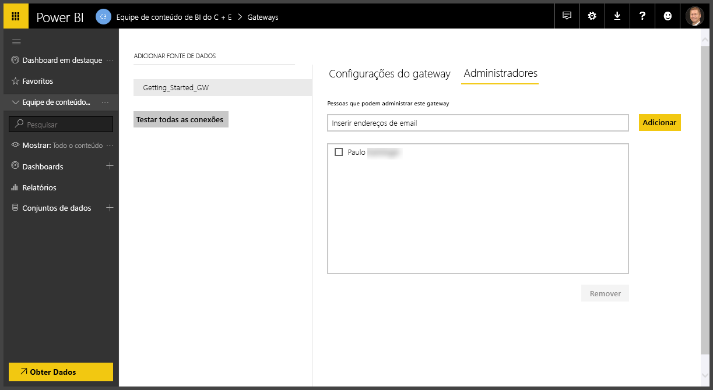
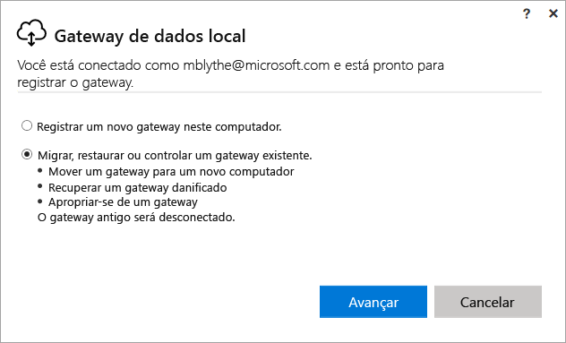
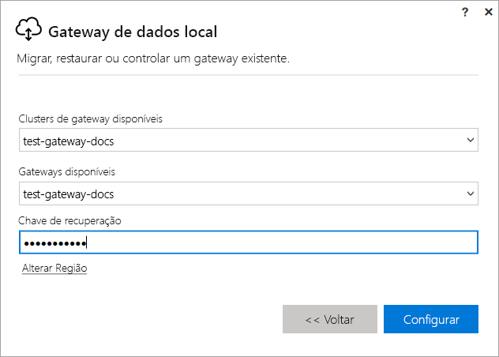

# Gerenciar um Power BI Gateway

Depois que você [instalar um gateway de dados do Power BI](service-gateway-install.md), pode gerenciá-lo por meio da área **Gerenciar gateways** do serviço do Power BI, no aplicativo do gateway em seu computador local e com scripts do PowerShell. Este artigo concentra-se no serviço do Power BI. Se você acabou de instalar um gateway, é recomendável [adicionar uma fonte de dados](#add-a-data-source) e, em seguida, [adicionar usuários](#add-users-to-a-data-source) para que eles possam acessar a fonte de dados.

## Gerenciar fontes de dados

O Power BI oferece suporte a várias fontes de dados no local, e cada uma tem seus próprios requisitos. Neste exemplo, mostraremos como adicionar o SQL Server como uma fonte de dados, mas as etapas são semelhantes para outras fontes de dados.

### Adicionar uma fonte de dados

1. No canto superior direito do serviço do Power BI, selecione o ícone de engrenagem   >  **Gerenciar gateways**.

    

2. Selecione um gateway > **Adicionar fonte de dados** ou vá para Gateways > **Adicionar fonte de dados**.

    

3. Selecione o **tipo de fonte de dados**.

    

4. Insira informações para a fonte de dados. Neste exemplo, são **Servidor**, **Banco de dados** e outras informações.  

    

5. Para o SQL Server, você escolheria um **Método de Autenticação** **Windows** ou **Básico** (Autenticação SQL).  Se você escolher **Básico**, insira as credenciais para a fonte de dados.

6. Opcionalmente, em **Configurações avançadas**, configure o [nível de privacidade]((https://support.office.com/article/Privacy-levels-Power-Query-CC3EDE4D-359E-4B28-BC72-9BEE7900B540)) para sua fonte de dados (não se aplica a [DirectQuery](desktop-directquery-about.md)).

    

7. Selecione **Adicionar**. Você verá *Conexão bem-sucedida* se o processo for bem-sucedido.

    

Agora, você pode usar essa fonte de dados para incluir dados do SQL Server em seus relatórios e painéis do Power BI.

### Remover uma fonte de dados

Você pode remover uma fonte de dados se não a estiver usando. Saiba que a remoção de uma fonte de dados interrompe todos os painéis e relatórios que dependem dessa fonte de dados.

Para remover uma fonte de dados, vá para a fonte de dados e selecione **Remover**.

## Gerenciar usuários e administradores

Depois de adicionar uma fonte de dados a um gateway, você dá acesso a usuários e grupos de segurança para a fonte de dados específica (não o gateway inteiro). A lista de usuários da fonte de dados controla somente quem tem permissão para publicar relatórios que incluem dados da fonte de dados. Os proprietários de relatório podem criar painéis, pacotes de conteúdo e aplicativos e, em seguida, compartilhá-los com outros usuários.

Você também pode dar acesso administrativo a usuários e grupos de segurança para o gateway.

### Adicionar usuários a uma fonte de dados

1. No canto superior direito do serviço do Power BI, selecione o ícone de engrenagem   >  **Gerenciar gateways**.

2. Selecione a fonte de dados à qual deseja adicionar usuários.

3. Selecione **Usuários** e insira um usuário da sua organização ao qual você deseja conceder acesso à fonte de dados selecionada. Na tela seguinte, você pode ver que estou adicionando Clara e Pedro.

    

4. Selecione **Adicionar** e o membro adicionado aparecerá na caixa.

    

E isso é tudo o que é necessário. Lembre-se de que você precisa adicionar usuários a cada fonte de dados às quais você deseja conceder acesso. Cada fonte de dados tem uma lista separada de usuários e você deve adicionar usuários para cada fonte de dados separadamente.

### Remover usuários de uma fonte de dados

Na guia **Usuários** para a fonte de dados, você pode remover usuários e grupos de segurança que usam essa fonte de dados.

### Adicionar e remover administradores

Na guia **Administradores**, para o gateway, adicione e remova os usuários (ou grupos de segurança) que podem administrar o gateway.

## Gerencie um cluster de gateways

Ao criar um cluster de dois ou mais gateways, todas as operações de gerenciamento de gateway, como adicionar uma fonte de dados ou conceder permissões administrativas para um gateway, se aplicam a todos os gateways que fazem parte do cluster. 

Quando os administradores usam o item do menu **Gerenciar gateways** encontrado sob o ícone de engrenagem no **Serviço do Power BI**, eles veem a lista de clusters registrados ou gateways individuais, mas não veem as instâncias individuais de gateway que são membros do cluster.

Todas as novas solicitações de **Atualização Agendada** e operações de DirectQuery são automaticamente direcionadas para a instância primária de um cluster de gateways específico. Se a instância do gateway primário não estiver online, a solicitação é encaminhada para outra instância de gateway no cluster.

## Migrar, restaurar ou assumir o controle de um gateway

Execute o instalador do gateway no computador em que deseja migrar, restaurar ou assumir o controle de um gateway.

1. Baixe e instale o gateway.

2. Após entrar na sua conta do Power BI, registre o gateway. Selecione **Migrar, restaurar ou tomar o controle de um gateway existente**  >  **Avançar**.

    

3. Selecione os clusters e os gateways disponíveis e insira a chave de recuperação para o gateway selecionado. Selecione **Configurar**.

    

## Reiniciar um gateway

O gateway é executado como um serviço Windows. Como qualquer serviço Windows, há várias maneiras para iniciá-lo e pará-lo. Veja abaixo como é possível fazer isso no prompt de comando.

1. No computador em que o gateway está em execução, inicie um prompt de comando com privilégios de administrador

2. Digite `net stop PBIEgwService` para parar o serviço.

3. Digite `net start PBIEgwService` para reiniciar o serviço.

## Excluir um gateway

Você pode remover um gateway se não o estiver usando. Mas lembre-se de que remover um gateway exclui todas as fontes de dados sob ele. Isso por sua vez interrompe todos os painéis e relatórios que dependem dessas fontes de dados.

1. No canto superior direito do serviço do Power BI, selecione o ícone de engrenagem   >  **Gerenciar gateways**.

2. Selecionar o gateway > **Remover**
   
   

## Próximas etapas

[Diretrizes para implantar um gateway de dados](service-gateway-deployment-guidance.md)

Mais perguntas? [Experimente a Comunidade do Power BI](http://community.powerbi.com/)