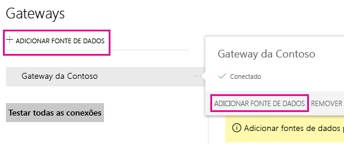
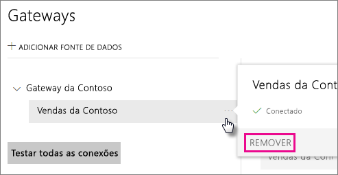
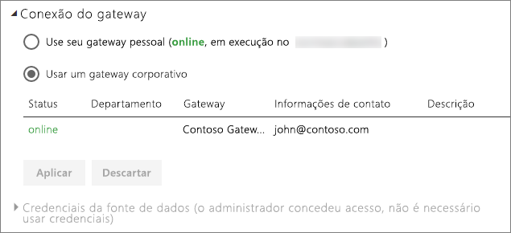

# <a name="manage-your-data-source---oracle"></a>Gerenciar sua fonte de dados – Oracle
Depois de instalar o gateway de dados local, será necessário adicionar fontes de dados que podem ser usadas com o gateway. Este artigo abordará como trabalhar com gateways e fontes de dados. Você pode usar a fonte de dados do Oracle para uma atualização agendada ou para o DirectQuery.

## <a name="download-and-install-the-gateway"></a>Baixar e instalar o gateway
É possível baixar o gateway no serviço do Power BI. Selecione **Downloads** > **Gateway de Dados** ou vá para a [página de download do gateway](https://go.microsoft.com/fwlink/?LinkId=698861).


> [!WARNING]
> Para que o gateway possa se conectar ao servidor Oracle, o Provedor de dados Oracle para .NET (ODP.NET) precisa ser instalado e configurado. Isso faz parte do ODAC (Oracle Data Access Components). Para obter mais informações sobre como baixar o provedor Oracle, veja [Instalando o cliente Oracle](#installing-the-oracle-client) abaixo.
> 
> 

## <a name="installing-the-oracle-client"></a>Instalando o cliente Oracle
Para versões de **32 bits** do Power BI Desktop, use o seguinte link para baixar e instalar o cliente Oracle de **32 bits**:

* [ODAC (Oracle Data Access Components) de 32 bits com Ferramentas de desenvolvimento da Oracle para Visual Studio (12.1.0.2.4)](http://www.oracle.com/technetwork/topics/dotnet/utilsoft-086879.html)

Para versões de **64 bits** do Power BI Desktop ou para o gateway de dados local, use o seguinte link para baixar e instalar o cliente Oracle de **64 bits**:

* [ODAC de 64 bits, 12.2c versão 1 (12.2.0.1.0) para Windows x64](http://www.oracle.com/technetwork/database/windows/downloads/index-090165.html)

Após a instalação, você precisará configurar o arquivo tnsnames.ora com as informações apropriadas para seu banco de dados. O Power BI Desktop e o gateway sairão do net_service_name definido no arquivo tnsnames.ora. Se não estiver configurado, você não poderá se conectar. O caminho padrão de tnsnames.ora é o seguinte: `[Oracle Home Directory]\Network\Admin\tnsnames.ora`. Para obter mais informações sobre como configurar arquivos tnsnames.ora, consulte [Oracle: parâmetros de nomeação Local (tnsnames.ora)](https://docs.oracle.com/cd/B28359_01/network.111/b28317/tnsnames.htm).

### <a name="example-tnsnamesora-file-entry"></a>Exemplo de entrada de arquivo tnsnames.ora
O formato básico de uma entrada em tnsname.ora é o seguinte.

```
net_service_name=
 (DESCRIPTION=
   (ADDRESS=(protocol_address_information))
   (CONNECT_DATA=
     (SERVICE_NAME=service_name)))
```

Aqui está um exemplo de informações de servidor e porta preenchidas.

```
CONTOSO =
  (DESCRIPTION =
    (ADDRESS = (PROTOCOL = TCP)(HOST = oracleserver.contoso.com)(PORT = 1521))
    (CONNECT_DATA =
      (SERVER = DEDICATED)
      (SERVICE_NAME = CONTOSO)
    )
  )
```

## <a name="add-a-gateway"></a>Adicionar um gateway
Para adicionar um gateway, basta [baixar](https://go.microsoft.com/fwlink/?LinkId=698861) e instalar o gateway em um servidor de seu ambiente. Depois de instalar o gateway, ele será mostrado na lista de gateways em **Gerenciar gateways**.

> [!NOTE]
> **Gerenciar gateways** não será mostrado até que você seja o administrador de, pelo menos, um gateway. Isso pode acontecer ao ser adicionado como um administrador ou ao instalar e configurar um gateway.
> 
> 

## <a name="remove-a-gateway"></a>Excluir um gateway
A exclusão de um gateway também excluirá as fontes de dados contidas nele.  Isso também interromperá todos os painéis e relatórios que dependem dessas fontes de dados.

1. Selecione o ícone de engrenagem  no canto superior direito > **Gerenciar gateways**.
2. Gateway > **Remover**
   
   

## <a name="add-a-data-source"></a>Adicionar uma fonte de dados
É possível adicionar uma fonte de dados selecionando um gateway e clicando em **Adicionar fonte de dados** ou acessando Gateway > **Adicionar fonte de dados**.



Você pode selecionar o **Tipo de Fonte de Dados** na lista.


Em seguida, é necessário preencher as informações sobre a fonte de dados, que incluem o **Servidor** e o **Banco de Dados**.  

Também é necessário escolher um **Método de Autenticação**.  Ele pode ser **Windows** ou **Básico**.  Use **Básico** se for usar uma conta criada com a autenticação do Oracle em vez da autenticação do Windows. Em seguida, insira as credenciais que serão usadas para esta fonte de dados.

> [!NOTE]
> Todas as consultas à fonte de dados serão executadas com essas credenciais. Para obter mais informações, veja o artigo principal sobre o gateway de dados local para saber mais sobre como as [credenciais](service-gateway-onprem.md#credentials) são armazenadas.
> 
> 


Você pode clicar em **Adicionar** depois preencher tudo.  Agora você pode usar esta fonte de dados para a atualização agendada ou para o DirectQuery, em relação a um servidor Oracle local. Você verá *Conexão Bem-sucedida* se tiver êxito.


### <a name="advanced-settings"></a>Configurações avançadas
Você pode configurar o nível de privacidade para sua fonte de dados. Ele controla como os dados podem ser combinados. É usado somente para a atualização agendada. Não se aplica ao DirectQuery. [Saiba mais](https://support.office.com/article/Privacy-levels-Power-Query-CC3EDE4D-359E-4B28-BC72-9BEE7900B540)


## <a name="remove-a-data-source"></a>Remover uma fonte de dados
A remoção de uma fonte de dados interromperá todos os painéis ou relatórios que dependem da fonte de dados em questão.  

Para remover uma Fonte de Dados, vá para a Fonte de Dados > **Remover**.



## <a name="manage-administrators"></a>Gerenciar administradores
Na guia Administradores, para o gateway, você pode adicionar e remover os usuários (ou grupos de segurança) que podem administrar o gateway.


## <a name="manage-users"></a>Gerenciar usuários
Na guia Usuários, da fonte de dados, você pode adicionar e remover os usuários ou grupos de segurança que podem usar essa fonte de dados.

> [!NOTE]
> A lista de usuários só controla quem tem permissão de publicar relatórios. Os proprietários de relatório podem criar painéis ou pacotes de conteúdo e compartilhá-los com outros usuários. Usuários que consomem relatório ou dashboard não precisam estar na lista de usuários.
> 
> 


## <a name="using-the-data-source"></a>Usando a fonte de dados
Depois de criar a fonte de dados, ela estará disponível para uso com as conexões do DirectQuery ou por meio da atualização agendada.

> [!WARNING]
> Os nomes do servidor e do banco de dados devem corresponder entre o Power BI Desktop e a fonte de dados no gateway de dados local!
> 
> 

O vínculo entre o conjunto de dados e a fonte de dados no gateway baseia-se nos nomes do servidor e do banco de dados. Eles devem corresponder! Por exemplo, se você fornecer um Endereço IP para o nome do servidor, no Power BI Desktop, será necessário usar o Endereço IP para a fonte de dados na configuração do gateway. Esse nome também deve corresponder a um alias definido no arquivo tnsnames.ora. Para obter mais informações sobre o arquivo tnsnames.ora, consulte [Instalando o cliente Oracle](#installing-the-oracle-client).

Isso acontece para o DirectQuery e a atualização agendada.

### <a name="using-the-data-source-with-directquery-connections"></a>Usando a fonte de dados com conexões do DirectQuery
Você precisará verificar se os nomes do servidor e do banco de dados correspondem entre o Power BI Desktop e a fonte de dados configurada para o gateway. Você também precisará certificar-se de que o usuário está listado na guia **Usuários** da fonte de dados para publicar os conjuntos de dados do DirectQuery. A seleção, para o DirectQuery, ocorre no Power BI Desktop quando você importa dados pela primeira vez. [Saiba mais](desktop-use-directquery.md)

Após a publicação, por meio do Power BI Desktop ou do recurso **Obter Dados**, seus relatórios deverão começar a funcionar. Pode levar vários minutos, após a criação da fonte de dados no gateway, para que a conexão seja utilizável.

### <a name="using-the-data-source-with-scheduled-refresh"></a>Usando a fonte de dados com a atualização agendada
Se você estiver listado na guia **Usuários** da fonte de dados configurada no gateway e houver a correspondência entre os nomes do servidor e do banco de dados, você verá o gateway como uma opção a ser usada com a atualização agendada.



## <a name="troubleshooting"></a>Solução de problemas
Você pode encontrar vários erros do Oracle quando a sintaxe de nomenclatura estiver incorreta ou não configurada corretamente.

* ORA-12154: TNS: não foi possível resolver o identificador de conexão especificado  
* ORA-12514: ouvinte TNS não sabe, no momento, de serviço solicitado no descritor de conexão  
* ORA-12541: TNS: nenhum ouvinte  
* ORA-12170: TNS: ocorrência de tempo limite de conexão  
* ORA-12504: SERVICE_NAME em CONNECT_DATA não foi atribuído ao ouvinte TNS  

Esses erros poderão ocorrer se o cliente Oracle não estiver instalado ou não estiver configurado corretamente. Se ele estiver instalado, verifique se o arquivo tnsnames.ora está configurado corretamente e se você está usando o net_service_name adequado. Você também precisará garantir que o net_service_name seja o mesmo entre o computador que está usando o Power BI Desktop e o computador que está executando o gateway. Para obter mais informações, consulte [Instalando o cliente Oracle](#installing-the-oracle-client).

> [!NOTE]
> Você também poderá enfrentar um problema devido à compatibilidade entre a versão do servidor Oracle e a versão do cliente Oracle. Normalmente, eles deverão corresponder.
> 
> 

Para obter informações adicionais de solução de problemas relativas ao gateway, veja [Solução de problemas do gateway de dados local](service-gateway-onprem-tshoot.md).

## <a name="next-steps"></a>Próximas etapas
[Gateway de dados local](service-gateway-onprem.md)  
[Detalhes sobre o gateway de dados local](service-gateway-onprem-indepth.md)  
[Solução de problemas do gateway de dados local](service-gateway-onprem-tshoot.md)  
[Power BI Premium](service-premium.md)

Mais perguntas? [Experimente perguntar à Comunidade do Power BI](http://community.powerbi.com/)

