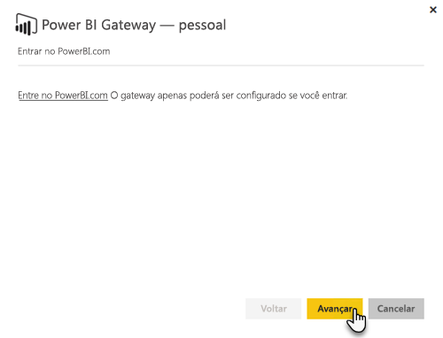
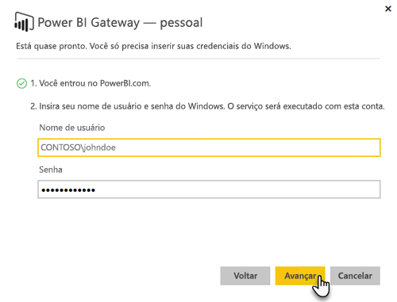

# Gateway de dados local
O gateway de dados local atua como uma ponte, fornecendo uma transferência de dados rápida e segura entre os dados locais (dados que não estão na nuvem) e os serviços do Power BI, Microsoft Flow, Aplicativos Lógicos e PowerApps.

Você pode usar um único gateway com diferentes serviços ao mesmo tempo. Se você estiver usando o Power BI, bem como o PowerApps, um único gateway poderá ser usado para ambos. Ele depende da conta que você usa para entrar.

> [!NOTE]
> O gateway de dados local implementa a compactação de dados e a criptografia de transporte em todos os modos.
> 
> 

<!-- Shared Requirements Include -->
[!INCLUDE [gateway-onprem-requirements-include](./includes/gateway-onprem-requirements-include.md)]

### Limitações das conexões dinâmicas do Analysis Services
Você pode usar uma conexão dinâmica em instâncias de tabela ou multidimensionais.

| **Versão do servidor** | **SKU necessário** |
| --- | --- |
| 2012 SP1 CU4 ou posterior |Business Intelligence e SKU Enterprise |
| 2014 |Business Intelligence e SKU Enterprise |
| 2016 |SKU Standard ou superior |

* Não há suporte para a Formatação no Nível de Célula nem para recursos de conversão.
* Ações e Conjuntos Nomeados não são expostos no Power BI, mas você ainda pode se conectar a cubos multidimensionais que também contêm Ações ou Conjuntos Nomeados e criar visuais e relatórios.

<!-- Shared Install steps Include -->
[!INCLUDE [gateway-onprem-datasources-include](./includes/gateway-onprem-datasources-include.md)]

## Baixar e instalar o Gateway de dados local
Para baixar o gateway, selecione **Gateway de Dados** no menu Downloads. Baixe o [Gateway de dados local](http://go.microsoft.com/fwlink/?LinkID=820925).

<!-- Shared Install steps Include -->
[!INCLUDE [gateway-onprem-install-include](./includes/gateway-onprem-install-include.md)]

## Instalar o gateway no modo pessoal
> [!NOTE]
> O modo pessoal só funcionará com o Power BI.
> 
> 

Depois que o gateway pessoal for instalado, você precisará iniciar o **Assistente de Configuração do Power BI Gateway – Personal**.

Em seguida, você precisará entrar no Power BI para registrar o gateway no serviço de nuvem.

Você também precisará fornecer o nome de usuário do Windows e a senha com a qual o serviço Windows será executado. Você pode especificar uma conta do Windows diferente da sua. O serviço do gateway será executado por meio dessa conta.

Após a conclusão da instalação, você precisará ir para seus conjuntos de dados no Power BI e verificar se as credenciais foram inseridas para suas fontes de dados locais.

## Armazenando credenciais criptografadas na nuvem
Quando você adiciona uma fonte de dados ao gateway, é necessário fornecer credenciais para essa fonte de dados. Todas as consultas à fonte de dados serão executadas com essas credenciais. As credenciais são criptografadas com segurança, usando a criptografia assimétrica, para que elas não possam ser descriptografadas na nuvem antes de serem armazenadas lá. As credenciais são enviadas para o computador que executa o gateway, no local em que são descriptografados quando as fontes de dados são acessadas.

<!-- Account and Port information -->
[!INCLUDE [gateway-onprem-accounts-ports-more](./includes/gateway-onprem-accounts-ports-more.md)]

<!-- How the gateway works -->
[!INCLUDE [gateway-onprem-how-it-works-include](./includes/gateway-onprem-how-it-works-include.md)]

## Limitações e considerações
* No momento, não há suporte para a [Proteção de Informações do Azure](https://docs.microsoft.com/en-us/microsoft-365/enterprise/protect-files-with-aip
)
* No momento, não há suporte para o [Access Online](https://products.office.com/en-us/access)

## Solução de problemas
Se você tiver problemas ao instalar e configurar um gateway, veja [Solução de problemas do gateway de dados local](service-gateway-onprem-tshoot.md). Se você achar que está tendo um problema com seu firewall, confira a seção [proxy ou firewall](service-gateway-onprem-tshoot.md#firewall-or-proxy) no artigo de solução de problemas.

Caso ache que está tendo problemas de proxy com o gateway, veja [Definindo as configurações de proxy dos gateways do Power BI](service-gateway-proxy.md).

## Próximas etapas
[Gerenciar sua fonte de dados – Analysis Services](service-gateway-enterprise-manage-ssas.md)  
[Gerenciar sua fonte de dados – SAP HANA](service-gateway-enterprise-manage-sap.md)  
[Gerenciar sua fonte de dados – SQL Server](service-gateway-enterprise-manage-sql.md)  
[Gerenciar sua fonte de dados – Oracle](service-gateway-onprem-manage-oracle.md)  
[Gerenciar sua fonte de dados – Importar/Atualização agendada](service-gateway-enterprise-manage-scheduled-refresh.md)  
[Detalhes sobre o gateway de dados local](service-gateway-onprem-indepth.md)  
[Gateway de dados local (modo pessoal) – a nova versão do gateway pessoal](service-gateway-personal-mode.md)
[Definindo as configurações de proxy do gateway de dados local](service-gateway-proxy.md)  
Mais perguntas? [Experimente a Comunidade do Power BI](http://community.powerbi.com/)

