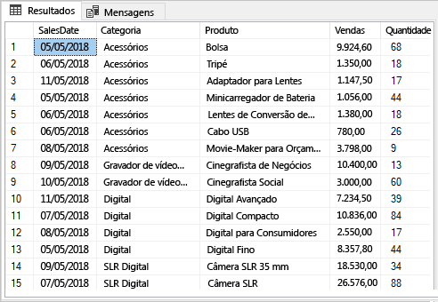
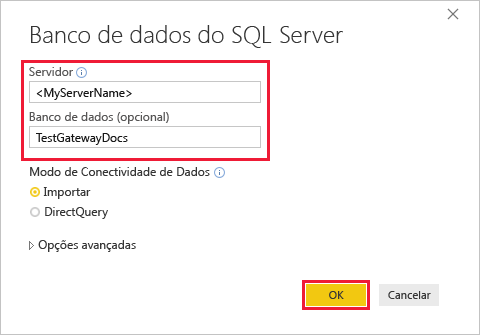
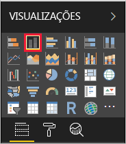
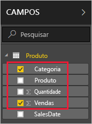
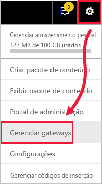
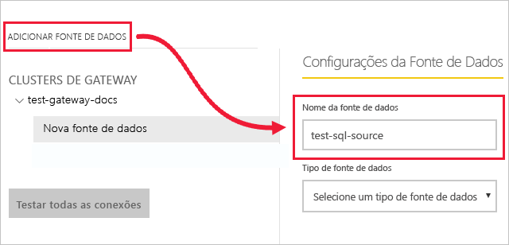
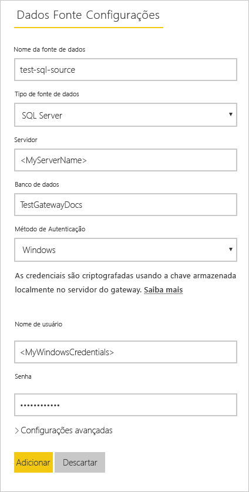
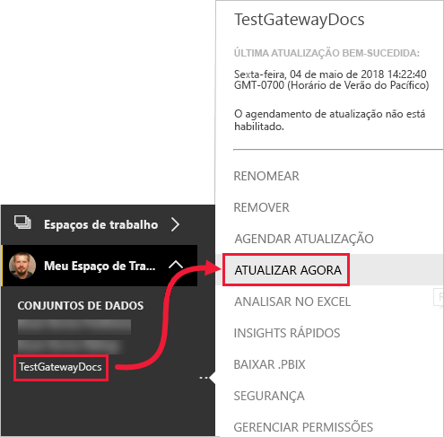

# <a name="tutorial-connect-to-on-premises-data-in-sql-server"></a>Tutorial: Conectar-se a dados locais no SQL Server

Um gateway de dados local é um software que você instala em uma rede local; ele facilita o acesso aos dados nessa rede. Neste tutorial, você criará um relatório no Power BI Desktop com base em dados de exemplo importados do SQL Server. Em seguida, você publicará o relatório para o serviço do Power BI e configurará um gateway para que o serviço possa acessar os dados locais. Esse acesso significa que o serviço pode atualizar os dados para manter o relatório atualizado.

Neste tutorial, você aprenderá a:
> [!div class="checklist"]
> * Criar um relatório de dados no SQL Server
> * Publicar o relatório no serviço do Power BI
> * Adicionar o SQL Server como uma fonte de dados do gateway
> * Atualizar os dados no relatório

Se você não estiver inscrito no Power BI, [inscreva-se para uma avaliação gratuita](https://app.powerbi.com/signupredirect?pbi_source=web) antes de começar.


## <a name="prerequisites"></a>Pré-requisitos

* [Instalar o Power BI Desktop](https://powerbi.microsoft.com/desktop/)
* [Instalar o SQL Server](https://docs.microsoft.com/sql/database-engine/install-windows/install-sql-server) em um computador local 
* [Instalar um gateway de dados local](service-gateway-install.md) no mesmo computador local (na produção, normalmente seria em um computador diferente)


## <a name="set-up-sample-data"></a>Configurar dados de exemplo

Comece adicionando dados de exemplo ao SQL Server, para que você possa usar esses dados no restante do tutorial.

1. No SSMS (SQL Server Management Studio), conecte-se à sua instância do SQL Server e crie um banco de dados de teste.

    ```sql
    CREATE DATABASE TestGatewayDocs
    ```

2. No banco de dados criado, adicione uma tabela e insira dados.

    ```sql
    USE TestGatewayDocs

    CREATE TABLE Product (
        SalesDate DATE,
        Category  VARCHAR(100),
        Product VARCHAR(100),
        Sales MONEY,
        Quantity INT
    )

    INSERT INTO Product VALUES('2018-05-05','Accessories','Carrying Case',9924.60,68)
    INSERT INTO Product VALUES('2018-05-06','Accessories','Tripod',1350.00,18)
    INSERT INTO Product VALUES('2018-05-11','Accessories','Lens Adapter',1147.50,17)
    INSERT INTO Product VALUES('2018-05-05','Accessories','Mini Battery Charger',1056.00,44)
    INSERT INTO Product VALUES('2018-05-06','Accessories','Telephoto Conversion Lens',1380.00,18)
    INSERT INTO Product VALUES('2018-05-06','Accessories','USB Cable',780.00,26)
    INSERT INTO Product VALUES('2018-05-08','Accessories','Budget Movie-Maker',3798.00,9)
    INSERT INTO Product VALUES('2018-05-09','Digital video recorder','Business Videographer',10400.00,13)
    INSERT INTO Product VALUES('2018-05-10','Digital video recorder','Social Videographer',3000.00,60)
    INSERT INTO Product VALUES('2018-05-11','Digital','Advanced Digital',7234.50,39)
    INSERT INTO Product VALUES('2018-05-07','Digital','Compact Digital',10836.00,84)
    INSERT INTO Product VALUES('2018-05-08','Digital','Consumer Digital',2550.00,17)
    INSERT INTO Product VALUES('2018-05-05','Digital','Slim Digital',8357.80,44)
    INSERT INTO Product VALUES('2018-05-09','Digital SLR','SLR Camera 35mm',18530.00,34)
    INSERT INTO Product VALUES('2018-05-07','Digital SLR','SLR Camera',26576.00,88)
    ```

3. Selecione os dados da tabela para verificá-los.

    ```sql
    SELECT * FROM Product
    ```

    


## <a name="build-and-publish-a-report"></a>Criar e publique um relatório

Agora que tem dados de exemplo com que trabalhar, você se conecta ao SQL Server no Power BI Desktop e cria um relatório com base nesses dados. Em seguida, publique o relatório no serviço do Power BI.

1. No Power BI Desktop, na guia **Início**, selecione **Obter Dados** > **SQL Server**.

2. Em **Servidor**, insira o nome do servidor e, em **Banco de dados**, insira "TestGatewayDocs". Selecione **OK**. 

    

3. Verifique suas credenciais e selecione **Conectar**.

4. Em **Navegador**, selecione a tabela **Produto** e, em seguida, selecione **Carregar**.

    

5. Na exibição de **Relatório** do Power BI Desktop, no painel **Visualizações**, selecione o **Gráfico de colunas empilhadas**.

        

6. Com o gráfico de colunas selecionado na tela do relatório, no painel **Campos**, selecione os campos **Categoria** e **Vendas**.  

    

    Agora, o gráfico deve ser semelhante ao seguinte.

    

    Observe que **Câmera SLR** é o líder de vendas atual. Isso mudará quando você atualizar os dados e atualizar o relatório posteriormente neste tutorial.

7. Salve o relatório com o nome "TestGatewayDocs.pbix".

8. Na guia **Início**, selecione **Publicar** > **Meu espaço de trabalho** > **Selecionar**. Entre no serviço do Power BI se for solicitado que você faça isso. 

    

9. Na tela **Êxito**, selecione **Abrir 'TestGatewayDocs.pbix' no Power BI**.


## <a name="add-sql-server-as-a-gateway-data-source"></a>Adicionar o SQL Server como uma fonte de dados do gateway

No Power BI Desktop, você se conecta diretamente ao SQL Server, mas o serviço do Power BI requer que um gateway atue como uma ponte. Agora, você adiciona sua instância do SQL Server como uma fonte de dados para o gateway que criou em um artigo anterior (listado em [Pré-requisitos](#prereqisites)). 

1. No canto superior direito do serviço do Power BI, selecione o ícone de engrenagem  > **Gerenciar gateways**.

    

2. Selecione **Adicionar fonte de dados** e digite "test-sql-source" em **Nome da Fonte de Dados**.

    

3. Selecione o **Tipo de Fonte de Dados** **SQL Server** e, em seguida, insira outros valores, conforme mostrado.

    

    | Opção | Valor |
    | ---    | ---   |
    | **Nome da fonte de dados**       | test-sql-source      |
    | **Tipo de fonte de dados**       | SQL Server      |
    | **Servidor**       |  O nome de sua instância do SQL Server (deve ser idêntico ao que você especificou no Power BI Desktop)    |
    | **Banco de dados**       | TestGatewayDocs      |
    | **Método de autenticação**       | Windows      |
    | **Nome de usuário**        |  A conta, como michael@contoso.com, que você usa para se conectar ao SQL Server     |
    | **Senha**       |  A senha da conta usada para se conectar ao SQL Server    |

4. Selecione **Adicionar**. Você verá *Conexão bem-sucedida* quando o processo for bem-sucedido.

    

    Agora, você pode usar essa fonte de dados para incluir dados do SQL Server em seus relatórios e dashboards do Power BI.


## <a name="configure-and-use-data-refresh"></a>Configurar e usar a atualização de dados

Você tem um relatório publicado no serviço do Power BI e a fonte de dados do SQL Server configurada. Com eles em vigor, agora você faz uma alteração na tabela de Produto, e essa alteração flui pelo gateway até o relatório publicado. Você também pode configurar atualizações agendadas para lidar com alterações futuras.

1. No SSMS, atualize os dados na tabela de Produto.

    ```sql
    UPDATE Product
    SET Sales = 32508, Quantity = 252
    WHERE Product='Compact Digital'     

    ```

2. No serviço do Power BI, no painel de navegação esquerdo, selecione **Meu espaço de trabalho**.

3. Em **Conjuntos de dados**, para o conjunto de dados **TestGatewayDocs**, selecione **mais** (**...** ) > **Atualizar agora**.

    

4. Selecione **Meu espaço de trabalho** > **Relatórios** > **TestGatewayDocs**. Veja como a atualização fluiu e o líder de vendas agora é **Compact Digital**. 

    

5. Selecione **Meu espaço de trabalho** > **Relatórios** > **TestGatewayDocs**. Selecione **mais** (**. . .**) > **Agendar atualização**.

6. Em **Agendar atualização**, defina a atualização como **Ativado** e, em seguida, selecione **Aplicar**. O conjunto de dados é atualizado diariamente por padrão.

    

## <a name="clean-up-resources"></a>Limpar recursos
Se não quiser mais usar os dados de exemplo, execute `DROP DATABASE TestGatewayDocs` no SSMS. Se não quiser usar a fonte de dados do SQL Server, [remova a fonte de dados](service-gateway-manage.md#remove-a-data-source). 


## <a name="next-steps"></a>Próximas etapas
Neste tutorial, você aprendeu a:
> [!div class="checklist"]
> * Criar um relatório de dados no SQL Server
> * Publicar o relatório no serviço do Power BI
> * Adicionar o SQL Server como uma fonte de dados do gateway
> * Atualizar os dados no relatório

Vá para o próximo artigo para saber mais
> [!div class="nextstepaction"]
> [Gerenciar o Power BI Gateway](service-gateway-manage.md)

