# Introdução ao serviço do Power BI
Esse tutorial ajuda você a começar a usar o ***serviço do Power BI***. Para compreender como o serviço do Power BI se adapta às outras ofertas do Power BI, recomendamos que você comece lendo [O que o é Power BI](guided-learning/gettingstarted.yml#step-1).

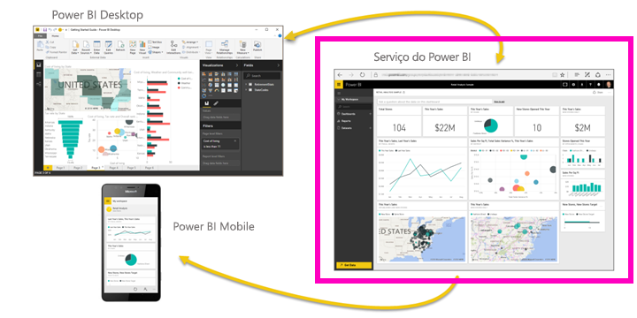

O serviço do Power BI tem uma versão gratuita e uma versão Pro. Independentemente de qual versão você está usando, abra um navegador e digite www.powerbi.com para começar. Se você já se inscreveu, selecione o link **Entrar** que aparecerá no canto superior direito. Se você ainda não se inscreveu no serviço do Power BI, selecione o link **Inscreva-se gratuitamente** em vez disso.

Se estiver procurando ajuda com o Power BI Desktop, veja [Introdução ao Desktop](desktop-getting-started.md). Se você estiver procurando ajuda para o Power BI para Celulares, consulte [Aplicativos Power BI para dispositivos móveis](mobile-apps-for-mobile-devices.md).

> [!TIP]
> Prefere um curso de treinamento gratuito baseado no seu ritmo? [Registre-se em nosso curso Analisando e visualizando dados no EdX](http://aka.ms/edxpbi).

Visite nossa [playlist no YouTube](https://www.youtube.com/playlist?list=PL1N57mwBHtN0JFoKSR0n-tBkUJHeMP2cP). Um bom vídeo para começar é o Introdução ao serviço do Power BI:
> 
> <iframe width="560" height="315" src="https://www.youtube.com/embed/B2vd4MQrz4M" frameborder="0" allowfullscreen></iframe>
> 
> 
> 

O Microsoft Power BI lhe ajuda a manter-se atualizado com relação às informações importantes para você.  Os ***painéis*** do serviço do Power BI ajudam a controlar o ritmo de sua empresa com um clique.  Seus dashboards exibem ***blocos*** nos quais você pode clicar para abrir ***relatórios*** e explorar mais detalhadamente.  Conecte-se a vários ***conjuntos de dados*** para reunir todos os dados relevantes em um único lugar. Precisa de ajuda para compreender os blocos de construção que compõem o Power BI?  Veja [Power BI – Conceitos básicos](service-basic-concepts.md).

Se você tiver dados importantes em arquivos do Excel ou CSV, é possível criar um painel do Power BI para se manter informado em qualquer lugar e compartilhar informações com outras pessoas.  Você tem uma assinatura de um aplicativo SaaS como o Salesforce?  Comece [conectando-se ao Salesforce](service-connect-to-salesforce.md) para criar um dashboard automaticamente com base nesses dados ou [confira todos os outros aplicativos SaaS](service-get-data.md) aos quais você pode se conectar. Se você faz parte de uma organização, veja se algum [aplicativo](service-create-distribute-apps.md) foi publicado para você.

Leia sobre todas as outras maneiras de [obter dados para o Power BI](service-get-data.md).

## Etapa 1: Obter dados
Veja um exemplo de como obter dados de um arquivo CSV. Deseja acompanhar este tutorial? [Baixe este arquivo CSV de exemplo](http://go.microsoft.com/fwlink/?LinkID=521962).

1. [Entre no Power BI](http://www.powerbi.com/). Não tem uma conta? Não se preocupe, você pode se inscrever gratuitamente.
2. O Power BI abre no seu navegador. Selecione **Obter Dados** na parte inferior do painel de navegação esquerdo.
   
   
3. Selecione **Arquivos**. 
   
   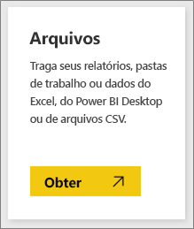
4. Selecione **Arquivo Local**, navegue até o arquivo no seu computador e escolha **Abrir**.
   
   
5. Para este tutorial, vamos selecionar **Importar** para adicionar o arquivo do Excel como um conjunto de dados para que possamos usá-lo para criar relatórios e dashboards.  
   
   > [!NOTE]
   > Se você selecionar **Carregar**, a pasta de trabalho inteira será carregada no Power BI e você poderá abri-la e editá-la no Excel online.
   > 
   > 
   
   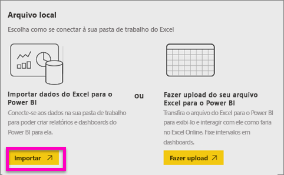
6. Quando seu conjunto de dados estiver pronto, selecione **Exibir conjunto de dados** para abri-lo no editor de relatório. .
   
   > [!TIP]
   > Uma ótima maneira de se familiarizar com o editor de relatório é [fazer um tour](service-the-report-editor-take-a-tour.md)
   > 
   > 

## Etapa 2: começar a explorar seu conjunto de dados
Agora que você se conectou aos dados, explore-os para encontrar novas percepções.  Quando encontrar algo que deseja monitorar, você pode criar um painel para se manter atualizado em relação às alterações.

1. Selecione a imagem do conjunto de dados no dashboard para explorar os dados aos quais você acabou de se conectar ou, no cabeçalho **Conjuntos de Dados**, selecione o nome do conjunto de dados para abri-lo. Isso abre o conjunto de dados como um relatório em branco.
   
   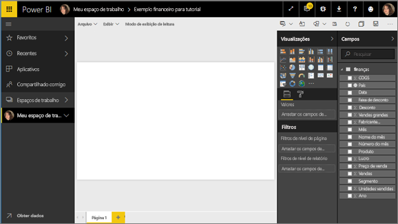
   
   > [!NOTE]
> Outra maneira de explorar dados é por **Insights rápidos**.  Para obter mais informações, veja [Introdução ao Quick Insights](service-insights.md)
   > 
   > 
2. Na lista **Campos** no lado direito da página, selecione os campos para criar uma visualização.  Selecione a caixa de seleção ao lado de **Vendas Brutas** e **Data**.
   
   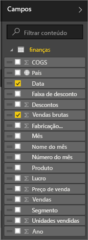
3. O Power BI analisa os dados e cria um elemento visual.  Se você selecionou **Data** primeiro, você verá uma tabela.  Se você selecionou **Vendas Brutas** primeiro, você verá um gráfico. Alterne para uma forma diferente de exibição dos dados. Tente mudar para um gráfico de linhas selecionando a opção correspondente.
   
   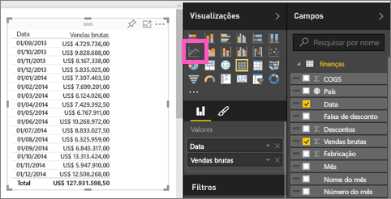
4. Quando desejar ter uma visualização específica no dashboard, focalize essa visualização e selecione o ícone **Fixar**.  Quando fixar essa visualização, ela será armazenada em seu painel para que você possa acompanhar rapidamente o valor mais recente.
   
   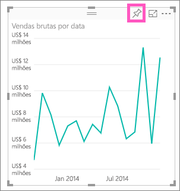
5. Como esse é um novo relatório, você precisa salvá-lo antes de poder fixar uma visualização dele no painel. Dê um nome ao seu relatório (por exemplo, *Vendas ao longo do tempo*) e selecione **Salvar e Continuar**. 
   
   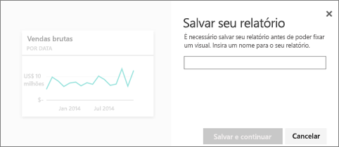
   
   O novo relatório aparece no painel de navegação no título **Relatórios** .
6. Fixe o bloco em um painel existente ou em um novo painel. 
   
   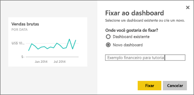
   
   * **Painel existente**: selecione o nome do painel no menu suspenso.
   * **Novo painel**: digite o nome do novo painel.
7. Selecione **Fixar**.
   
   Uma mensagem de Êxito (perto do canto superior direito) informa que a visualização foi adicionada, como um bloco, ao painel.
   
   
8. Selecione **Ir para o dashboard** para ver o seu novo dashboard com o bloco fixado. O gráfico de linhas é fixado, como um bloco, ao dashboard. Melhore ainda mais a aparência de seu dashboard [renomeando, redimensionando, vinculando e reposicionando blocos](service-dashboard-edit-tile.md).
   
   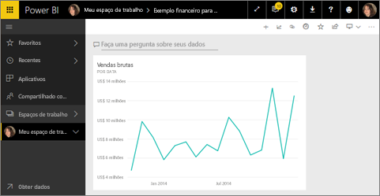
   
   Selecione o novo bloco em seu dashboard para retornar ao relatório a qualquer momento.

## Etapa 3: Continuar explorando com as perguntas e respostas (consulta em linguagem natural)
1. Para explorar seus dados rapidamente, tente fazer uma pergunta na caixa P e R. A caixa de perguntas das perguntas e respostas fica localizada na parte superior do seu painel. Por exemplo, tente digitar “**qual segmento tinha a maior receita**”.
   
   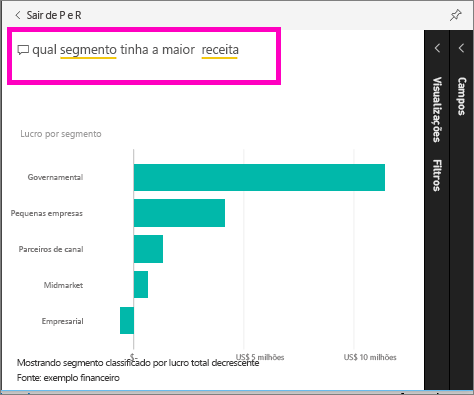
2. Clique no ícone de pino  para mostrar esta visualização no painel também.
3. Fixe a visualização no painel de Exemplo Financeiro.
   
    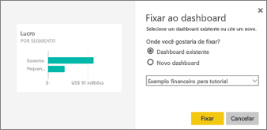
4. Selecione a seta para voltar para **Sair de P e R**  para retornar ao dashboard no qual você verá o novo bloco.

## Próximas etapas
Pronto para experimentar mais?  Aqui estão alguns modos excelentes de explorar mais do Power BI.

* [Conecte-se a outro conjunto de dados](service-get-data.md).
* [Compartilhe seu dashboard](service-share-dashboards.md) com seus colegas.
* Leia [dicas para a criação de dashboards](service-dashboards-design-tips.md).
* Exibir seus dashboards com um [aplicativo Power BI em um dispositivo móvel](mobile-apps-for-mobile-devices.md)

Ainda não está preparado para ir direto ao ponto? Comece por estes tópicos projetados para ajudá-lo a se familiarizar com o Power BI.

* [Saiba como relatórios, conjuntos de dados, dashboards e blocos todos se conjugam](service-basic-concepts.md)
* [Vídeos do Power BI](videos.md)
* [Veja quais exemplos temos disponíveis para que você utilize](sample-datasets.md)

### Mantenha contato com o Power BI
* Siga [@MSPowerBI no Twitter](https://twitter.com/mspowerbi)
* Assine nosso [canal de vídeos no YouTube](https://www.youtube.com/channel/UCy--PYvwBwAeuYaR8JLmrfg)
* Assista aos nossos [webinars de Introdução ao Power BI](webinars.md) sob demanda
* Não sabe onde procurar ajuda? Consulte nossa página [10 dicas para obter ajuda](service-tips-for-finding-help.md)

Mais perguntas? [Experimente perguntar à Comunidade do Power BI](http://community.powerbi.com/)

