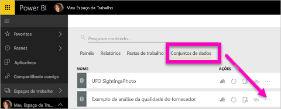
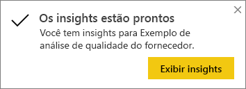
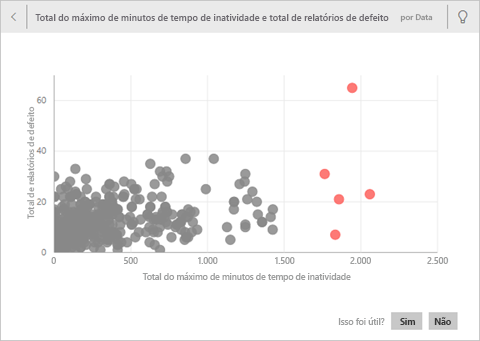
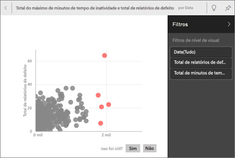
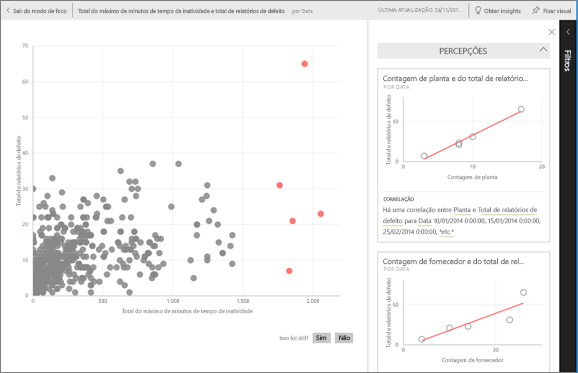
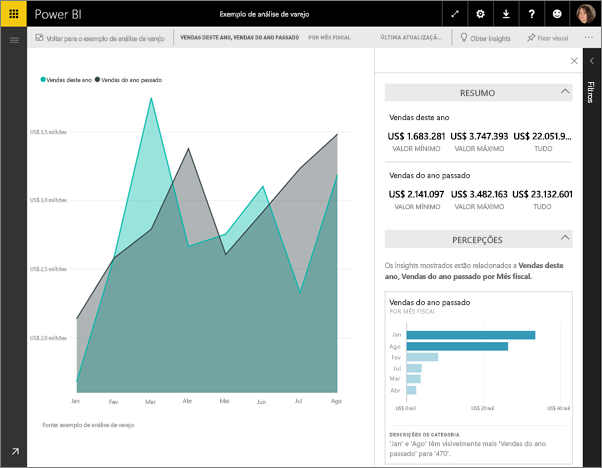

# Quick Insights com o Power BI
Tem um novo conjunto de dados e não sabe exatamente por onde começar?  Você precisa criar um painel rápido?  Deseja procurar rapidamente informações que você pode ter perdido?

Execute o Quick Insights para gerar visualizações interativas e interessantes com base em seus dados. Os Insights Rápidos podem ser executados em um conjunto de dados inteiro (Insights Rápidos) ou em um bloco de dashboard específico (Insights com Escopo). Você pode até mesmo executar os Insights Rápidos em um Insight!

> **Observação**: o Quick Insights não funciona com DirectQuery, ele apenas funciona com os dados carregados no Power BI.
> 
> 

O recurso Insights Rápidos tem como base um crescente [conjunto de algoritmos analíticos avançados](service-insight-types.md) desenvolvido em conjunto com a Microsoft Research, que continuaremos usando para permitir que mais pessoas encontrem informações em seus dados de maneiras novas e intuitivas.

## Executar o Quick Insights em um conjunto de dados
Assista a um vídeo em que Amanda executa os Insights Rápidos em um conjunto de dados, abre um Insight no modo de Foco, fixa um desses Insights Rápidos como um bloco em seu dashboard e, em seguida, obtém Insights Rápidos para um visual.

<iframe width="560" height="315" src="https://www.youtube.com/embed/et_MLSL2sA8" frameborder="0" allowfullscreen></iframe>

Agora é sua vez. Explore Quick Insights usando o [exemplo de análise de qualidade de fornecedor](sample-supplier-quality.md).

1. Na guia **Conjuntos de dados**, selecione as reticências (...) e escolha **Obter Insights**.
   
    
   
    
2. O Power BI usa [vários algoritmos](service-insight-types.md) para pesquisar tendências no conjunto de dados.
   
    
3. Em poucos segundos, suas informações estão prontas.  Selecione **Exibir Insights** para exibir as visualizações.
   
    
   
   > **OBSERVAÇÃO**: alguns conjuntos de dados não podem gerar Insights Rápidos porque os dados não são estatisticamente significativos.  Para saber mais, veja [Otimizar seus dados para o Power BI Quick Insights](service-insights-optimize.md).
   > 
   > 
4. As visualizações são exibidas em uma tela especial dos **Insights Rápidos** com até 32 cartões de insights separados. Cada cartão contém um gráfico e uma breve descrição.
   
    

## Interagir com os cartões de Insights Rápidos
  

1. Passe o mouse sobre um cartão e selecione o ícone de alfinete para adicionar a visualização a um dashboard.
2. Passe o mouse sobre um cartão e selecione o ícone do modo de Foco para exibir o cartão em tela cheia.
   
    
3. No modo de Foco você pode:
   
   * [filtrar](service-interact-with-a-report-in-reading-view.md) as visualizações.  Para exibir os filtros, no canto superior direito, selecione a seta para expandir o painel Filtros.
     
        
   * Fixe o cartão de insight em um dashboard, selecionando o ícone de fixar  ou **Fixar visual**.
   * Executar os Insights Rápidos no próprio cartão. Trata-se do chamado **Insights Rápidos com Escopo**. No canto superior direito, selecione o ícone de lâmpada  ou **Obter Insights**.
     
       
     
     O Insight Rápido é exibido à esquerda e os novos cartões, baseados apenas nos dados desse único Insight Rápido, são exibidos à direita.
     
       
4. Para retornar à tela original Insights Rápidos, no canto superior esquerdo, selecione **Sair do modo de Foco**.

## Executar os Insights Rápidos em um bloco do painel
Em vez de buscar insights em um conjunto de dados inteiro, restrinja sua pesquisa aos dados usados para criar um único bloco de painel. Trata-se do chamado **Insights Rápidos com Escopo**.

1. Abra um dashboard.
2. Selecione um bloco e [abra no bloco no Modo de foco](service-focus-mode.md).
3. No canto superior direito, selecione **Obter Insights**.
   
    
4. O Power BI exibe os cartões de insight no lado direito do bloco.
   
    
5. Algum insight desperta seu interesse? Selecione esse cartão de insights para se aprofundar ainda mais. O Insight Rápido selecionado é exibido à esquerda e os novos cartões de insights, baseados apenas nos dados desse único Insight Rápido, são exibidos à direita.
6. Continue examinando seus dados e, quando encontrar um Insight Rápido interessante, fixe seu visual ao dashboard selecionando **Fixar visual** no canto superior direito. Além disso, você pode enviar comentários para informar o proprietário do conjunto de dados se determinado Insight Rápido foi útil ou não.
   
    

## Próximas etapas
Se você é proprietário de um conjunto de dados, [otimize-o para os Insights Rápidos](service-insights-optimize.md)

Saiba mais sobre os [tipos de Insights Rápidos disponíveis](service-insight-types.md)

Mais perguntas? [Experimente a Comunidade do Power BI](http://community.powerbi.com/)

