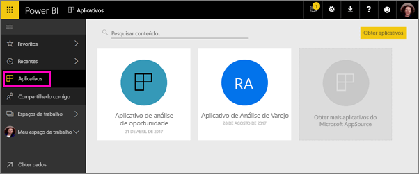
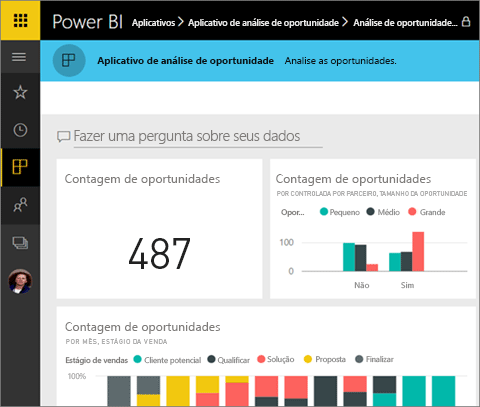
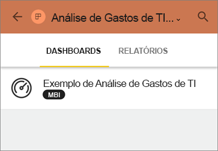
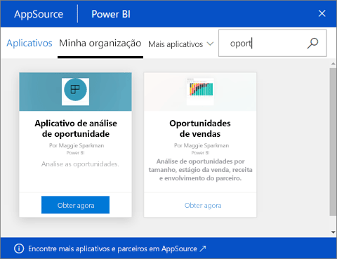

# Instalar e usar aplicativos com dashboards e relatórios no Power BI
No Power BI, os *aplicativos* reúnem os dashboards e os relatórios relacionados em um só local. As pessoas em sua organização podem criar e distribuir aplicativos com informações comerciais essenciais. Os [serviços externos](service-connect-to-services.md) que talvez você já usa, como o Google Analytics e o Microsoft Dynamics CRM, também oferecem aplicativos do Power BI. 

Os aplicativos são fáceis de encontrar e de instalar no serviço do Power BI ([https://powerbi.com](https://powerbi.com)) e no seu dispositivo móvel. Depois de instalar um aplicativo, não será necessário lembrar os nomes dos muitos dashboards diferentes, uma vez que eles são reunidos no aplicativo, no navegador ou no dispositivo móvel.

Com os aplicativos, sempre que o autor do aplicativo liberar atualizações, você verá automaticamente as alterações. O autor também controla a frequência com a qual os dados são atualizados, de forma que você não precisa se preocupar em manter-se atualizado. 

Planejando criar um aplicativo? Consulte [Create workspaces with your colleagues in Power BI](service-create-distribute-apps.md) (Criar espaços de trabalho com seus colegas no Power BI) para obter mais informações.

## Obter um novo aplicativo
Você pode obter aplicativos de algumas maneiras diferentes. O autor do aplicativo pode instalá-lo automaticamente na conta do Power BI ou lhe enviar um link direto para um aplicativo, ou você pode pesquisar no AppSource, no qual você vê todos os aplicativos que pode acessar. No Power BI em seu dispositivo móvel, você só pode instalá-lo de um link direto e não do AppSource. Se o autor do aplicativo instalar o aplicativo automaticamente, você o verá na sua lista de aplicativos.

### Instalar um aplicativo por meio de um link direto
A maneira mais fácil de instalar um novo aplicativo é obter um link direto do autor do aplicativo. O Power BI cria um link de instalação, que o autor pode enviar para você.

**No computador** 

Ao clicar no link no email, o serviço do Power BI ([https://powerbi.com](https://powerbi.com)) é aberto em um navegador. Você confirma que deseja instalar o aplicativo e ele é aberto na página inicial do aplicativo.

**No dispositivo móvel Android ou iOS** 

Ao clicar no link no email no seu dispositivo móvel, o aplicativo é instalado automaticamente e a lista de conteúdo do aplicativo no aplicativo móvel é aberta. 

### Obter o aplicativo no Microsoft AppSource
Você também pode encontrar e instalar aplicativos aos quais você tenha acesso no Microsoft AppSource. 

1. Selecione **Aplicativos**  > **Obter aplicativos**. 
   
     
2. No AppSource, em **Minha organização**, você pode pesquisar para restringir os resultados e localizar o aplicativo que está procurando.
   
     
3. Selecione **Obter agora** para adicioná-lo à sua Página de aplicativos. 

## Interagir com os dashboards e relatórios no aplicativo
Agora você pode explorar os dados nos dashboards e relatórios do aplicativo. Você tem acesso a todas as interações padrão do Power BI, como filtragem, realce, classificação e busca detalhada. Também é possível [exportar os dados para o Excel ](power-bi-visualization-export-data.md) de uma tabela ou de outro visual em um relatório. Leia sobre como [interagir com relatórios no Power BI](service-reading-view-and-editing-view.md). 

## Próximas etapas
* [Criar e publicar aplicativos no Power BI](service-create-distribute-apps.md)
* [Aplicativos do Power BI para serviços externos](service-connect-to-services.md)
* Dúvidas? [Experimente perguntar à Comunidade do Power BI](http://community.powerbi.com/)

