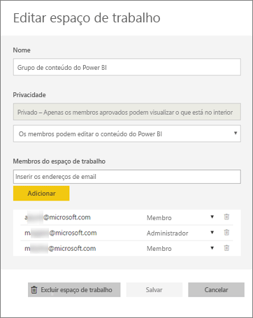
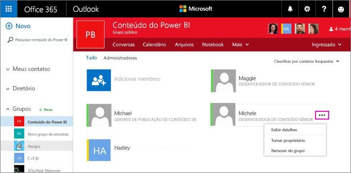
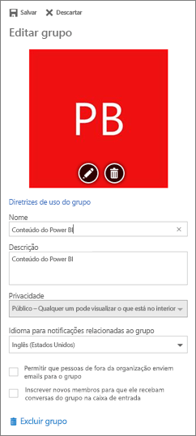

# Gerenciar seu espaço de trabalho de aplicativo no Power BI e no Office 365
Como criador ou administrador de um [espaço de trabalho de aplicativo no Power BI](service-install-use-apps.md) ou no Office 365, você gerencia alguns aspectos do seu espaço de trabalho no Power BI. Outros aspectos que você gerencia no Office 365. 

**No Power BI** , você pode:

* Adicionar ou remover membros do espaço de trabalho de aplicativo, incluindo tornar um membro do espaço de trabalho um administrador.
* Editar o nome do espaço de trabalho de aplicativo.
* Excluir o espaço de trabalho de aplicativo.

**No Office 365** , você pode:

* Adicionar ou remover membros do grupo do espaço de trabalho do aplicativo e também fazer com que um membro seja o administrador.
* Edite o nome do grupo, a imagem, a descrição e outras configurações.
* Ver o endereço de email do grupo.
* Excluir o grupo.

Você precisa de uma licença do [Power BI Pro](service-free-vs-pro.md) para ser um administrador ou um membro de um espaço de trabalho do aplicativo. Os usuários de seu aplicativo também precisam de uma licença do Power BI Pro, a menos que seu espaço de trabalho do aplicativo esteja em uma capacidade do Power BI Premium. Os usuários empresariais podem acessar seu aplicativo com uma licença gratuita do Power BI. Leia [O que é o Power BI Premium?](service-premium.md) para obter detalhes.

## Editar seu espaço de trabalho de aplicativo no Power BI
1. No serviço do Power BI, selecione a seta ao lado de **Espaços de trabalho** > selecione as reticências (**...**) ao lado do nome do espaço de trabalho > **Editar espaço de trabalho**. 
   
   
   
   > [!NOTE]
   > Você só verá **Editar espaço de trabalho** se você for um administrador do espaço de trabalho de aplicativo.
   > 
   > 
2. Aqui você pode renomear, adicionar ou remover membros, ou excluir o espaço de trabalho de aplicativo. 
   
   
3. Selecione **Salvar** ou **Cancelar**.

## Editar as propriedades do espaço de trabalho de aplicativo do Power BI no Office 365
1. No serviço do Power BI, selecione a seta ao lado de **Espaços de trabalho** > selecione as reticências (**...**) ao lado do nome do espaço de trabalho > **Membros**. 
   
   
   
   Isso abre a exibição de grupo do Outlook para Office 365 do seu espaço de trabalho de aplicativo.
   
   Talvez seja necessário entrar em sua conta corporativa.
2. Toque nas reticências (**...**) ao lado do nome do membro para tornar o membro um administrador ou excluir o membro do espaço de trabalho do aplicativo. 
   
   

## Adicionar uma imagem e definir outras propriedades do espaço de trabalho no grupo do Office 365
Quando você distribuir seu aplicativo do espaço de trabalho do aplicativo, a imagem que você adiciona aqui será a imagem de seu aplicativo. Consulte a seção [Adicionar uma imagem ao seu aplicativo](service-create-distribute-apps.md#add-an-image-to-your-app-optional) do artigo [Criar e distribuir um aplicativo no Power BI](service-create-distribute-apps.md).

1. Na exibição do seu espaço de trabalho de aplicativo do Outlook para Office 365, selecione a imagem do grupo para editar as propriedades do espaço de trabalho de grupo.
   
   
2. Você pode editar o nome, descrição e idioma, adicionar uma imagem e definir outras propriedades aqui.
   
   
3. Selecionar **Salvar** ou **Descartar**.

## Próximas etapas
* [O que são aplicativos no Power BI?](service-install-use-apps.md)
* [Criar aplicativos e espaços de trabalho de aplicativo no Power BI](service-create-distribute-apps.md)
* Mais perguntas? [Experimente a Comunidade do Power BI](http://community.powerbi.com/)

