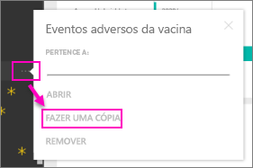

# Pacotes de conteúdo organizacional: copiar, atualizar e obter acesso
> [!NOTE]
> Você já ouviu a respeito dos novos *aplicativos*? Os aplicativos são a nova maneira para distribuir conteúdo a um grande público no Power BI. Você cria aplicativos em *espaços de trabalho de aplicativo*, que substitui os grupos e os espaços de trabalho de grupo. É recomendável usar aplicativos em vez de espaços de trabalho somente leitura ou pacotes de conteúdo organizacional. Saiba [mais sobre os aplicativos](service-install-use-apps.md).
> 
> 

Quando um pacote de conteúdo organizacional é publicado, todos os destinatários veem o mesmo painel, os mesmos relatórios, as mesmas pastas de trabalho do Excel, os mesmos conjuntos de dados e dados (a menos que seja uma fonte de dados do SSAS (SQL Server Analysis Services)).  [Somente o criador do pacote de conteúdo pode editar e publicar novamente](service-organizational-content-pack-manage-update-delete.md) o pacote de conteúdo.  No entanto, todos os destinatários podem salvar uma cópia do pacote de conteúdo, que pode permanecer juntamente com o original.

Criar pacotes de conteúdo é diferente de compartilhar dashboards ou colaborar neles em um grupo. Leia [Como devo colaborar e compartilhar relatórios e dashboards?](service-how-to-collaborate-distribute-dashboards-reports.md) para decidir sobre a melhor opção para sua situação.

## Criar uma cópia de um pacote de conteúdo organizacional
Crie sua própria cópia do pacote de conteúdo, invisível para outros usuários.

1. Selecione as reticências (...) ao lado do dashboard do pacote de conteúdo > Fazer uma cópia.
   
    
2. Selecione **Salvar**.  

Agora você tem uma cópia que pode alterar. Ninguém verá as alterações feitas.

## Ajuda!  Eu não consigo mais acessar o pacote de conteúdo
Isso pode ocorrer por diversos motivos:

* **Alterações de associação**: os pacotes de conteúdo são publicados em grupos de distribuição de email, grupos de segurança e nos [grupos do Power BI baseados no Office 365](https://support.office.com/article/Create-a-group-in-Office-365-7124dc4c-1de9-40d4-b096-e8add19209e9).  Se você for removido do grupo, você não terá mais acesso ao pacote de conteúdo.
* **Alterações de distribuição:** o criador do pacote de conteúdo altera a distribuição. Por exemplo, se o pacote de conteúdo foi publicado originalmente para toda a organização, mas o criador o publicou novamente para um público menor, você poderá não estar mais incluso.
* **Alterações às configurações de segurança:** se o painel e os relatórios se conectarem a fontes de dados locais do SSAS e forem feitas alterações às configurações de segurança, suas permissões para esse servidor poderão ser revogadas.

## Como os pacotes de conteúdo organizacional são atualizados?
Quando o pacote de conteúdo é criado, as configurações de atualização são herdadas com o conjunto de dados.  Ao criar uma cópia do pacote de conteúdo, a nova versão mantém seu link no conjunto de dados original e em seu agendamento de atualização. 

Veja [Gerenciar, atualizar e excluir pacotes de conteúdo organizacional](service-organizational-content-pack-manage-update-delete.md)

## Próximas etapas
* [Introdução aos pacotes de conteúdo organizacional](service-organizational-content-pack-introduction.md)
* [Criar um grupo no Power BI](service-create-distribute-apps.md)
* Mais perguntas? [Experimente a Comunidade do Power BI](http://community.powerbi.com/)

