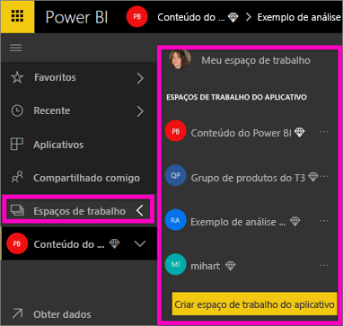
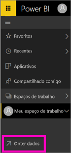
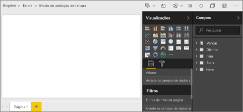
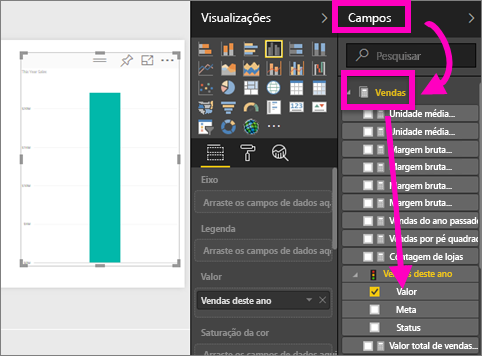
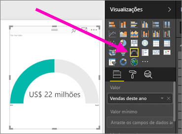
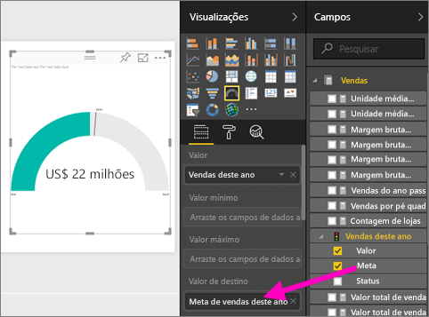
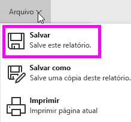
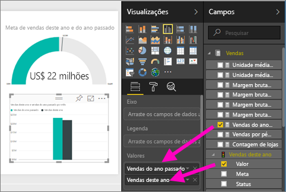
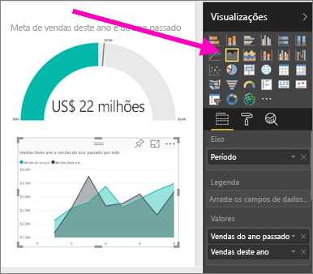
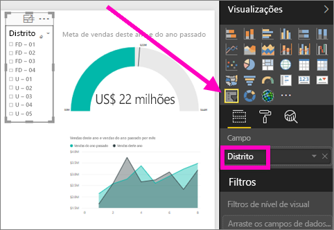

# Criar um novo relatório no serviço do Power BI importando um conjunto de dados
Você já leu [Relatórios no Power BI](service-reports.md) e agora deseja criar o seu próprio relatório. Há muitas maneiras diferentes para criar um relatório e, neste artigo, vamos começar criando um relatório muito básico com base em um conjunto de dados do Excel usando o serviço do Power BI. Depois de compreender os fundamentos da criação de um relatório, as **Próximas etapas** no final vão direcioná-lo para tópicos mais avançados sobre relatórios.  

> **DICA**: para criar um relatório copiando um relatório existente, consulte [Copiar um relatório](power-bi-report-copy.md)
> 
### Pré-requisitos
- Serviço do Power BI (para criar relatórios usando o Power BI Desktop, confira [Exibição de relatório do Desktop](desktop-report-view.md))  
- Conjunto de dados Exemplo de Análise de Varejo

## Importar o conjunto de dados
Esse método para a criação de um relatório começa com um conjunto de dados e uma tela de relatório em branco. Para acompanhar, [baixe o conjunto de dados de exemplo do Excel, Análise de Varejo](http://go.microsoft.com/fwlink/?LinkId=529778) e salve-o no OneDrive for Business (de preferência) ou localmente.

1. Criaremos o relatório em um espaço de trabalho do serviço do Power BI, portanto, selecione um espaço de trabalho existente ou crie um novo.
   
   
2. Na parte inferior do painel de navegação à esquerda, selecione **Obter dados**.
   
   
3. Selecione **Arquivos** e navegue até o local em que você salvou o exemplo Análise de Varejo.
   
    
4. Para este exercício, selecione **Importar**.
   
   
5. Depois que o conjunto de dados for importado, selecione **Exibir conjunto de dados**.
   
   
6. Na verdade, exibir um conjunto de dados abre o editor de relatório.  Você verá uma tela em branco e as ferramentas de edição do relatório.
   
   

> **DICA**: se você não estiver familiarizado com a tela de edição de relatório ou precisar de um lembrete, [Faça um tour pelo editor de relatório ](service-the-report-editor-take-a-tour.md) antes de continuar.
> 
> 

## Adicionar um Medidor Radial ao relatório
Agora que nosso conjunto de dados foi importado, vamos começar respondendo algumas perguntas.  Nossa CMO (Diretora de Marketing) quer saber se estamos próximos de alcançar as metas de vendas deste ano. Um Medidor é uma [boa opção de visualização](power-bi-report-visualizations.md) para exibir esse tipo de informação.

1. No painel Campos, selecione **Vendas** > **Vendas Deste Ano** > **Valor**.
   
    
2. Converta o visual em um Medidor selecionando o modelo de Medidor  no painel **Visualizações**.
   
    
3. Arraste **Vendas** > **Vendas Deste Ano** > **Meta** para a seção **Valor de Destino**. Parece que estamos muito perto de alcançar a nossa meta.
   
    
4. Agora seria um bom momento para [salvar seu relatório](service-report-save.md).
   
   

## Adicionar um gráfico de área e uma segmentação de dados ao relatório
Nossa CMO tem algumas perguntas adicionais para respondermos. Ela gostaria de ver a comparação das vendas deste ano com as vendas do ano passado. E também desejaria ver os resultados por distrito.

1. Primeiro, vamos criar espaço em nossa tela. Selecione o Medidor e mova-o para o canto superior direito. Em seguida, pegue e arraste um dos cantos e torne-o menor.
2. Desmarque o medidor. No painel Campos, selecione **Vendas** > **Vendas Deste Ano** > **Valor** e selecione **Vendas** > **Vendas do Ano Passado**.
   
    
3. Converta o visual em um gráfico de área selecionando o modelo de gráfico de área  no painel **Visualizações**.
4. Selecione **Tempo** > **Período** para adicionar ao **Eixo** também.
   
    
5. Para classificar a visualização por período de tempo, selecione as reticências e escolha **Classificar por Período**.
6. Agora vamos adicionar a segmentação de dados. Selecione uma área vazia na tela e escolha a segmentação     de segmentação. Isso adiciona uma segmentação de dados vazia à nossa tela.
   
        
7. No painel Campos, selecione **Distrito** > **Distrito**. Mova e redimensione a segmentação de dados.
   
      
8. Use a segmentação de dados para procurar por padrões e insights por Distrito.
   
     

Continue explorando seus dados e adicionando visualizações. Quando você encontrar insights especialmente interessantes, [fixe-os em um painel](service-dashboard-pin-tile-from-report.md).

## Próximas etapas
* [Adicionar uma nova página ao relatório](power-bi-report-add-page.md)  
* Saiba como [fixar visualizações em um dashboard](service-dashboard-pin-tile-from-report.md)   
* Mais perguntas? [Experimente a Comunidade do Power BI](http://community.powerbi.com/)

