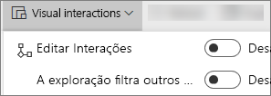
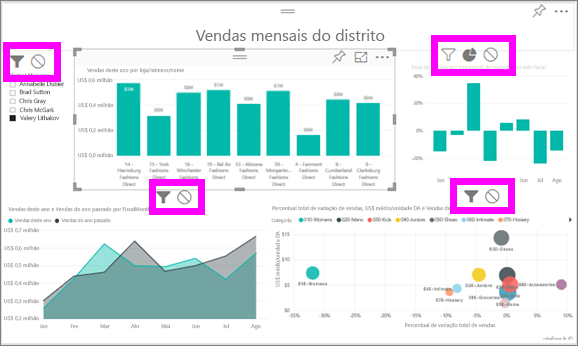

# Interações de visualização em um relatório do Power BI
Se você tiver permissões de edição para um relatório, poderá usar as **interações visuais** para alterar como as visualizações em uma página de relatório afetam umas às outras. 

Por padrão, as visualizações em uma página de relatório podem ser usadas para filtro cruzado e realce cruzado de outras visualizações na página.
Por exemplo, selecionar um estado em uma visualização de mapa realça o gráfico de colunas e filtra o gráfico de linhas para exibir apenas os dados que se aplicam a um estado.
Veja [Sobre filtragem e realce](power-bi-reports-filters-and-highlighting.md). E se você tiver uma visualização que é compatível com [drill down](power-bi-visualization-drill-down.md), por padrão, fazer drill down em uma visualização não afeta as outras visualizações na página do relatório. Mas ambos os comportamentos padrão podem ser substituídos e as interações definidas por visualização.

Este artigo mostra como usar as **interações visuais** no [Exibição de edição](service-interact-with-a-report-in-editing-view.md) do serviço do Power BI e no Power BI Desktop. Se um relatório foi compartilhado com você, não será possível alterar as configurações de interações visuais.

> [!NOTE]
> Os termos *filtro cruzado* e *realce cruzado* são usados para distinguir o comportamento descrito aqui do que acontece quando você usa o painel **Filtros** painel para filtrar e realçar visualizações.  
> 
> 

<iframe width="560" height="315" src="https://www.youtube.com/embed/N_xYsCbyHPw?list=PL1N57mwBHtN0JFoKSR0n-tBkUJHeMP2cP" frameborder="0" allowfullscreen></iframe>

1. Selecione a visualização para ativá-la.  
2. Exiba as opções de **Interações Visuais**.
    - No serviço do Power BI, selecione o menu suspenso na barra de menus do relatório.

       

    - Na Área de trabalho, selecione **Formato > Interações**.

        

3. Para ativar os controles de interação de visualização, selecione **Editar interações**. O Power BI adiciona os ícones de filtro cruzado e realce cruzado a todas as outras visualizações na página do relatório.
   
    
3. Determine o impacto que a visualização selecionada deve ter nas outras visualizações.  E, como opção, repita para todas as outras visualizações na página do relatório.
   
   * Se precisar executar o filtro cruzado na visualização, selecione o ícone de **filtro**.
   * Se precisar executar o realce cruzado da visualização, selecione o ícone de **realce**.
   * Se ela não precisar ter impacto, selecione o ícone de **nenhum impacto** .

4. Para ativar os controles de drill down, selecione **Filtros detalhados de outros elementos visuais**.  Agora, quando você fizer drill down (e up) em uma visualização, as outras visualizações na página do relatório serão alteradas para refletir sua seleção atual de detalhamento. 

   

### Próximas etapas
[Como usar filtros de relatório](power-bi-how-to-report-filter.md)

[Filtros e realce em relatórios](power-bi-reports-filters-and-highlighting.md)

[Power BI – conceitos básicos](service-basic-concepts.md)

Mais perguntas? [Experimente a Comunidade do Power BI](http://community.powerbi.com/)

