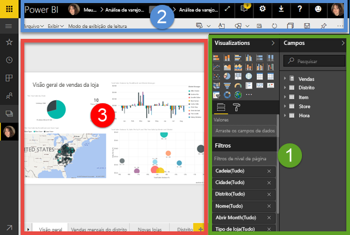
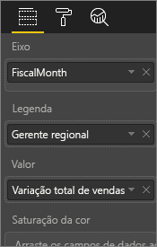
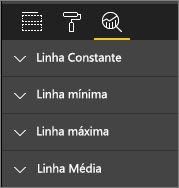
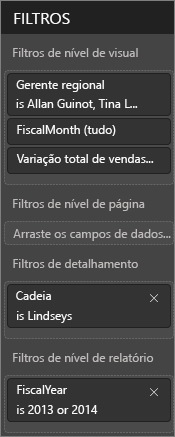

# O editor de relatório... Faça um tour
## Editar relatórios no serviço Power BI e Power BI Desktop
O editor de relatório no serviço do Power BI e o editor de relatório no Power BI Desktop são muito semelhantes. O vídeo mostra o editor de relatório no Power BI Desktop e este artigo mostra o editor de relatório no serviço do Power BI. 

## A diferença entre *criadores* de relatório e *consumidores* de relatório
A capacidade de criar e editar um relatório está restrita a proprietários do relatório (também conhecidos como *criadores*). Se você estiver *consumindo* um relatório que foi compartilhado com você, ainda poderá abrir e interagir com o relatório no [modo de exibição somente leitura](service-reading-view-and-editing-view.md) do serviço Power BI, mas não terá todos os recursos robustos e abrangentes disponíveis para o criador do relatório.  

Para saber mais sobre o modo de exibição de leitura do relatório, confira [Modo de exibição de leitura e modo de exibição de edição no serviço Power BI](service-reading-view-and-editing-view.md) 

<iframe width="560" height="315" src="https://www.youtube.com/embed/IkJda4O7oGs" frameborder="0" allowfullscreen></iframe>

No serviço de Power BI, o *editor de relatório* só está disponível no [Modo de Exibição de Edição](service-reading-view-and-editing-view.md). Para abrir um relatório no Modo de Exibição de Edição, você deve ser o proprietário ou criador de um relatório.

O editor de relatório do Power BI é composto de 3 seções:  

1. painéis **Campos**, **Visualizações** e **Filtros**
2. barras de navegação superior    
3. tela de relatório     

## 1. Os painéis do editor de relatório

Há 3 painéis visíveis quando você abre um relatório pela primeira vez: Campos, Filtros e Visualizações. Os painéis do lado esquerdo, Visualizações e Filtros, controlam a aparência das visualizações: tipo, cores, filtragem e formatação.  E o painel do lado direito, Campos, gerencia os dados subjacentes usados nas visualizações. 

O conteúdo exibido no editor de relatório varia de acordo com as seleções feitas na tela de relatório.  Por exemplo, quando você seleciona um elemento visual individual, 

|  |  |
| --- | --- |
|  |<ul><li>A parte superior do painel Visualização identifica o tipo de visual em uso. Neste exemplo, trata-se de um Gráfico de coluna clusterizado.  </li> <li>A parte inferior do painel Visualização (talvez você precise rolar para baixo) exibe os campos usados no visual. Este gráfico está usando FiscalMonth, DistrictManager e Variância total de vendas.   </li><li>O painel Filtros (talvez você precise rolar para baixo) exibe todos os filtros que foram aplicados.   </li><li>O painel Campos lista as tabelas disponíveis e, se você expandir o nome de uma tabela, os campos que compõem essa tabela. A fonte amarela informa que pelo menos um campo da tabela está sendo usado na visualização.  </li><li> Para exibir o painel de formatação, para a visualização selecionada, selecione o ícone de rolo de tinta.  </li><li> Para exibir o painel Análise, selecione o ícone de lupa.</ul> |

## O painel Visualizações (da parte superior para a inferior)

É aqui que você seleciona um tipo de visualização. As pequenas figuras são chamadas de *modelos*. Na imagem acima, o Gráfico de barras clusterizado está selecionado. Se você não selecionar primeiro um tipo de visualização, mas, em vez disso, começar a criar uma visualização através da seleção de campos, o Power BI escolherá o tipo de visualização para você. Você pode manter a seleção do Power BI ou alterar o tipo selecionando um modelo diferente. Mude quantas vezes quiser para localizar o tipo de visualização que melhor representa seus dados.

### Gerencie os campos usados em seu visual.

Os buckets (também chamados de *caixas*) mostrados nesse painel variam de acordo com o tipo de visualização selecionado.  Por exemplo, se você tiver selecionado um gráfico de barras, você verá buckets para: Valores, Eixo e Legenda. Quando você seleciona um campo, ou arrasta-o para a tela, o Power BI adiciona esse campo a um dos buckets.  Você também pode arrastar campos da lista Campos diretamente para os buckets.  Alguns buckets são limitados a determinados tipos de dados.  Por exemplo, **Valores** não aceitará campos não numéricos. Portanto, se você arrastar um campo **employeename** para o bucket **Valores** , o Power BI o alterará para a **contagem de employeename**.

### Remover um campo
Para remover um campo da visualização, selecione o **X** à direita do nome do campo.

Para obter mais informações, veja [Adicionar visualizações a um relatório do Power BI](power-bi-report-add-visualizations-i.md)

### Formatar os elementos visuais
Selecione o ícone de rolo de pintura para exibir o painel Formatar. A opção disponível depende do tipo de visualização selecionada.

As possibilidades de formatação são quase infinitas.  Para saber mais, explore por conta própria ou visite esses artigos:

* [Personalização do título, da tela de fundo e da legenda da visualização](power-bi-visualization-customize-title-background-and-legend.md)
* [Formatação de cor](service-getting-started-with-color-formatting-and-axis-properties.md)
* [Personalização das propriedades dos eixos x e y](power-bi-visualization-customize-x-axis-and-y-axis.md)

### Adicionar análises às suas visualizações
Selecione o ícone de lupa para exibir o painel Análise. A opção disponível depende do tipo de visualização selecionada.

    
Com o painel Análise no serviço do Power BI, você pode adicionar linhas de referência dinâmica às visualizações e destacar tendências ou ideias importantes. Para saber mais, consulte [Painel de análise no serviço do Power BI](service-analytics-pane.md) ou [Painel de análise no Power BI Desktop](desktop-analytics-pane.md).

- - -
## O painel Filtros
Use o painel de filtros para exibir, configurar e modificar filtros persistentes para seus relatórios no nível de página, relatórios, detalhamento e visual. Sim, você pode fazer a filtragem local nas páginas de relatório e nos elementos visuais selecionando os elementos visuais ou usando ferramentas como as segmentações, mas ao usar o painel Filtros, o estado dos filtros é salvo com o relatório. 

O painel Filtros tem outro recurso eficiente, a capacidade de filtrar usando um campo ***que ainda não está sendo usado em um dos elementos visuais em seu relatório***. Deixe-me explicar. Quando você cria uma página de relatório, o Power BI adiciona automaticamente todos os campos que você usa nas suas visualizações para a área de filtros de nível visual do painel Filtros.  Porém, se quiser definir um visual, página, detalhamento ou relatório, filtre usando um campo que não esteja sendo usado em uma visualização, simplesmente arrastando-o para um dos buckets de filtros.   

Para obter mais informações, veja [Adicionar um filtro a um relatório](power-bi-report-add-filter.md).

- - -
## O painel Campos
O painel Campos exibe as tabelas e campos que existem nos seus dados e que estão disponíveis para serem usados para criar visualizações.

|  |  |
| --- | --- |
|  |<ul><li>Arraste um campo até a página para iniciar uma nova visualização.  Você também pode arrastar um campo para uma visualização existente para adicioná-lo a essa visualização.  </li> <li>Quando você adiciona uma marca de seleção ao lado de um campo, o Power BI adiciona esse campo à visualização ativa (ou nova). Ele também decide em qual bucket colocar esse campo.  Por exemplo, o campo deve ser usado como uma legenda, um eixo ou um valor? O Power BI faz a melhor estimativa e você pode movê-lo desse bucket para outro se for necessário.   </li><li>De qualquer forma, cada campo selecionado é adicionado ao painel Visualizações no editor de relatório.</li></ul> |

**OBSERVAÇÃO**: se estiver usando o Power BI Desktop, você também terá opções para mostrar/ocultar campos, adicionar cálculos etc.

### O que significam os ícones de campo?
* **Agregações ∑** uma agregação é um valor numérico que será somado ou do qual será obtida uma média, por exemplo. As agregações são importadas com os dados (definidos no modelo de dados no qual seu relatório se baseia).
  Para obter mais informações, veja [Agregações em relatórios do Power BI](service-aggregates.md).
*  **Medidas calculadas (também chamadas campos calculados)**  
   Cada campo calculado tem sua própria fórmula embutida em código. Não é possível alterar o cálculo; por exemplo, se ele for uma soma, ele só poderá ser uma soma. Para obter mais informações, [leia Noções básicas sobre medidas](desktop-measures.md)
*  **Campos exclusivos**  
   Os campos com este ícone foram importados do Excel e são definidos para mostrar todos os valores, mesmo se contiverem duplicatas. Por exemplo, seus dados podem ter dois registros para pessoas chamadas “Mateus Rodrigues” e cada um deles será tratado como exclusivo – eles não serão somados.  
* ** Campos de geografia**  
   Campos de local podem ser usados para criar visualizações de mapa. 
* ** Hierarquia**  
   Selecione a seta para revelar os campos que compõem a hierarquia. 

- - -
## 2. A barra de navegação superior
São várias as ações disponíveis na barra de navegação superior, com novas ações adicionadas a todo momento. Para obter informações sobre uma ação específica, use o Sumário da Documentação do Power BI ou a caixa de Pesquisa.

## 3. A tela de relatório
A tela de relatório é o local em que seu trabalho é exibido. Quando você usa os painéis Campos, Filtros e Visualizações para criar elementos visuais, eles são criados e exibidos na sua tela de relatório. Cada guia na parte inferior da tela representa uma página no relatório. Selecione uma guia para abrir a respectiva página. 

## Próximas etapas:
[Criar um relatório](service-report-create-new.md)

Leia mais sobre relatórios no [serviço Power BI](service-reports.md), [Power BI Desktop](desktop-report-view.md) e [Power BI Mobile](mobile-apps-view-phone-report.md).

[Power BI – conceitos básicos](service-basic-concepts.md)

Mais perguntas? [Experimente a Comunidade do Power BI](http://community.powerbi.com/)

