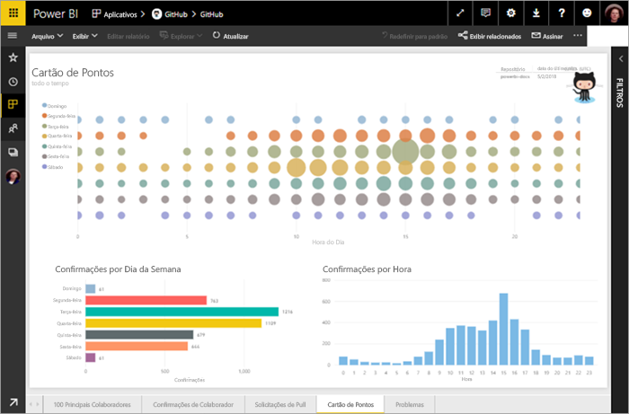
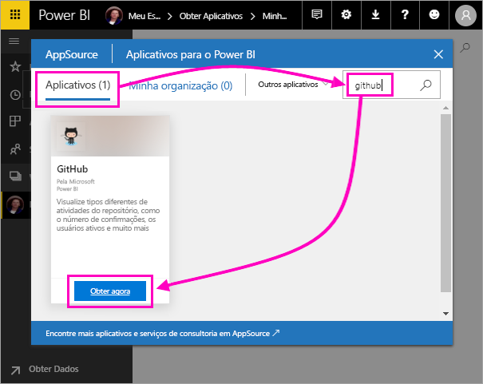
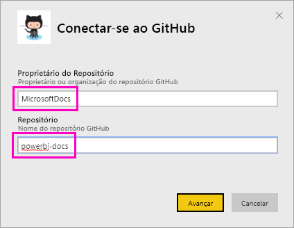
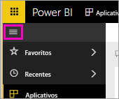
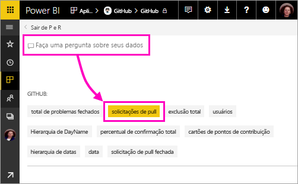
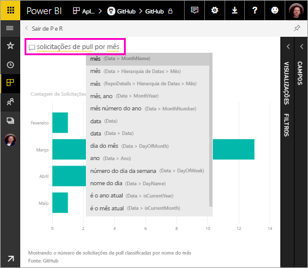
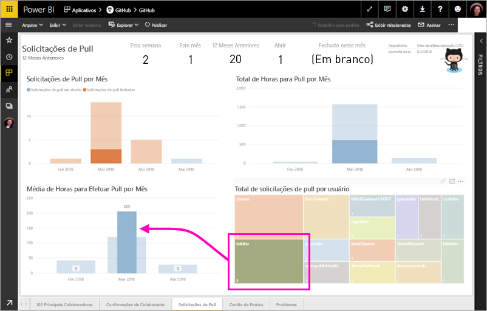
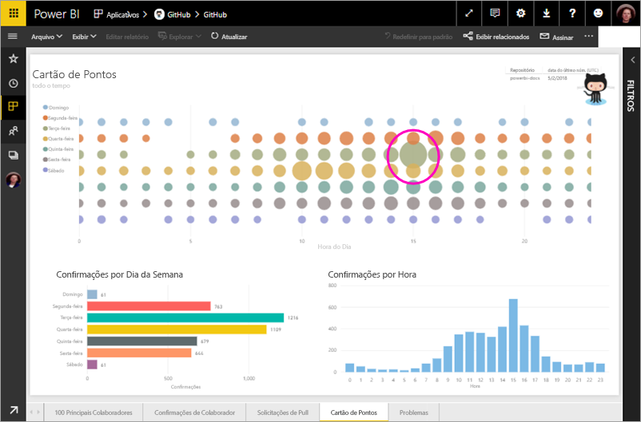
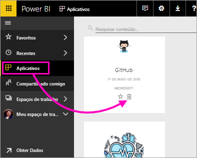

# Tutorial: Conectar-se ao aplicativo GitHub com o Power BI
Neste tutorial, você se conecta a dados reais no serviço do GitHub com o Power BI, e Power BI cria dashboards e relatórios automaticamente. Conecte-se ao repositório público de conteúdo do Power BI (também conhecido como *repo*) e veja estas informações: Quantas pessoas contribuem com o conteúdo público do Power BI? Quem contribui mais? Qual dia da semana tem mais contribuições? E respostas para outras perguntas. 

Neste tutorial, você concluirá as etapas a seguir:

> [!div class="checklist"]
> * Inscrever-se para uma conta do GitHub, caso ainda não tenha uma 
> * Entrar em sua conta do Power BI ou inscrever-se, caso ainda não tenha uma
> * Abrir o serviço do Power BI
> * Encontrar o aplicativo GitHub
> * Inserir as informações do repositório GitHub público do Power BI
> * Exibir o dashboad e o relatório com os dados do GitHub
> * Limpar os recursos, excluindo o aplicativo

Se você não estiver inscrito no Power BI, [inscreva-se para uma avaliação gratuita](https://app.powerbi.com/signupredirect?pbi_source=web) antes de começar.

## Pré-requisitos

Para concluir este tutorial, você precisará de uma conta do GitHub, caso ainda não tenha uma. 

- Inscrever-se para uma [conta do GitHub](https://docs.microsoft.com/contribute/get-started-setup-github)

## Como se conectar
1. Entre no serviço do Power BI (http://powerbi.com). 
2. No painel de navegação esquerdo, selecione **Aplicativos** e, em seguida, **Obter aplicativos**.
   
    

3. Selecione **Aplicativos**, digite **github** na caixa de pesquisa > **Obter agora**.
   
    

4. Digite o nome do repositório e também o seu proprietário. A URL desse repositório é https://github.com/MicrosoftDocs/powerbi-docs, portanto o **Proprietário do Repositório** é **MicrosoftDocs** e o **Repositório** é **powerbi-docs**. 
   
    

5. Insira as credenciais do GitHub que você criou. O Power BI poderá ignorar esta etapa se você já tiver entrado no GitHub em seu navegador. 

6. Para o **Método de Autenticação**, selecione **oAuth2** \> **Entrar**.

7. Siga as telas de autenticação do Github. Conceda permissão para o Power BI aos dados do GitHub.
   
   Agora o Power BI pode se conectar ao GitHub e aos dados.  Os dados são atualizados uma vez por dia.

8. Depois que o Power BI importar os dados, você verá o novo bloco do GitHub. 
 
    

8. Selecione o ícone de navegação global para minimizar o painel de navegação esquerdo e aumentar o espaço disponível.

    

10. Selecione o bloco do GitHub da etapa 8. 
    
    O dashboard do GitHub é aberto. Esses são dados dinâmicos, portanto, os valores exibidos podem ser diferentes.

    

    

## Fazer uma pergunta

11. Coloque o cursor na **Faça uma pergunta sobre os dados** e, em seguida, selecione **solicitações de pull**. 

    

12. Digite **por mês**.
 
    

     O Power BI cria um gráfico de barras mostrando o número de solicitações de pull por mês.

13. Selecione **Sair de P e R**.

## Exibir o relatório do GitHub 

1. No dashboard do GitHub, selecione o gráfico de combinação de coluna e linha de **Solicitações de Pull por Mês** para abrir o relatório relacionado.

    

2. Selecione um nome de usuário no gráfico **Total de solicitações de pull por usuário** e veja, como neste exemplo, que ele teve uma média de horas maior do que a média total de março.

    

3. Selecione a guia **Cartão de Pontos** para exibir a próxima página do relatório. 
 
    

    Aparentemente, terças-feiras às 15h é o dia e a hora mais comuns para *confirmações*, quando as pessoas fazem check-in de seus trabalhos.

## Limpar recursos

Agora que você já concluiu o tutorial, é possível excluir o aplicativo GitHub. 

1. Na barra de navegação esquerda, selecione **Aplicativos**.
2. Focalize o bloco do GitHub e selecione a lixeira **Excluir**.

    

## Próximas etapas

Neste tutorial, você se conectou a um repositório público do GitHub e obteve dados que o Power BI formatou em um dashboard e em um relatório. Você respondeu algumas perguntas sobre os dados explorando o dashboard e o relatório. Agora você pode aprender mais sobre como se conectar a outros serviços, como o Salesforce, o Microsoft Dynamics e o Google Analytics. 
 
> [!div class="nextstepaction"]
> [Conectar aos serviços online que você usa](./service-connect-to-services.md)

