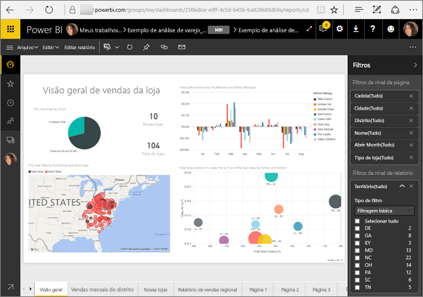
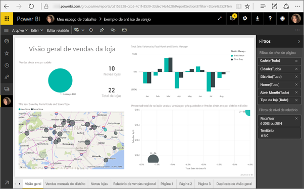

# <a name="filter-a-report-using-query-string-parameters-in-the-url"></a>Filtrar relatórios usando parâmetros da cadeia de caracteres de consulta na URL
Ao abrir um relatório no serviço do Power BI, cada página do relatório tem sua própria URL exclusiva. Para filtrar essa página do relatório, é possível usar o painel Filtros na tela de relatório.  Outra opção é adicionar parâmetros da cadeia de caracteres de consulta na URL para filtrar o relatório. Talvez você tenha um relatório que gostaria de mostrar aos colegas, mas antes deseja filtrá-lo previamente para enviar a eles. Uma maneira de fazer isso é iniciar com a URL padrão correspondente ao relatório, adicionar os parâmetros de filtro à URL e, em seguida, enviar a URL inteira por email aos usuários.



<iframe width="640" height="360" src="https://www.youtube.com/embed/WQFtN8nvM4A?list=PLv2BtOtLblH3YE_Ycas5B1GtcoFfJXavO&amp;showinfo=0" frameborder="0" allowfullscreen></iframe>

## <a name="query-string-parameter-syntax-for-filtering"></a>Sintaxe dos parâmetros da cadeia de caracteres de consulta para filtragem
A sintaxe é razoavelmente simples; comece com a URL do relatório, adicione um ponto de interrogação e, em seguida, adicione a sintaxe do filtro.

URL?filter=***Table***/***Field*** eq '***value***'


* Os nomes da **Tabela** e do **Campo** diferenciam maiúsculas de minúsculas, e o **valor** é Não.
* Os campos ocultos na exibição de relatório ainda podem ser filtrados.
* O **Valor** deve estar entre aspas simples.
* O tipo de campo deve ser um número ou uma cadeia de caracteres
* Os nomes de tabelas e campos não podem conter espaços.

Se ainda estiver confuso, continue lendo e nós explicaremos detalhadamente.  

## <a name="filter-on-a-field"></a>Filtrar em um campo
Suponhamos que a URL do nosso relatório seja a seguinte.


Podemos ver em nossa visualização de mapa (acima) que temos lojas na Carolina do Norte.

>[!NOTE]
>Este exemplo baseia-se na [amostra da Análise de Varejo](sample-datasets.md).
> 

Para filtrar o relatório para mostrar dados somente de lojas em "NC" (Carolina do Norte), inclua a URL com o seguinte:

?filter=Store/Territory eq 'NC'


>[!NOTE]
>*NC* é um valor armazenado no campo **Território** da tabela **Repositório**.
> 
> 

Nosso relatório é filtrado para Carolina do Norte; todas as visualizações na página de relatório mostram dados apenas da Carolina do Norte.



## <a name="filter-on-multiple-fields"></a>Filtrar em vários campos
Também é possível filtrar em vários campos adicionando mais parâmetros à sua URL. Vamos voltar ao nosso parâmetro de filtro original.

```
?filter=Store/Territory eq 'NC'
```

Para filtrar em campos adicionais, adicione um `and` e outro campo no mesmo formato que o anterior. Veja um exemplo.

```
?filter=Store/Territory eq 'NC' and Store/Chain eq 'Fashions Direct'
```

<iframe width="640" height="360" src="https://www.youtube.com/embed/0sDGKxOaC8w?showinfo=0" frameborder="0" allowfullscreen></iframe>


### <a name="using-dax-to-filter-on-multiple-values"></a>Usando DAX para filtrar em vários valores
Outra maneira de filtrar em vários campos é criar uma coluna calculada que concatena dois campos em um único valor. A partir daí, é possível filtrar nesse valor.

Suponhamos, por exemplo, que haja dois campos: Território e Cadeia. No Power BI Desktop, [crie uma nova coluna Calculada](desktop-tutorial-create-calculated-columns.md) (campo) chamada TerritoryChain. Lembre-se que o nome do **Campo** não pode conter espaços. Veja a seguir a fórmula DAX da coluna.

TerritoryChain = [Território] & " - " & [Cadeia]

Publique o relatório no serviço do Power BI e, em seguida, use a cadeia de caracteres de consulta de URL para filtrar e exibir dados somente de lojas Lindseys em NC.

https://app.powerbi.com/groups/me/reports/8d6e300b-696f-498e-b611-41ae03366851/ReportSection3?filter=Store/TerritoryChain eq 'NC–Lindseys'

## <a name="pin-a-tile-from-a-filtered-report"></a>Fixar um bloco de um relatório filtrado
Após filtrar o relatório usando parâmetros da cadeia de caracteres de consulta, é possível fixar as visualizações do relatório em questão no seu dashboard. O bloco no dashboard exibirá os dados filtrados; a seleção desse bloco do dashboard abrirá o relatório usado para criá-lo.  No entanto, a filtragem executada usando a URL não é salva com o relatório, e, quando o bloco do dashboard é selecionado, o relatório abre no estado não filtrado.  Isso significa que os dados exibidos no bloco do dashboard não corresponderão aos dados exibidos na visualização de relatório.

Pode haver casos em que isso será útil, isto é, quando você desejar obter resultados diferentes: filtrados no dashboard e não filtrados no relatório.

## <a name="limitations-and-troubleshooting"></a>Limitações e solução de problemas
Há alguns pontos a serem considerados ao usar os parâmetros da cadeia de caracteres de consulta.

* A filtragem da cadeia de caracteres de consulta não funciona com [Publicar na Web](service-publish-to-web.md) nem com o Power BI Embedded.   
* O tipo de campo deve ser um número ou uma cadeia de caracteres.
* Os nomes de tabelas e campos não podem conter espaços.

## <a name="next-steps"></a>Próximas etapas
[Fixar uma visualização em um dashboard](service-dashboard-pin-tile-from-report.md)  
[Experimente – é gratuito!](https://powerbi.com/)

Mais perguntas? [Experimente perguntar à Comunidade do Power BI](http://community.powerbi.com/)

