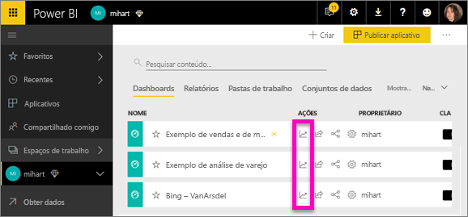
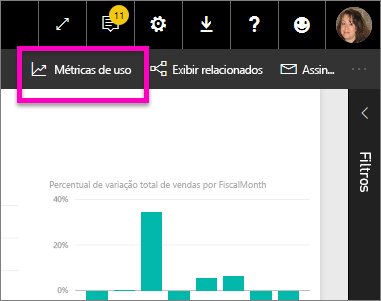
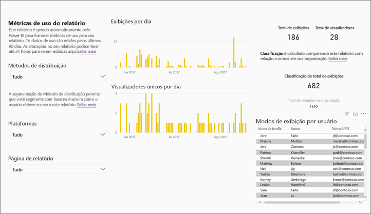
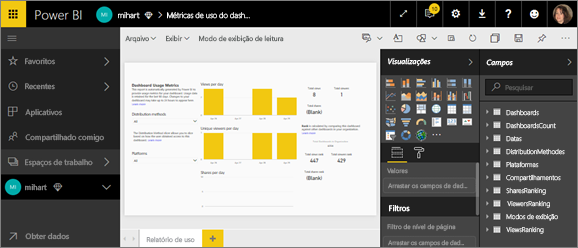
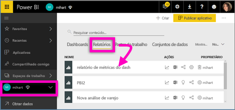
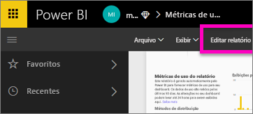
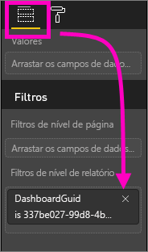
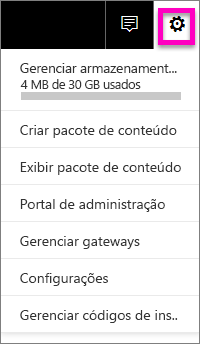
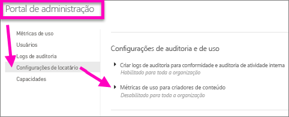
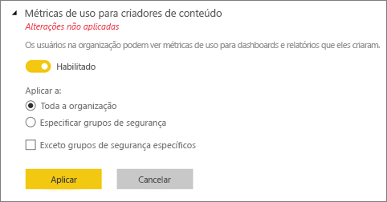

# Métricas de uso de dashboards e relatórios
Se você cria dashboards e relatórios, as métricas de uso ajudam a compreender seus impactos. Quando executa as métricas de uso de um dashboard ou de um relatório, você descobre como esses dashboards e relatórios estão sendo usados em sua organização – o que está sendo usado, por quem e para que finalidade.  

  > **Observação**: as métricas de uso acompanharão o uso dos relatórios inseridos no SharePoint Online. No entanto, as métricas de uso não acompanharão a inserção de dashboards e relatórios por meio do fluxo das "próprias credenciais do usuário" ou das "próprias credenciais do aplicativo". As métricas de uso também não acompanharão o uso de relatórios inseridos por meio de [publicação na Web](service-publish-to-web.md).

Esses relatórios de métricas de uso são somente leitura. No entanto, você pode personalizar um relatório de métricas de uso usando "Salvar como". Isso cria um novo conjunto de dados e converte o relatório somente leitura em um relatório completo do Power BI que você pode editar. O relatório personalizado contém não apenas as métricas do dashboard ou relatório selecionado mas, removendo o filtro padrão, agora você tem acesso às métricas de uso de todos os dashboards ou todos os relatórios no espaço de trabalho selecionado.

## Por que as métricas de uso são importantes para mim?
Saber como seu conteúdo está sendo usado ajuda a demonstrar seu impacto e priorizar esforços. As métricas de uso podem mostrar que um dos relatórios é usado diariamente por um grande segmento da organização e pode mostrar que um dashboard criado não está sendo exibido. Esse tipo de comentário é imprescindível para orientar seus esforços de trabalho.

A execução de relatórios de métricas de uso só está disponível no serviço do Power BI.  No entanto, se salvar um relatório de métricas de uso ou fixá-lo em um dashboard, você poderá abrir e interagir com esse relatório em dispositivos móveis.

### Pré-requisitos
- O recurso de métricas de uso captura informações de uso de todos os usuários, tanto gratuitos quanto Pro. No entanto, é necessária uma licença Pro para executar e acessar os dados de métricas de uso.
- As métricas de uso são fornecidas em dashboards ou relatórios no espaço de trabalho selecionado. Para acesso a métricas de uso de um relatório ou dashboard específico, você precisa:    
    • Ter acesso de edição a esse dashboard ou relatório   
    • Ter uma licença Pro

## Sobre o relatório de métrica de uso

Quando você seleciona **Métrica de uso** ou o ícone , o Power BI gera um relatório predefinido com métrica de uso para esse conteúdo nos últimos 90 dias.  O relatório é semelhante aos relatórios do Power BI que você já conhece, mas foi criado para ser informativo, não interativo. Você poderá fatiar com base em como seus usuários finais tiveram acesso – se eles acessaram pela Web, por um aplicativo móvel etc. Conforme seus dashboards e relatórios evoluírem, o relatório de métricas de uso também evoluirá e será atualizado todos os dias com novos dados.  

Os relatórios de métricas de uso não serão exibidos em **Recente**, **Espaços de trabalho**, **Favoritos** ou em outras listas de conteúdo. Eles não pode ser adicionados a um aplicativo. Se você fixar um bloco de um relatório de métricas de uso em um dashboard, o dashboard não poderá ser adicionado a um aplicativo ou a um pacote de conteúdo.

Para se aprofundar quanto aos dados do relatório ou para criar seus próprios relatórios relativos ao conjunto de dados, use **Salvar como** (consulte [Salvar o relatório de métrica de uso como um relatório completo do Power BI](#Save-the-Usage-Metrics-report-as-a-full-featured-Power-BI-report-(personalize)).

## Abrir um relatório de métrica de uso para um dashboard ou relatório
1. Inicie no espaço de trabalho que contém o dashboard ou o relatório.
2. Na lista de conteúdo do espaço de trabalho ou no dashboard ou relatório em si, selecione o ícone de **Métricas de uso**  .
   
    
   
    
3. Na primeira vez que você fizer isso, o Power BI criará o relatório de métricas de uso e lhe informará quando ele estiver pronto.
   
        
4. Para abrir os resultados, selecione **Exibir métricas de uso**.
   
    As métricas de uso serão um poderoso aliado enquanto você trabalha para implantar e manter relatórios e dashboards do Power BI. Está se perguntando quais páginas do seu relatório são mais úteis e quais você deveria descontinuar? Fatie por **Página de relatório** para descobrir. Gostaria de saber se você deve criar um layout para dispositivos móveis para seu dashboard? Fatie por **Plataformas** para descobrir quantos usuários estão acessando seu conteúdo por meio dos aplicativos móveis versus por meio do navegador da Web.

5. Opcionalmente, passe o mouse sobre uma visualização e selecione o ícone de fixar para adicionar a visualização a um dashboard. Ou, na barra de menus superior, selecione **Fixar esta Página em Tempo Real** para adicionar a página inteira a um dashboard. Do dashboard, você pode monitorar as métricas de uso mais facilmente ou compartilhá-los com outras pessoas.
   
   > **OBSERVAÇÃO**: se você fixar um bloco de um relatório de métricas de uso em um dashboard, o dashboard não poderá ser adicionado a um aplicativo ou a um pacote de conteúdo.
   > 
   > 

  

## Quais as métricas relatadas?
| Métrica | Painel | Relatório | Descrição |
| --- | --- | --- | --- |
| Segmentação do método de distribuição |sim |sim |Como os usuários têm acesso ao conteúdo. Há três métodos possíveis: os usuários podem acessar o dashboard ou o relatório sendo membros de um [espaço de trabalho do aplicativo](service-the-new-power-bi-experience.md), fazendo com que o conteúdo seja [compartilhado com eles](service-share-dashboards.md) ou instalando um aplicativo/pacote de conteúdo.  Observe que as exibições por meio de um aplicativo são contadas como um "pacote de conteúdo". |
| Segmentação de plataformas |sim |sim |O dashboard ou o relatório foi acessado pelo serviço do Power BI (powerbi.com) ou por um dispositivo móvel? O dispositivo móvel inclui todos os nossos aplicativos iOS, Android e Windows. |
| Segmentação da página de relatório |não |sim |Se o relatório tiver mais de uma página, segmente o relatório por página(s) que foi exibido. Se você vir uma opção de lista "Em Branco", isso significa que uma página de relatório foi adicionada recentemente (dentro de 24 horas, o nome real da nova página será exibido na lista de segmentação) e/ou que páginas do relatório foram excluídas. "Em branco" captura esses tipos de situações. |
| Exibições por dia |sim |sim |Número total de exibições por dia – uma exibição é definida como um usuário que carrega uma página ou dasbhoard de relatório. |
| Visualizadores únicos por dia |sim |sim |Número de usuários *diferentes* que exibiram o dashboard ou relatório (com base na conta de usuário do AAD). |
| Exibições por usuário |sim |sim |Número de exibições nos últimos 90 dias, dividido por usuários individuais. |
| Compartilhamentos por dia |sim |não |Número de vezes que o dashboard foi compartilhado com outro usuário ou grupo. |
| Total de exibições |sim |sim |Número de exibições nos últimos 90 dias. |
| Total de visualizadores |sim |sim |Número de visualizadores únicos nos últimos 90 dias. |
| Total de compartilhamentos |sim |não |Número de vezes que o dashboard ou o relatório foi compartilhado nos últimos 90 dias. |
| Total na organização |sim |sim |Contagem de todos os dashboards ou relatórios em toda a organização que tiveram pelo menos uma exibição nos últimos 90 dias.  Usado para calcular a classificação. |
| Classificação: total de exibições |sim |sim |Para o total de exibições de todos os dashboards ou relatórios na organização durante os últimos 90 dias, no qual este dashboard ou relatório é classificado. |
| Classificação: total de compartilhamentos |sim |não |Para o total de compartilhamentos de todos os dashboards na organização durante os últimos 90 dias, no qual este dashboard ou relatório é classificado. |

### Relatório de Métrica de uso do Dashboard

### Relatório de Métrica de uso do Relatório

## Salvar o relatório de métricas de uso como um relatório completo do Power BI (personalizar)

Use **Salvar como** para converter o relatório de métrica de uso em um relatório completo do Power BI que pode ser personalizado e compartilhado. Após ter criado uma cópia personalizada, você terá acesso completo ao conjunto de dados subjacente, permitindo personalizar o relatório de métricas de uso de acordo com suas necessidades específicas. Você pode até mesmo usar o Power BI Desktop para criar relatórios de métricas de uso personalizados usando a [conexão dinâmica com o recurso de serviço do Power BI](https://powerbi.microsoft.com/blog/connecting-to-datasets-in-the-power-bi-service-from-desktop).

Ainda melhor, o conjunto de dados subjacente inclui os detalhes de uso de todos os dashboards ou relatórios no espaço de trabalho. Isso abre outro mundo de possibilidades. Você pode, por exemplo, criar um relatório que compara todos os dashboards em seu espaço de trabalho com base no uso. Ou você pode criar um dashboard de métricas de uso para seu aplicativo do Power BI agregando o uso em todo o conteúdo distribuído nesse aplicativo.  Consulte [Remover o filtro de nível de página](#remove-the-filter-to-see-all-the-usage-metrics-data-in-the-workspace) abaixo.

### O que é criado usando "Salvar como"?
Quando o Power BI cria o relatório completo, ele também cria um novo conjunto de dados **composto por todos os dashboards ou todos os relatórios contidos no espaço de trabalho atual** que foram acessados nos últimos 90 dias. Por exemplo, digamos que você tem um espaço de trabalho chamado "Vendas" e que ele contém três dashboards e dois relatórios, e você cria um relatório de métricas de uso no dashboard "Nordeste". Em seguida, você usa **Salvar como** para personalizar e convertê-lo em um relatório completo. O conjunto de dados para esse novo relatório contém as métricas de uso *não apenas desse dashboard chamado "Nordeste"*, mas de todos os três dashboards no espaço de trabalho "Vendas". Por padrão, o relatório exibirá dados do dashboard "Nordeste" e você precisará [remover um filtro](#remove-the-filter-to-see-all-the-usage-metrics-data-in-the-workspace) (único clique) para exibir os dados de todos os três dashboards.

### Criar uma cópia do relatório de uso usando "Salvar como"
Quando você cria uma cópia usando "Salvar como" (personalizar), o Power BI converte o relatório pré-criado somente leitura em um relatório completo.  À primeira vista, ele parece ser exatamente o mesmo relatório. No entanto, agora você pode abrir o relatório no modo de exibição de Edição, adicionar novas visualizações, filtros e páginas, modificar ou excluir visualizações existentes e muito mais. O Power BI salva o novo relatório e conjunto de dados no espaço de trabalho atual. No exemplo a seguir, o espaço de trabalho atual é **mihart**.

1. No relatório de métricas de uso pré-criado, selecione **Arquivo > Salvar como**. O Power BI converte o relatório de métrica de uso em um relatório completo do Power BI. Ele é chamado de relatório de métricas de uso *personalizado*. O relatório de uso personalizado e o conjunto de dados são salvos no espaço de trabalho atual, que é chamado **mihart*.
   
    
2. Abra o relatório no modo de edição e [interaja com ele como você faria com qualquer outro relatório do Power BI](service-interact-with-a-report-in-editing-view.md). Por exemplo, adicione novas páginas e crie novas visualizações, adicione filtros, formate as fontes e cores, etc.
   
    
3. Como alternativa, comece com o novo conjunto de dados e crie um relatório do zero.
   
    
4. O novo relatório é salvo no espaço de trabalho atual (mihart) e também adicionado à lista de conteúdo **Recente**.
   
    

### Remover o filtro para ver ***todos*** os dados de métricas de uso do espaço de trabalho
Para ver as métricas de todos os dashboards ou de todos os relatórios no espaço de trabalho, você precisará remover um filtro. Por padrão, o relatório personalizado é filtrado para exibir métricas somente para o dashboard ou relatório que foi usado para criá-lo.

Se, por exemplo, você usou o dashboard chamado "Vendas na Europa"para criar esse novo relatório personalizado, somente dados de uso do dashboard "Vendas na Europa" serão exibidos. Para remover o filtro e habilitar dados de todos os dashboards no espaço de trabalho:

1. Abra o relatório personalizado no modo de exibição de Edição.
   
    
2. No painel Filtros, localize o bucket **Filtros de nível de relatório** e remova o filtro selecionando o "x".
   
    
   
    Agora, seu relatório personalizado exibe as métricas de todo o espaço de trabalho.

## Controles de administração para métricas de uso – para administradores do Power BI
Os relatórios de métrica de uso são um recurso que o administrador do Power BI ou do Office 365 pode ativar ou desativar. Os administradores têm controle granular sobre quais usuários terão acesso às métricas de uso. Elas são ativadas por padrão para todos os usuários na organização.

1. Abra o portal do administrador selecionando o ícone de engrenagem no canto superior direito do serviço do Power BI e escolhendo **Portal de administração**.
   
    
2. No portal de administração, selecione **Configurações do locatário** e escolha **Métrica de uso para criadores de conteúdo**.
   
    
3. Habilite (ou desabilite) métrica de uso e selecione **Aplicar**.
   
    

Ao desabilitar as métricas de uso para toda a sua organização, os administradores podem usar a opção **excluir todo o conteúdo existente de métricas de uso** para excluir todos os relatórios e blocos de dashboards existentes que foram criados usando os relatórios de métricas de uso e os conjuntos de dados. Esta opção remove todo o acesso aos dados de métricas de uso para todos os usuários da organização que já podem estar usando esses dados. Tenha cuidado, pois a exclusão do conteúdo de métricas de uso existente é irreversível.

## Considerações e limitações
P: Não consigo executar as métricas de uso em um dashboard ou relatório    
R: Você só pode ver métricas de uso para o conteúdo que você possui ou que tem permissões para editar.

P: As métricas de uso capturam as exibições de dashboards e relatórios inseridos?     
R: Atualmente, as métricas de uso não oferecem suporte ao uso de captura para dashboards e relatórios inseridos, incluindo os fluxos [o usuário tem dados](developer/integrate-report.md), [o aplicativo tem dados](developer/embed-sample-for-customers.md) e o [publicar na Web](service-publish-to-web.md). Nesses casos, recomendamos o uso das plataformas de análise da Web existentes para controlar o uso do aplicativo de hospedagem ou portal.

P: Não consigo executar a métrica de uso em nenhum conteúdo.    
R1: Os administradores podem desligar esse recurso em sua organização.  Contate seu administrador para ver se é esse o caso.    
A2: As métricas de uso são um recurso do Power BI Pro.

P: Os dados não parecem atualizados. Por exemplo, os métodos de distribuição não são exibidos, as páginas do relatório estão ausentes, etc.   
R: Pode levar até 24 horas para que os dados sejam atualizados.

P: Há quatro relatórios no espaço de trabalho, mas o relatório de métricas de uso exibe apenas três.    
R: O relatório de métricas de uso inclui somente os relatórios (ou dashboards) que foram acessados nos últimos 90 dias.  Se um relatório (ou dashboard) não aparecer, provavelmente ele não foi usado em mais de 90 dias.

## Próximas etapas
[Adicionar um dashboard como favorito](service-dashboard-favorite.md)

Mais perguntas? [Experimente a Comunidade do Power BI](http://community.powerbi.com/)

